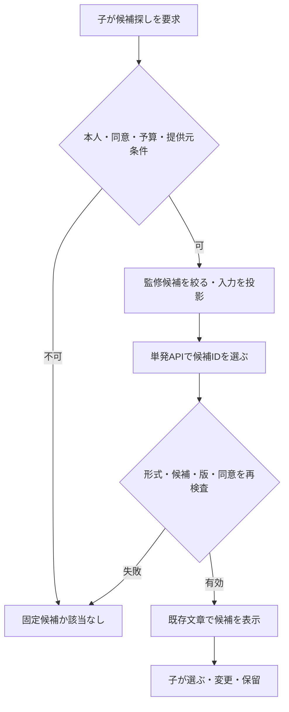

# 次の行動を助けるAI：採否・API・運用 v0.4

DESIGN／レビュー案、2026-09-23。v0.2の入力最小化・同意・公開・予算・停止を継承し、用途と表示経路を更新する。本文とv0.2が異なる箇所は本書を優先。実装・API呼出し・効果検証は未実施。

## 1. AIが必要か

| 仕事 | AIなし | AIを使う差分 | 判断 |
|---|---|---|---|
| 次の画面・保存・共有許可・残額計算 | 確定ルールで可能 | 誤りと遅延が増える | AI禁止領域 |
| 三教材から選ぶ／固定ヒント | 本人選択＋条件フィルタで十分 | この規模では優位性が小さい | 通常コードを採用 |
| 自由な「なんで？」を監修教材へ結ぶ | 本人がテーマ・比較軸を選ぶ | 曖昧な表現と教材語彙の対応付け | 第一の比較評価対象。必要性は未実証 |
| 家族の経験を次の問いへ結ぶ | 出所を表示し、本人が問いを選ぶ | 返信の言い回しから既存候補を見つける | 同じ対応付けjobで比較 |
| 問い・振り返りの新しい文章 | 固定質問で可能 | 自然な言い換えはできるが答えの代筆に寄る | 親向け任意下書き、子へ直接生成しない |
| 新聞の文章化 | 原文の定型配置で成立 | 複数素材の短文化・編集補助 | 第二優先。総編集時間が減る時だけ |
| 写真理解・常時会話・自動採点 | 初期体験には不要 | 費用・誤認・依存が大きい | M1では不採用 |

選択肢はA=固定だけ、B=固定＋必要時の限定AI、C=会話エージェント。推奨はB。ただしAを基準として常に動かす。AIが本人の選択を置き換えるなら採用しない。Google PAIRも非AIのルールで足りるかを先に比較する考え方を示す[S1]。

## 2. 使う瞬間と画面

1. C01/C04で子が「これ、なんで？」や家族の言葉を選ぶ。原文は変更せず保存。
2. 最初は本人が選べる固定のテーマ／比較軸を表示。「探すのを手伝って」を本人が押し、家庭のAI条件も満たす場合だけAPIを呼ぶ。
3. アプリが実行可能な監修済み候補を先に絞る。モデルは候補IDを0〜3件選ぶだけ。
4. アプリが候補の既存文章と確認できる出所を表示。「AIが候補を探しました」「別の候補」「あとで」を添える。
5. 子が選ぶまで開始しない。支出・契約・機器操作など別の許可が必要なものは、候補選択だけで実行可能にならない。

例：家族の「昔は瓶で買っていた」→監修された「今の容器と量を比べる」候補。AIは経験を現在の事実と認定せず、自由な実験や金融商品の推奨を作れない。該当教材がなければ「ここにはまだ合う体験がありません。気になることとして残す／家族に相談する」。無関係な水道問題へ強引に戻さない。

## 3. 表示と承認の境界

| 出力 | 誰へ | 承認・実行条件 |
|---|---|---|
| 固定ヒント、固定教材の候補 | 子 | 事前の教材・家庭許可内。毎回の親確認不要 |
| AIが選んだ既存候補ID | 子 | 外部処理同意、提供元条件、候補allowlist、家族・素材の再検証。文章は監修済みの固定文だけ |
| 新規生成した問い・説明・新聞文 | 親の下書き欄 | 親が原文と比べて確認するまで子や祖父母へ出さない |
| 家族への共有 | 選ばれた相手 | 子の素材・版・宛先の意思＋親の最終確認。AI候補の選択とは別 |
| 実購入・契約・送金 | 本機能の範囲外 | アプリの提案を実行権限に変えない |

v0.2の「すべて親が起動・確認」をここで限定的に改訂する。事前審査した教材の検索・選択補助を子が要求できる。自由生成文の直接提示、自律実行、子の情報を無条件にAPIへ送る変更ではない。

## 4. 製品ハーネスとAPI



ブラウザー→自分のFastAPI→provider adapter→モデルAPI。秘密鍵はサーバーだけ。ブラウザーにAPIキーや任意prompt入力を持たせない。Codex開発用スキルはこの呼出しには載せない。システム指示、出力schema、許可教材、検査コード、運用設定が製品ハーネスになる。SDKは通信部品であり、認可や教材安全性を代替しない。

### アプリAPIの契約

`POST /assist/next-actions` request:

```json
{"experience_id":null,"source_ref":"q_demo","expected_revision":2,"operation_id":"op_demo_1"}
```

source_refはアプリ内の許可済みquestion/replyレコードを参照。任意の本文やfamily_id、role、candidate_ids、risk_levelをリクエストで指定させない。actorとfamilyはsession由来。取得時に本人／現在の受信者権限を確認。子の拒否素材を検索のために広く共有しない。

体験開始前のC01ではexperience_id=nullを正式に受け付ける。questionは本人の原文・本人が選んだfocus_id（価格／量／必要性／時間／その他）・任意のsource_reply_refを持ち、親の設定した家庭内に保存。`POST /questions`で作成し、既存体験がなくても固定／AI経路で次を選べる。replyから始める場合も先に子が焦点を選びquestionを作る。expected_revisionはquestionの版を指す。

response（サーバーが検査後に組み立てる）:

```json
{
  "mode":"ai_matched",
  "request_id":"req_demo",
  "source_revision":2,
  "suggestion_id":"sg_demo",
  "expires_at":"2026-09-23T12:15:00Z",
  "candidates":[{"candidate_id":"container_compare_v1","title":"いまの容器と量を比べる","reason":"選んだ家族の経験をもとに探しました","origin":"curated"}],
  "can_skip":true
}
```

modeはfixed/ai_matched/no_match。モデル自身にmodeや説明文を確定させない。reasonは実際に入力として使用した資料の種類に基づく固定文であり、モデルの内的推論や確信度を説明したとは表示しない。

`POST /assist/next-actions/{suggestion_id}/choose` requestはcandidate_id、operation_id、expected_revision。全候補条件と家庭許可を再検査して既存の体験開始へ渡す。IDを推測して直接開始する経路でも同じ検査を行う。scope違反404、版変更409。AI停止／無効／予算超過は許可された固定候補の200応答、実際の未認証は401を返す。

選択候補は15分で期限切れという初期案。期限内でも同意・教材の公開状態・家族権限が変わったら失効。AI要求は状態を書き換えず、選択が体験開始を行う。

### モデルに送るもの／返させるもの

入力：job_type=next_action_match、学年帯、現在のステップ種別（未開始はexplore）、本人が保存したfocus_id、子の問いを主とする送信用短文1件（最大280文字）、公開監修候補最大12件のリクエスト内ID＋題名＋短い説明。家族返信は出所としてアプリ内に残し、丸ごとの外部送信はしない。本文を送る前に確認画面で送信対象を示す。実児童の行動タグも自動で匿名扱いしない。

送らない：氏名、学校、全家族履歴、私的メモ、写真、音声、健康状態、正確な住所、家計。候補リストはサーバーが教材帯・設備・費用・成人同席・家庭許可から絞る。候補0件ならモデルを呼ばない。

原文と送信投影は別フィールド。送信投影は子が問いとして選んだ短文を元に作る。まずローカル規則で電話・メール・住所等を検出し、家族・学校の既知名や家計／健康の入力欄を除外する。自由文の検出は完全ではないため、M1の自由文外部送信は親が送信投影を確認した素材版に限定。疑わしい・分類できない部分は本文を丸ごと送らず、親が個人情報を除いた問いに直して再確認するか固定候補へ戻す。確認前のredaction目的で別の外部LLMへ送らない。本人原文は書き換えない。日々の固定ヒントと候補表示をこの送信確認待ちにしない。

出力は `contracts/next-action-match.schema.json`。`candidate_ids`（0〜3件）と`no_match`のみ。根拠の自由文章、UIコード、宛先、報酬、権限、URL、ツール呼出しは受け付けない。IDはリクエスト内だけのa1等へ置換し、元教材IDへの対応表はサーバー内。モデル出力から追加のDB検索をしない。

構文が合っても、意味的な一致・安全性・有用性の保証にはならない。app側でID重複・allowlist・件数・no_matchとの整合を検査し、内容の対応精度は別の評価セットで確かめる。自然文から危険性を見抜く責任をモデル単独へ委任しない。自由文に未知の行動が含まれる場合も、実行できるのは公開済み候補だけ。

### 提供元adapter案

初期接続候補はOpenAI Responses API。これは設計上の第一adapterであって、提供元契約済み・モデル選定済みではない。`POST https://api.openai.com/v1/responses`をサーバーから呼び、環境設定のmodel、投影済みinput、`text.format={type:json_schema,name:next_action_match,strict:true,schema:...}`、`store:false`を使う。ツールなし、streamなし、conversation/previous_response_idなし。拒否・incomplete・schema不一致は固定版へ戻す。実装時に対応モデルとSDKの実仕様を再確認する[S8]。

入力4000tokens／出力800tokens、全体10秒／最大2試行、家庭10要求/日・50円/週というv0.2の初期上限を継承。子の画面は最初から固定候補を操作可能にし、明示要求時だけAIの状態欄を開く。候補を触り始めた後は遅延結果で並べ替えない。「新しい候補を見る」を本人が選んだ時だけ交換。待ち時間目標はp95 3秒以内、10秒は強制打切り。SDK内の自動再試行を含め総試行数を制御する。

価格設定・全体予算・API認証がない時はOFF。モデル名／単価は設定に保存する。未成年向けに提供元が推奨する最新の安全機能を備えた構成を比較基準にし、安価な候補は同じ安全・品質条件を満たした場合だけ検討する。費用だけで選ばない。現段階でモデルの精度・単価を捏造しない。

OpenAIの未成年向け条件を確認し、13歳未満等の個人データについて求められるZDR等が満たされるまで実データは送らない[S9]。`store:false`はZDRの契約・有効化と同義ではない[S10]。まず合成原文だけで接続・比較する。利用条件確認は実装前に全作業を止める理由ではなく、実児童データをONにする条件である。

## 5. 記憶・安全・停止

記憶はDBの本人の原文、選んだ比較軸、ヒント使用、reply→seed→experienceの参照。モデルの人格推定・能力ランクは保存しない。役割はAPI jobの権限と表示先で分け、三人のAI人格を常駐させない。追加のagent framework／RAG／vector DBは初期の12候補には不要。

キャッシュは初期OFF。operation_idの同一payloadは同じ処理結果、異なるpayloadで同じIDは409。同意撤回、元返信削除、教材廃止、役割／family切替、ユーザーの取消後の結果は表示・採用不可。suggestionから他家庭のsourceを推測できる応答を返さない。

ログはrequest/job/model/prompt/schema/教材版、時間、使用量、fallback理由、本人の選択／保留のみ。自由文・写真・私的情報をログへ混ぜない。監視用には仮名化した集計、内容を調べる時は別権限と監査。学習効果をモデルの自己採点で報告しない。

全体／family／job単位kill switch。OFFは新規要求を止め、進行中結果を無効化し、固定候補を保つ。漏えい・同意無視・候補外行動は1件で該当機能停止し、原文を含まない監査記録から影響確認。出力の公開権限はAIサービスへ渡さない。

## 6. 採用・撤退の判定（AI41）

1. 固定候補・手動テーマ選択で循環を作る。本人が詰まる場所を記録する。
2. `evals/next-action-cases.jsonl`の合成16件（開発12／holdout4）で対応付けを比較。自由文に個人情報、同じ返信で異なる本人の焦点、既存体験なし、採用結果非共有を含める。別に既存24件を維持。すべて仕様であり未実行。
3. 候補外ID、別家庭、同意失効、代理実行は1件で不採用。関連のない候補を正解として返す率と適切なno_matchを別々に測る。
4. 合成精度比較は同じ候補セット・入力で固定方式とAI方式を各3回。正解候補は教育担当とレビュアーがモデル出力を見る前に定義。テストの期待値を実装そのものから作らない。
5. 許可を得た探索的利用者比較では提示順を交互にする。本人が役立つ次の行動を選べた割合、選ぶ時間、本人の説明、親の介入時間、費用を測る。AI案を選んだ率だけで評価しない。
6. 暫定採用線：適切な候補を選べる率が固定より15ポイント以上高い、または同等以上の適切さで選択時間中央値20%以上減。親の介入が増えず、本人の理由説明を代替しない。低件数では本採用せず、追加評価に進む目安とする。p95 3秒目標と予算も同時に確認。
7. 改善がなければ次の行動AIをOFFにし、本人の固定選択と家族循環を残す。新聞AIは独立に総編集時間20%以上減というv0.2基準で判断する。

## 7. 引き継ぎ

B10：探検と比較／ヒント、B20：家族返信→次のたね→固定候補の循環、B60：next_action_matchのfake→API合成評価→条件を満たした後にopt-in。外部接続を前提にしたadapterを計画に追加するが、D0をAPIキー待ちにしない。

一次資料：
- [S1] Google PAIR https://pair.withgoogle.com/chapter/user-needs/
- [S8] https://developers.openai.com/api/docs/guides/structured-outputs
- [S9] https://developers.openai.com/api/docs/guides/safety-checks/under-18-api-guidance
- [S10] https://developers.openai.com/api/docs/guides/your-data

確認2026-09-23。サービス条件は実接続前に再確認する。予算、期限、人数、採用閾値は本プロジェクトの仮説で、提供元推奨値・法的適合・教育効果の保証ではない。
