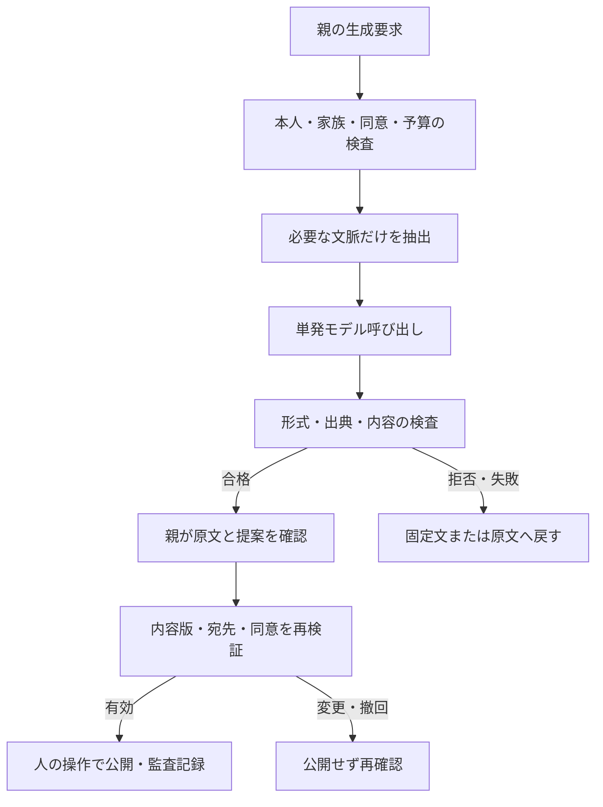

# AIサジェストと運用ハーネス v0.2

状態：DESIGN / レビュー用。以下の数値は設計初期値であり実測・契約・実装済みではない。v0.1のAI詳細を更新する。M1の土台は固定教材で完了する。AI付加層は独立フラグで無効化できる。

## 1. AIを何に使うか

| 方式 | 利点 | 問題 | 採用判断 |
|---|---|---|---|
| 固定教材・定型文 | 安定、低コスト、再現できる | 家庭ごとの表現調整は人の仕事 | 必須の基準系 |
| 限定された提案・下書き | 親の編集、次の問い作成を短縮できる可能性 | 不正確さ、確認工数、子どもの情報の取扱い | 推奨する追加層。効果は比較検証 |
| 自律エージェント・自由チャット | 広い対話ができる | 終了条件、逸脱、依存、評価・原価が膨らむ | M1では採用しない |

支払理由はAIそのものではなく、本人の判断体験を保ったまま親の準備・記録・共有負担が減ること。AIを加えて確認負担が増えるなら固定版を残す。

## 2. 機能単位の契約

| job_type | 起動 | 最小入力 | 生成するもの | 誰が確認／確定 | 失敗時 |
|---|---|---|---|---|---|
| quest_suggestion | 親が「次の体験案」 | 年齢帯、承認済み教材ID、選択テーマ、利用済み教材ID | 許可済み候補から1〜3件と理由 | 親が候補を確認、子が選択・変更・辞退 | 固定の3教材候補 |
| reflection_prompt | 親が振り返り補助を要求 | 教材ステップ、許可済み短文、使ったヒント | 中立な問いを1件、最大80字 | 親が子に示す前に確認、子は飛ばせる | 教材の固定質問 |
| newspaper_draft | 親が新聞下書きを要求 | 公開候補に選んだ同意済み本文、宛先投影済み素材ID | 見出し最大30字・説明最大160字／記事、最大3記事 | 親が原文・宛先と照合し公開。子の共有選択も維持 | 元の写真＋本人の一言の定型新聞 |
| conversation_bridge | 家族返信から親が次の問いを要求 | 許可済み返信と教材、経験／意見という出所分類 | 次に確かめる問いを1件 | 親が確認、子が選ぶ | 「何を確かめたい？」 |

初回導入はnewspaper_draftだけを評価し、同じ評価手順で残りを追加する。全機能の設計は用意するが一斉にライブ化しない。定期の自動生成、子どもへの未確認の直接生成回答、家族の代理返信はM1に含めない。将来の直接提示は別の評価と設計判断が必要。

本人が入力した原文は保持し、生成文とは別フィールドで保存する。AIが幸福感、達成感、家族の発言、実施していない行動を補完しない。S/Q等は検証用の観察仮説であり、M1ではモデルによる能力更新・進級・ヒントの自動剥奪に使わない。学習支援を減らすことと、共有・安全の許可を減らすことは別。

## 3. 二つのハーネス

**開発用**：CodexがAGENTS→状態→タスク→スキル→仕様→検査→引き継ぎを回す。製品データや本番資格情報を開発評価へ持ち込まない。

**製品内**：アプリのサーバーがモデルへの入力と出力を管理する。LLMに判断を委任しない部分を通常コードで保持する。

生成サービスにはDBの読取投影のみを渡し、書込み・通知・決済・公開・同意変更のツールを渡さない。生成本文はアプリの下書き保存サービスが保存し、公開経路とは分離する。モデルの返したIDを新規の検索権限に変換しない。

## 4. 入出力と根拠

アプリが持つ要求エンベロープ：request_id、family_id、actor_id、job_type、consent_version、artifact_versions、recipient_ids、curriculum_version、prompt_version、model_config_version、idempotency_key。
この全体をモデルへ送らない。モデル入力は年齢帯、job_type、承認済み教材の必要部分、当該用途に同意した短文とリクエスト内限定のsource_ref（s1等）だけ。

- 氏名、住所、学校、メール、正確な生年月日、自由な家族履歴、家計・口座・健康情報は投影から除外。
- M1のAIには写真・請求書・音声を送らない。写真は通常の共有機能で管理する。
- 匿名IDへの置換だけで匿名化済みと扱わない。本文に個人情報が残る可能性を評価する。
- 事実・経験・意見・未確認を入力段階で区別。祖父母の経験は現在の公的事実と置き換えない。
- 金額計算はアプリの確定的な計算を使用。教材にない料金・金融制度・商品推奨を生成させない。最新情報が必要なら「親と確認する」に戻す。

モデル出力は `contracts/ai-draft.schema.json` のみ。approval、recipient_ids、family_id、publish、reward等の操作フィールドを許さない。アプリが付ける監査・状態メタデータはモデル出力の外側に置く。
job別の意味検査：quest_suggestionはkind=questの1〜3件と許可済みtemplate_id、reflection_prompt/conversation_bridgeはkind=questionの1件・80字以内・template_id=null、newspaper_draftはheadline/captionの対を最大3記事・headline30字以内・template_id=nullに限定する。schemaとは別にこれらの相互制約を検査する。

source_refsは入力allowlistに存在するか検証し、候補教材IDも入力範囲内か検証する。構造化出力に適合しても内容が正しいとは限らないため、意味・情報漏れ・年齢適合の検査と人の照合を残す。[S1]

## 5. 状態と承認の無効化

生成要求：requested → running → ready / failed / cancelled。下書き：draft → edited → approved → published。別経路としてdraft/edited/approved → rejected / expired、published → revoked。

| 出来事 | 必須動作 |
|---|---|
| 親が本文・写真・宛先を変えた | content_versionを増やし承認を破棄、再確認 |
| 子が共有を拒否・撤回 | 公開しない／アクセス失効。親承認で上書きしない |
| 生成中に同意・家族所属が失効 | 遅延結果を保存・表示しない。再生成も禁止 |
| publishが二重に到着 | family＋操作キーの一意制約で一度だけ確定 |
| 素材が別家庭・宛先不一致 | 生成前と公開前の両方で拒否 |
| 新聞の一素材を撤回 | 該当号・派生画像を失効し、残すなら新しい版を確認 |

親の「この内容をこの相手へ送る」操作がapprovedとpublishedを一度のトランザクションで確定してよい。余分な承認ボタンを増やす必要はない。content hash、recipient set hash、素材版、consent_version、承認者を紐付ける。将来通知を導入する場合も配信workerが直前に再検証する。M1はアプリ内新着だけ。

デジタルの失効はサーバー側の全読取・画像取得・書出しに適用。既に保存された画像や印刷物を回収できると約束しない。即時失効が必要な画像は認可付き配信を使い、長命な公開URLへ変換しない。

## 6. 記憶と教材

- 家族の記憶はアプリDBの本人回答・選択・利用ヒント・返信参照として残す。モデルが推論した人格や健康を永続メモリにしない。
- 会話全履歴を毎回送らない。用途ごとに最新の許可済みレコードだけ取得する。
- 初期教材3テーマは人が審査した版管理済みデータ。M1にWeb検索、自動RAG、ベクトルDBは不要。
- 教材のsource_url・確認日・監修者を持つ。モデルの外部知識だけで教材を更新しない。
- AI結果のキャッシュはfamily＋用途＋素材版＋同意版＋宛先＋プロンプト／モデル版で分離。無効化条件を守れないならキャッシュしない。公開教材だけは家庭を越えた共通キャッシュ可。

## 7. 障害・コスト・運用

設計初期値：親の明示要求のみ、1家庭1日10要求、入力上限4,000トークン、出力800、同時生成1件、1回の要求は最大2回の試行。10秒の全体期限内で429/一時5xxのみ1回再試行、拒否・内容違反・スキーマ失敗は自動再生成しない。期限超過は破棄して固定版を出す。画面に未検査のストリームを見せない。

週予算案は1家庭50円。これは料金予測ではない。モデルと単価を決めた後、最大入力・出力と再試行分を予約し、実消費との差額を返す。価格設定が未確認ならライブAIを無効にする。通貨換算日を保存し、全家庭合計の上限も運営設定する。満額時は固定版へ戻す。

監視：要求数、job_type、モデル／プロンプト版、token数、所要時間、推計費用、fallback理由、親の採用／修正／却下、編集時間。本文・写真・金融額・APIキーは監視ログへ入れない。原文と下書きはアプリの権限制御された保存領域だけ。

保持案：未採用下書き7日、採用済み本文はアルバム規則、本文を含まない運用ログ30日、公開・撤回の監査90日。削除SLAは製品書10.4（即アクセス停止、本文30日・backup90日以内の目標）と整合し、実サービス条件を確認後に約束する。運営は原則メタデータだけ閲覧。

kill switchは全体／family／job_type別。ONにすると新規要求と待ち行列を止め、遅延結果を破棄。固定教材・原文・既存アルバムは使える。情報漏れ／未承認公開を検知したら該当機能停止→閲覧失効→監査から影響範囲確認→運営責任者へ報告→修正と同じケースの再検証。勝手に家族へAI生成の事故通知を送らない。

## 8. 評価と導入順序

`evals/ai-cases.jsonl` は24件の合成シナリオ。実行結果ではない。PLANでテスト関数と結び、モデルの単体出力評価とアプリ認可・公開経路の結合テストを分ける。システムの権限検査をLLM採点で代用しない。

1. 固定版で体験と共有の一周を実装・確認。
2. 合成素材で新聞下書きの候補モデルを比較。開発用16件／保留評価8件。保留ケースをプロンプト例へ転用しない。
3. 全24ケースを各候補構成で3回実行し、構成変更時も再評価。[S2]
4. 漏えい、無承認公開、他家庭アクセス、子の拒否無視、健康推定の重大違反は1件でも不採用。小標本で0件でも安全証明とはしない。
5. 固定文との差は親の総編集時間、修正量、事実を変えないこと、読みやすさで評価。教育効果を文章の流暢さで代用しない。
6. 設計仮説として総編集時間の中央値20%以上減、事実捏造0を候補採用条件に置く。合格しても実家庭展開は別判断。
7. 利用条件・同意・保持・責任者が確認できた家庭だけopt-in。拒否した家庭は同じ固定版を利用できる。

評価表はcase_id、model/prompt/schema/教材版、結果、根拠、token・費用・時間、reviewer、日時を持つ。採点は形式・認可を機械検査し、事実保持と年齢適合は人が原文対照。LLM judgeは補助に限る。

## 9. 未成年者と提供元の選択

提供元は未確定。OpenAIを候補とする場合、公式Under-18 guidanceには、13歳未満または該当するデジタル同意年齢未満の子どもの個人データ処理について、APIのZero Data Retention導入前に行わない旨の条件がある。[S3] 親向け画面経由でも子の個人データであることは変わらない。

現在のDESIGNでは合成評価仕様の作成と文書チェックまでで、ライブモデル呼び出しはしない。実装・評価段階への移行後にまず許可対象とするのは、合成データによる評価と個人情報を含まない一般教材の制作補助まで。実家庭の本文を外部モデルへ送る機能は初期OFF。契約・ZDR等の適用可否・対象endpoint・地域・保持・利用規約を実際に確認し、証拠と責任者を残すまでONにしない。確認不可なら固定版＋親の編集で進める。他社採用時も当該社の条件を別途確認する。

これは特定法域への法的助言や適合保証ではなく、提供元選定の技術・運用条件である。

## 10. 確認した一次資料

確認日：2026-09-22 UTC。APIのモデル名・単価は固定していない。実装時は当日の公式仕様を確認する。

- [S1] [OpenAI Structured Outputs](https://developers.openai.com/api/docs/guides/structured-outputs) — 形式適合と内容の正確性は別、拒否処理も必要。
- [S2] [OpenAI Evaluation best practices](https://developers.openai.com/api/docs/guides/evaluation-best-practices) — 目的・データ・指標を定義し変更ごとに比較する。
- [S3] [OpenAI Under-18 guidance](https://developers.openai.com/api/docs/guides/safety-checks/under-18-api-guidance) — 未成年者向けの追加条件。

上記から導いた本製品の選択（親確認、初期OFF、コスト上限等）は設計判断であり、提供元の推奨値と混同しない。
