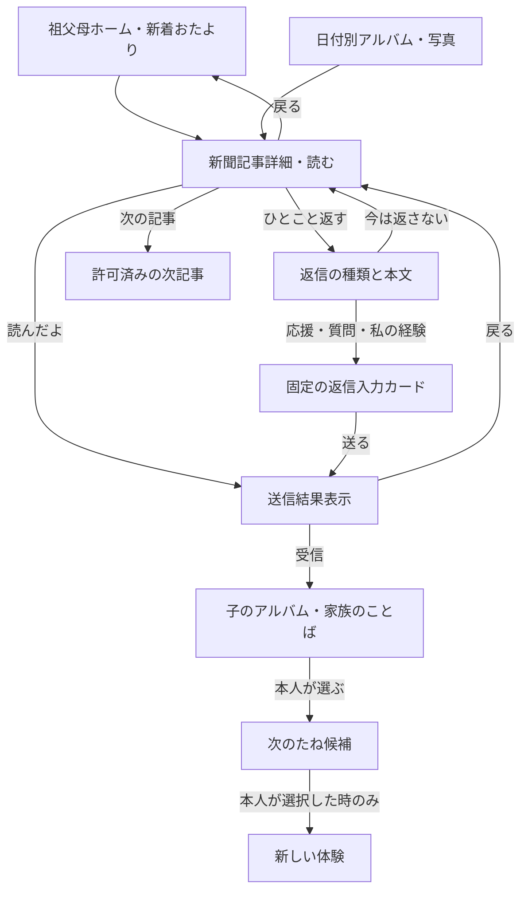

# やってみクエスト｜祖父母の新聞詳細・返信（G02/G03）設計 v1
更新：2026-10-08／系統：製品 DESIGN／成果物：固定UI画面契約・操作・状態・受入条件／ステータス：レビュー案・実装未承認

## 0. 結論と設計境界

祖父母にはインテリジェントな画面生成を行わない。**同じ見出し、同じ順番、同じ位置の操作**で、写真と本人の考えを読み、任意で返せる紙面にする。新聞の「レビュー」は**祖父母が子の選択を採点・認定することではなく、「読んだよ／応援／質問／私の経験」を返すこと**。返信しなくても読むだけで一回の体験として完了する。子のポイント・家族の承認・学習能力判定に連動させない。

このファイルは**設計書**であり、利用中のCodexの製品実装・データ通信・児童のライブAI処理を実行したものではない。親が確認した記事と宛先の範囲に限り公開する。

### 0.1 変更前に参照したGitHubの根拠

| 出典・節／画面 | 根拠として扱う内容 | 今回の設計に適用したもの・注意点 |
|---|---|---|
| `docs/design/role-experience-v0.3.md` 画面契約 G01-G04・M05/M06 | G02 写真/発見/原文/日付、拡大・印刷、戻る・次の記事。G03 読んだよ/経験/質問→送る、あとで、二重タップ防止 | G02→G03 を別操作にし、固定紙面。新聞の自動ページ送りはしない |
| `docs/design/personas-cycle-review-v0.4.md` §4 | 返信「応援・質問・経験」を分け、`source_card→family_reply→seed→chosen_action→new_experience` は子が選んだ時だけ成立 | 祖父母の返信は本人の次の問いの**候補**で、AIや祖母が子の決定を上書きしない |
| `docs/design/やってみクエスト_主要導線と表示情報_20261006.md` WF08, WF10-WF13 | 許可済みの日付別閲覧、本人の今日を送る固定入口、毎回の新聞号発行は不要、未送信・閲覧なしも正常 | G02へは号・日付別・写真一覧から同じ記事IDで入り、閲覧だけで親に作業を要求しない |
| `docs/design/やってみクエスト_アルバムと家庭のお金・報酬設計_20261006.md` アルバム・公開境界 | 子の原文・本人の判断、家族言葉、記事の許可済み再利用 | 理由の自動捏造／家計の自動公開は禁止 |
| `docs/design/ui-review-20261007.md`／`role-experience-v0.3.md` §2 | 祖父母は本文20px以上、主操作56px以上、行高1.6以上、固定ナビ、段差の少ない画面 | 文字拡大200%と狭い幅でもボタンが記事に重ならない |
| `AGENTS.md`／`yattemi-role-based-ui-design/SKILL.md` | 親・子・祖父母の役割を分ける。AIは親向け案の補助であり、許可なしの公開をしない | 祖父母は原則AI不要、固定の返信テンプレート＋本人による任意入力 |
| 代表シナリオ `docs/design/representative-household-scenarios-20261007.md`（PR #12）／統合レビュー（PR #13） | HSC-01〜03を現実の行動と分けて扱い、A/B店の比較や家族の合意は本人が報告したもの | カレーの金額・時刻・家庭科経験・祖母の好みは**合成例**。公開情報は都度選ばれた内容だけ |

## 1. 誰の、どんな成功か

| 視点 | 目的 | 不安 | 端末・状況 | 最初の成功 |
|---|---|---|---|---|
| 祖父母 | 孫の「写真」だけでなく何を考えて決めたかを知りたい。無理なく関わりたい | 文字が小さい、誤送信、返信を迫られる | スマホ／タブレット／必要時は印刷、座って読む | 記事を最後まで読めた。返信は任意 |
| 子 | 自分が選んだ理由が誤解なく伝わり、相手の経験を参考にできる | AIや親の言葉を自分の言葉として発信される／採点される | あとで自分のアルバムに戻る | 自分の公開した言葉が伝わった。返事があれば別の意見として読める |
| 保護者 | 手をかけず、内容と相手を確認して共有できる | 金額・家計・居場所・写真の無断公開 | 合間の短い確認 | 承認した同じ版のみ表示。祖母の反応で追加承認を強要されない |

## 2. 固定情報設計と画面遷移



下部の固定ナビは「**おたより／写真／元気だよ**」。詳細では親子の管理UIを混ぜない。画面を縦スクロールしても3タブの位置は変わらないが**本文を覆わない独立フッター**。内容の自動スクロール、カルーセルの自動再生、隠れた「送信」操作は禁止。

## 3. G02 新聞・写真詳細：画面の順番を固定

### 3.1 モバイル標準版のワイヤー

```text
┌──────────────────────────────┐
│ 〈 おたよりに戻る       文字を大きく A+ │  ←常設。56pxタップ
├──────────────────────────────┤
│ 10月8日｜はるちゃんから                 │
│ おばあちゃんとカレーを食べたよ           │  ←題名 26–28px
│ ┌──────────────────────────┐ │
│ │      共有を許可した写真（任意）   │ │  ←横幅いっぱい
│ └──────────────────────────┘ │
│ はるちゃんが決めたこと                   │
│ 「A店で買い物することにしたよ」         │
│                                        │
│ どうしてそう決めたの？                   │
│ 「B店は安かったけれど、帰る時間を        │
│   考えてA店にしたよ」                   │  ←本人の言葉
│                                        │
│ 実際にやったこと                         │
│ 買い物をし、家族と料理したと報告         │
│ ▾ もっと詳しく読む（許可された内容のみ）│
│                                        │
│ ── はるちゃんにお返事 ──               │
│ [       読んだよ を送る          ]      │  ←主操作56px
│ [       ひとこと返す              ]      │  ←二次操作56px
│ 今は返さなくても大丈夫                   │
│                                        │
│ 〈 前の記事       次の記事 〉            │
├──────────────────────────────┤
│   おたより   ｜   写真   ｜   元気だよ     │ ←固定フッター
└──────────────────────────────┘
```

### 3.2 表示要素と情報の出所

| 順 | 部位 | 必須 / 任意 | 根拠・表示ルール |
|---:|---|---|---|
| 1 | 戻る、文字サイズA−/A+ | 必須 | 「戻る」で一覧の**同じスクロール位置**に戻る。OS文字200%でも使用可 |
| 2 | 共有日付、投稿者「はるちゃん」 | 必須 | 記事の実際の公開日時と本人の公開名。詳細な場所と買い物時刻を既定で載せない |
| 3 | 見出し | 必須 | 子の原文・親の承認版の範囲。AIの推測を事実として見出しにしない |
| 4 | 大きな写真 | 任意 | 許可された画像IDだけ。複数なら「1/3」「前へ」「次へ」、自動再生なし。写真なしなら空白を置かず本文へ |
| 5 | **何を決めたか** | 原文にあれば必須 | 「A店にする」等の子の申告。本人未報告なら「今回の記録には選んだことは書かれていません」 |
| 6 | **どうしてそう決めたか** | 原文にあれば必須 | 子本人が話した理由を短く引用。AIの候補／祖母の経験／親の推測を本人の理由にしない |
| 7 | 何を実際にしたか | 記録のある範囲 | 「本人が〜と報告しました」と書き、レシート・写真だけで全作業を完了認定しない |
| 8 | もっと詳しく読む | 任意 | 親＋子が許可した比較データや途中の検討だけ。予算・父の迎え時刻・店の位置はデフォルトで省く |
| 9 | **読んだよ／ひとこと返す** | 必須入口 | タップサイズ56px以上。「今は返さない」が見える。星評価・点数・出来栄えの採点は置かない |
| 10 | 前/次、日付別アルバム | 必須 | 見てよい記事だけ。公開失効記事は飛ばす |
| 11 | 下部3タブ | 必須 | おたより／写真／元気だよ。親や子の画面へのロールスイッチなし |

**公開の最低条件**：`child_share_intent(article_version, recipient)` と `parent_approval(same_article_version, recipient)` が両方あり、画像ID・文面・宛先が完全一致すること。変更・撤回は一覧・詳細・印刷用データを再検証。すでに物理印刷された紙の回収はできないと明示する。

### 3.3 カレーの記事の表示例（架空）

- 題：おばあちゃんとカレーを食べたよ。
- 写真：完成した料理の写真1枚（写真なしでも成立）。
- **はるちゃんが決めたこと**：「お店を比べて、A店で買うことにしたよ」。
- **本人が話した理由**：「B店のほうが安かったけれど、お父さんのお迎えの時間を考えてA店にしたよ」。
- **本人の実行報告**：「材料を買って、家族とカレーを作ったよ」。
- **原則非公開**：A/B店の正確な金額、家族の帰宅時刻、親のルール、住所、家庭科経験、祖母の好み、家庭のポイント。許可されていない項目は見せない。
- 子が理由を話していない記事で、記事本文に「頑張って選んだ」「自分で考える力が付いた」等を自動補充しない。値段や迎え時刻を今回の理由に用いたとしても、外向きの文言は共有版の範囲。

### 3.4 3クエストそれぞれに適用（固定テンプレは同一）

| クエスト | 見出しの合成例 | 決めたこと | 本人の理由／記録の取り扱い |
|---|---|---|---|
| HSC-01 家族の約束 | 初めての献立を考えたい | 家の仕事から調べると決めた | 初回の家族の権限・制限・報酬は自動で新聞に出さない |
| HSC-02 家の調査 | 買い物前のひと工夫 | 父へ出発前に在庫を知らせる案に変えた | 本人が報告した「お店に入った後では遅い」を短い理由に。家計収入・支出は共有しない |
| HSC-03 カレー | おばあちゃんとカレーを食べたよ | B店よりA店を選んだ | 本人の「帰宅時間を考えた」を記録、具体時刻と位置は原則省く |

## 4. G03 返す：固定の3種類と具体動作

最初から自由入力を求めると返信負担が高い可能性があるため、**「読んだよ」だけで終われる**。もう一言伝えたいときだけ次の固定画面に進む。返信種別は値付け・採点ではなく、出所を守るためのラベル。

| 種別 | 祖父母の最初のタップ | 次の画面に表示する支援文（固定、AI生成なし） | 具体例 |
|---|---|---|---|
| 読んだよ | G02の主ボタン「読んだよを送る」 | 説明画面は不要、**送信中 → 受信確認後「届けました」** | 「おばあちゃんが読んだよと言っています」 |
| 応援 | G03「応援のひとこと」 | 「どんな工夫が印象に残りましたか？」＋短文の候補 | 「帰る時間も考えて選んだんだね。教えてくれてありがとう」 |
| 質問 | G03「聞いてみたいこと」 | 「何をもっと聞いてみたいですか？」＋必要なら例 | 「今度は何を作ってみたい？」 |
| 私の経験 | G03「昔の私の工夫」 | 「自分がやってみたことを教えてください。今でも同じとは限りません」 | 「私はお肉が余ったら小分けに冷凍していたよ」 |

### 4.1 返信カード（応援／質問／経験）

```text
〈 新聞にもどる
はるちゃんへのお返事
[ 〇 応援 ][ 〇 質問 ][ 〇 私の経験 ]  ←3行の大きい固定項目
------------------------------------------------
私の経験：
「私はお肉が余ったら小分けにして
　冷凍していたよ」
[文を直す] [音声で話す※任意]
------------------------------------------------
送る相手：はるちゃん（家族内）
[この内容を送る]
[今は返さない]
```

- 種別を選ぶだけでは送らない。例文を選んだだけでも送らない。入力内容と宛先の確認表示後に「この内容を送る」を押す。テキスト入力の音声補助は**本人が読み直して修正してから送る**。
- 本人の文章を「よくできましたね」とAIが勝手に採点文へ変換しない。代理入力なら「○○さんが入力しました」を付ける。必要時はいつでも自由文・短文無しの「読んだよ」へ戻れる。
- 親の事前記事共有承認が必要なのは**子の記事**。祖母本人の成人発信は本人の意思で、常に親へ毎回の代行編集を要求しない。ただし送信先・家庭への参加権限の確認は維持する。
- 子に届く表示：「おばあちゃんの**経験**」「おばあちゃんからの**質問**」「**応援**」として分ける。祖母の推測を家族全員の事実や学習成績に置き換えない。
- 子の「次のたね」に載せるのは、返信の出所・記事ID・版を添えた**任意の候補**。子が「次に試してみる」を自分で選んだ時だけ新しい体験として記録。相手へ採用結果を自動通知しない。

### 4.2 ボタンの厳密な状態遷移

```text
G02 opened
  ├─ [読んだよを送る] → sending → ACK後 sent_read → 完了表示 → G02
  │                    └→ fail → unsent ＋ 再試行（メッセージは消さない）
  ├─ [ひとこと返す] → G03 (kindを選ぶ) → draft → preview → sending
  │                                       ├─ ACK → sent_reply
  │                                       └─ fail → unsent ＋ 再試行
  └─ [今は返さない] → G02でそのまま戻る／次の記事
```

- 送信操作には `article_id, published_version, recipient_family_id, sender_id, kind, body, client_action_id` を持たせ、一意な `client_action_id` によって二重タップ／通信再試行で同内容を二重送信しない。
- 完了表示は成功ACK後のみ。送信中はボタン二重押し不可、戻った場合は下書きを保持して未送信として復帰できる。送信失敗時に「届いた」と表示しない。
- 「読んだよ」は**祖母が明示的にタップした時だけ**送る。ページを開いただけで既読を監視・送信しない。祖母の未返信を異常扱いしない。
- 同じ記事に何度も返信することはできるが、「読んだよ」の連打で重複イベントは作らない。
- 返信の撤回・編集の可否と相手に既に読まれた場合の扱いは、成人本人の操作権限とデータ保持仕様として次の設計で確定（未決を実装事実として扱わない）。

## 5. 一つの返信を次の子どもの体験に接続する（自動採用しない）

実例（すべて合成）：
1. 祖母が新聞で「B店よりA店を選んだ理由」を読む。
2. 祖母は G03「私の経験」を選び、「私は余ったお肉を小分けにして冷凍していたよ」と送る。
3. 子の C04／アルバムに「おばあちゃんからの経験」と表示される。
4. はるの画面の選択肢は「**次の体験で確かめたい**」「あとで読む」「今回は使わない」。ここで「次は2日分なら？」と本人が選んだ時だけ次回の種として残す。
5. 返信を無視してもポイントや体験進行に影響はない。祖母の経験を現在の食材保存の正解と断定する教材へ昇格しない。

## 6. 状態別表示・導線の欠落を塞ぐ

| ID | 状態／異常 | G02/G03に表示する内容 | 操作 |
|---|---|---|---|
| GP-01 | 記事に写真がない | 画像枠を空で残さず、題・本人の言葉から始める | そのまま読む |
| GP-02 | 本人が理由を書いていない | 理由を生成せず「この記録には理由が書かれていません」 | 読む／任意の質問 |
| GP-03 | 新しい記事がない | 「新しいおたよりはまだありません」／過去アルバム／元気だよへ | 過去を見る |
| GP-04 | 相手への公開が取り消された／版が変わった | 「この記事は現在表示できません」／写真・本文は隠す | 一覧へ戻る |
| GP-05 | オフライン・サーバー失敗 | 「送信できていません」。本文保持・再試行 | もう一度送る／あとで |
| GP-06 | ダブルタップ | 1度だけ受理。送信中はボタン無効 | 結果待ち |
| GP-07 | 祖母が返事をしない | 未返信を赤字・警告・督促にしない | そのまま閉じる |
| GP-08 | 代理入力 | 誰が代わりに入力したか明記 | 本文確認・送信 |
| GP-09 | 写真が3枚 | 1/3を表示、左右大ボタン。スワイプ無しでも使用可 | 前の写真／次の写真 |
| GP-10 | 文字200%・幅320px | 本文折返し、1列、下部ナビが内容を覆わない | すべて読める |
| GP-11 | 音声入力不可 | 文字入力または読んだよで完結 | 別の手段 |
| GP-12 | 素材が印刷済 | デジタル失効は反映しても印刷物の回収はできない | 状態の説明 |
| GP-13 | 返信本文が空 | 空の文章は送信せず、「読んだよ」か後で選ぶ | 送る内容を書く |
| GP-14 | 子のクエストが未完 | 実行済み表現をしない。本人が公表した現状だけ読む | 任意で応援 |
| GP-15 | 子の家計・報酬が存在 | 許可外の数字・住所・予定・通学情報は出さない | 私的記録を守る |
| GP-16 | 祖母の経験が届いた | 本人の次回候補。強制進級／ポイント付与なし | 子の選択に任せる |

## 7. UIと動作の契約（Codex向け）

- 画面型：`G02_NewspaperDetail` と `G03_Reply`。汎用カード構成は同じでも祖父母専用の固定レイアウト。AIによる画面部品生成なし。
- タイポグラフィ：本文 **20px以上／行高1.6以上**、タイトル 26〜28px目安。返信本文入力も20px以上。祖父母の主操作 **56px以上**、戻る・写真切替・選択も可能なら56px。見出しに意味のある階層をつける。
- 色：プロジェクト共通の `#FFFDF7`（背景）／`#172B2A`（本文）／`#176B5B`（主操作）／`#EAF4F0`（補助）。コントラストは実レンダリングで検査。文字サイズ・OS設定を尊重する。
- 写真：自動送りなし。画面回転や派手な紙面アニメを使わない。写真の代替テキストは家族に承認された短文のみ。写真を見せる／見せないも元の許可範囲で検査。
- M05：記事切替は 120ms以下のフェード、動きを減らす設定では即切替。読書位置を戻りで維持。M06：押下反応100ms程度、**通信成功後にのみ送信済み表示**。
- 下部タブは独立したフッター（読書領域の高さを確保する）。重なる fixed オーバーレイで本文を隠さない。過去のAndroidレビューで問題になったのはこの重なり。
- 固定の「おたより／写真／元気だよ」はG02からでも開けるが、確認していない家族の写真を広く見せない。写真一覧は公開済み素材の索引。
- 「元気だよ」「歩数」操作はこの詳細内のボタンと混ぜず、別タブG04で行う。子へのお返事と祖母自身の近況は別イベント。
- **非AIベースライン**：定型の新聞構成・本人原文の抜粋・祖母の定型操作のみで完結させる。祖母自身の経験を生成AIで代筆しない。固定文面で足りない場合のみ後段検証。
- ロールの切替スイッチはレビュー用HTMLにはあっても、本番データの親・子の認可を切り替えない。

### 記事表示モデルの例（案）

```json
{
  "article_id": "article-demo-dinner-01",
  "source_card_id": "quest-hsc03-demo",
  "approved_version": 2,
  "recipient_family_member_id": "grandma-demo",
  "shared_at": "2026-10-08T12:00:00+09:00",
  "author_label": "はるちゃん",
  "title": "おばあちゃんとカレーを食べたよ",
  "approved_media_ids": ["photo-demo-01"],
  "what_i_chose": "A店で買い物することにしたよ",
  "child_reason_quote": "B店は安かったけれど、帰る時間を考えてA店にしたよ",
  "child_reported_result": "材料を買って、家族とカレーを作ったよ",
  "approved_optional_detail_ids": [],
  "publication_status": "published",
  "reply_policy": { "read_ack": true, "free_text": true, "allow_types": ["support", "question", "experience"] }
}
```

**安全境界**：このJSONは構造例であり実行するAPI契約ではない。全て合成レコード・ダミーID。DB保持期間・返信の撤回・印刷・多世帯共有の法務面は未確定。親が内容と宛先を承認して初めて本人の意図した素材が配信される。

### 受入確認（合成試験 + 後日ユーザー観察）

- G02-01：最初の5秒で「写真」「子の判断理由」「返す」が分かるか（実祖父母で未検証）。
- G02-02：共有済み article_id 以外のURL直アクセスを拒否できる（要本番認可試験）。
- G02-03：子の理由が未入力ならAIが補わず「理由なし」と出る。
- G02-04：共有版に含まれない金額・迎え時刻・家庭状況はDOM・印刷・API返却にも含まない。
- G02-05：写真なし・複数枚・紙面なしでも記事とナビが成立する。
- G02-06：前/次・戻るを使って読書位置を保存、許可を取り消された記事へ行けない。
- G02-07：320／360／390／768px、文字200%、OS動き低減で本文と主ボタンを覆わず押せる。
- G03-01：「読んだよ」だけで完了し、未返信者を催促しない。
- G03-02：応援／質問／経験を選ぶだけでは送信しない。
- G03-03：祖母の自由文と宛先を見せて明示送信。失敗なら未送信で文章保持。
- G03-04：同じ `client_action_id` での送信再試行が1イベントになる。
- G03-05：送信成功まで受信・時刻を表示しない。
- G03-06：親の活動ポイントと送信状況は独立し、返信でPが増えない。
- G03-07：返信が子へ出所付きで届くが、次のクエストを勝手に決めず、祖母へ採用状況を自動返送しない。

## 8. 実装順の提案（親の負担を増やさない）

1. **固定の記事閲覧G02**：許可済み記事の読み取り・写真・本人の選択理由・前次/戻る・公開失効。AIなし。
2. **ワンタップの「読んだよ」G03**：本人の送信ACKと二重タップ防止。
3. **応援・質問・経験の返信G03**：編集・宛先・未送信・再試行。
4. **子のC04へ受信し、任意の次のたねを本人が選ぶ**：出所ラベル／非採用の自由。
5. **写真一覧・文字拡大・印刷と失敗系を完成**。新聞号発行は追加の任意機能でありG02の閲覧前提にしない。

仕様確定が要る項目：子側で祖母の自由文をいつ誰が見られるか、返信撤回・削除期間、成人の代理入力証跡、印刷・共有されたコピーの扱い、複数祖父母への宛先単位の通知頻度。**未決を既に実装されている仕様として扱わない。**

## 9. 実証上の不確実性

公開資料は「祖父母がこのレビューを使い続ける」「本人の理由を読むと家庭内の行動が増える」ことを証明していない。まず既存のコンセプト画面で、祖父母が①記事を読了できる②何を考えて決めたか説明できる③任意の返信を自分で送れる④返信したくない時に負担がない、を観察する。途中で援助が必要だった箇所と、本文文字拡大・主ボタンへの到達までの操作数を記録する。
