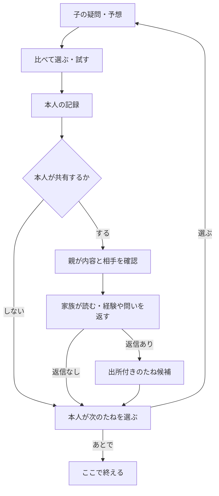

# 三者三様の体験とAIの必要性：再レビュー v0.4

状態：DESIGN／設計改訂案。2026-09-23。実装・家族調査・教育効果の結果ではない。
今回の依頼：APIでAIを組み込む意味を検証し、子どもの面白さ、三役の違いと統一性、家族循環から現行案を見直す。

## 1. 結論と現行案の欠点

AIは必須ではない。ただし「本人の自由な疑問／家族の経験を、次に確かめられる候補へ結ぶ」場面には検証価値がある。三つの教材から選ぶだけ、金額計算、画面遷移、共有許可には通常コードで十分。新聞の短文化は第二優先へ下げる。

| 発見 | 現行の根拠 | 問題 | 改訂・受入ID |
|---|---|---|---|
| 子の画面が入力フォーム中心 | v0.3 C02／見本は問い＋回答例＋次へ | 自分が試して結果を変える感覚が薄い | 探索→予想→比較→選択→現実で試す→発見帳。UX41 |
| 子は自分の問いから入りにくい | C01に「たね」はあるが実行導線が曖昧 | 出題を消化するサービスに寄る | 「これ、なんで？」保存→本人が焦点を選ぶ→監修済み候補。UX42 |
| 親確認がすべての小さな支援に必要 | AI v0.2では全候補を親確認 | 毎回親待ちで体験が止まる | 監修済みヒント／候補の表示と、共有・新規生成文・実支出の承認を分ける。UX43 |
| 祖父母が読むだけになりやすい | 見本は読んだよ中心 | 経験や問いが次の判断を変える仕組みが弱い | 経験／質問／応援を区別し、子が次のたねへ採用。UX44 |
| AIの価値が文章整形に寄っている | 初回評価job=newspaper_draft | 核の「次の行動」「支援を減らす」と遠い | next_action_matchを合成評価の第一対象へ。AI41 |
| 共通カード＝共通体験になっている | 三役が同じ構造の縦カード | 子の探索と祖父母の読書を両立できない | 意味・部品を共通にして、構成と表現量は役割別。UX45 |

これは専門家視点の設計レビューであり、「子どもがつまらないと答えた」という調査結果ではない。

## 2. ペルソナは仮説として分ける

年齢だけで操作能力や好みを決めない。以下は調査前の仮説。初期教材帯は小4〜6を維持し、小4と小6で受け取り方を別に確認する。

| 観点 | 子：小5・10〜11歳の探索好きという仮説 | 親：合間に使う養育者という仮説 | 祖父母：別居しスマホを使う成人という仮説 |
|---|---|---|---|
| 本人の目的 | 自分の疑問を確かめ、選んだことを誰かに話す | 教材準備や採点をせず、任せられる範囲を増やす | 孫の考えを知り、自分の経験が役立つ |
| 嫌なこと | 宿題、長文入力、子ども扱い、AIが先に正解を言う | 承認通知の山、毎回教師役、家計公開 | 小さい字、どこを押すか不明、返信ノルマ |
| 入口 | 3つの探索場所と「これ、なんで？」 | 要対応とただの共有を分けた確認トレイ | 1号の便り、子が選んだ理由が読める紙面 |
| 価値のある一操作 | 予想と違った点を選び「次はこれ」を決める | 内容・相手・変更点を見て一度で送る | 自分の経験を一言返す／今回は読むだけ |
| AIの許容位置 | 求めた時の選択肢整理。主役にしない | 自由文の整理・新聞の短文化を必要時だけ | 原則AI不要。本人の経験や声を代筆しない |
| 成功の証拠 | 自分の理由を説明し、次に確かめることを選ぶ | 確認のための実作業が短く、勝手に公開されない | 本人の経験を返せる。子が後で共有した時は次の問いへのつながりも知れる |
| 必要な別ケース | 読むのが苦手、無口、ゲーム嫌い、共有端末 | 一人親、複数養育者、忙しい、デジタルが苦手 | 祖父母不在、視力・運動の制約、複数家庭、PC／紙 |

## 3. 子ども向けの面白さを操作に落とす

推奨は「暮らしの探検帳」。本物の生活で発見し、自分で比較して決める楽しさを中心にする。全面3Dゲームや自由会話のAI相棒はM1に不要。かわいい絵を付けるだけではUX41を満たさない。

| 動機の仮説 | 実際の画面・操作 | 体験の意味 | 採用しない誘導 |
|---|---|---|---|
| 気になる | C01：水・お店・家の仕事を表す探索カード。気づきの持込みも同列 | 自分で入口を選ぶ | 「本日の義務」、毎日連続記録 |
| 予想したい | C02：短い予想を先に残す。「まだ分からない」も選べる | 結果との違いが生まれる | AIによる先回り回答 |
| 自分で動かしたい | 比較対象を選ぶ。ドラッグする見せ方には同じボタン操作を用意 | 条件で結果が変わる | 正解を押すまで先に進めない |
| 自分らしく残したい | C04：観察・選択・理由を本人の発見カードに。表紙色を任意選択 | コレクションが本人の思考履歴になる | 金額／回数でレア度・能力順位をつける |
| 家族に影響したい | 家族の経験を読む→確かめたい点を選ぶ | 次の体験の起点になる | 返事の催促・未返信の罰 |
| できるようになりたい | ヒントは閉じて開始、必要なら同じ場所から呼べる | 主導権を子へ返す | 成功判定でヒントを剥奪する |

具体例（架空価格、購入不要）：300円の予算。Aは200mlで180円、Bは400mlで260円。「飲みきれる量」「量あたりの値段」「残すお金」を子が比較軸として選ぶ。Bの方が単位量あたり安くても、Aや今回は買わないを選ぶ理由がある。アプリは残額等の計算だけ行い、最適解を採点しない。商品名・実価格の推薦ではない。水の体験も残し、ホームで題材を変えられる。

画面は1場面1つの主操作。選択用の複数ボタンは同格の入力であり、主操作と混同しない。長文入力を必須にせず、自由記述は短文・選択・「分からない」で代替。音声入力や撮影は追加費用・同意があるためM1の必須にしない。幼児向けキャラクターを高学年全員に押し付けない。

動きは既存M01〜M07を使用。比較値の変化は即時、意味のある発見の記録でだけ短い強調。読む間に動かさない。演出完了を操作条件にしない。操作量や滞在時間を増やす目的で演出を作らない。

## 4. 家族の循環を閉じる

共有しただけでは循環完了と数えない。`source_card → family_reply → seed → chosen_action → new_experience`を、本人が採用した時だけ結ぶ。順序通り進める義務も、全部を毎回埋める義務もない。

最初の体験の完了と、返信を起点に次の体験を記録した家族循環の成立は別イベントにする。採用結果を祖父母へ自動通知しない。C04で子が改めて選び、P02の確認を経て共有された場合だけG02へ届く。共有しなくても返信した人へ失敗・未採用と表示しない。

例：祖母「昔は飲み物を瓶で買っていた（私の経験）」→子「今の容器で違いはある？」→承認教材の「同じ量と容器の表示を比べる」を選ぶ。昔の記憶を今の価格や環境効果の事実へ変換しない。選ばれなかった返信は失敗扱いしない。

| 渡す場面 | 欠けやすいもの | 画面で補う | 返信・参加なしの場合 |
|---|---|---|---|
| 子→親 | 選択理由と共有意思 | 原文、今回選んだこと、宛先を同じ確認面へ | 記録だけで一周完了 |
| 親→祖父母 | 活動写真だけで本人の考えが見えない | 予想／選択／理由を短い本文に | 未読催促しない |
| 祖父母→子 | 助言・命令・事実の混同 | 「経験」「質問」「応援」等の出所ラベル | 固定の次の問いを使える |
| 子→次の行動 | 返信を読んで終わる | 「これを確かめたい」「別のこと」「あとで」 | 親・本人の問いから続ける |

新聞作成は任意のまとめ方。共有済みカードを読むことと、親が毎回新聞を編集することを結び付けない。同じ素材の版・宛先のまま定型新聞へまとめる場合は親の最終送信操作1回。意味や宛先の変更があれば子の意思を取り直す。

## 5. Google・Amazonから採用するもの

公式の設計体系を参照し、このプロジェクト向けスキルに手順化する。「Google公式Codexスキル」「Amazon公式子どもUIスキル」を導入したとは称さない。配布スキルの存在は未確認である。

| 一次資料 | 採用する原則 | 実装への落とし込み | そのまま移植しない点 |
|---|---|---|---|
| Google Material 3 [S1] | 色・文字・形を意味のあるトークンで共有 | 共通token→role variant→component。状態の意味を統一 | Androidの数値・部品をWebへ機械的に移すこと |
| Google PAIR [S2][S3] | 非AI比較、本人の主導権、失敗からの復帰 | AI判定表、理由／変更／スキップ、固定候補へ戻す | AIを入れること自体の成功扱い |
| Amazon Working Backwards [S4] | 顧客の変化から逆算し仮説を確かめる | 三役の目的・一操作・成功／撤退条件を書いてから画面を作る | 社内書式を増やすだけの運用 |
| AWS Cloudscape [S5][S6] | 再利用可能な部品・状態、AIの制御と表示 | 親の確認、原文と提案、失敗と再試行を同じ部品に | AWS管理画面の密度を子の画面に移すこと |
| UNICEF RITEC [S7] | 選択・達成感・創造・関係性を子の視点で扱う | 予想と発見、自分の表現、任意の家族循環 | 本製品での教育効果を証明したと扱うこと |

採用したUI部品ライブラリはまだない。GoogleとAWSの部品を混在させるのではなく、同一トークンと自前の小さな部品契約を使う。

## 6. 統一性をCodexが守る契約

- 共通token：`color.surface/onSurface/action/onAction/status.*`、`type.body/title/label`、`space.*`、`radius.card`、`motion.*`。生の色・時間値はトークン定義以外に散らさない。
- role variant：子は探索と選択、親は確認対象と差分、祖父母は読みやすさ。役割ごとに本文サイズと密度を変えても、保存・共有・取消の意味は同じ。
- 共通部品：ActionCard、ChoiceGroup、ArtifactStatus、SourceLabel、ConsentSummary、SuggestionPanel、EmptyState。各部品にdefault/loading/empty/error/disabled/revokedの該当状態を用意する。
- SuggestionPanelは`origin=fixed|ai_matched|ai_draft`を表示。固定候補をAIと表示しない。生成文と家族の原文を混ぜない。
- 別role・教材を追加する時はmanifestとvariantで対応。安全・認可・同意をtheme設定に入れない。

## 7. 何を確かめれば採用できるか

初期の評価案は子6人（小4〜6各2人）、親6人、祖父母等4人程度。人数は探索的な不具合発見用で、効果・市場性の統計的証明ではない。保護者同意と本人の参加意思を得て、途中辞退を認める。家庭調査はまだ実施しない。

| ID | 課題 | 合否の設計案 |
|---|---|---|
| UX41 | 探索→予想→比較→本人選択 | 子6人中5人以上が主操作を説明し開始、4人以上が選んだ理由を自分の言葉で説明。詰まった箇所は人数にかかわらず修正 |
| UX42 | 自分の「なぜ？」から始める | 候補を別にする／保留できる。AIの文章を本人の回答と誤認しない |
| UX43 | 親の負担 | 1件の共有確認の実操作中央値60秒以内を暫定目標。確認なしの公開0。必要な介入を隠して時間短縮しない |
| UX44 | 返信→次の体験 | 返信→たね→本人選択→新たな体験記録を出所と版付きで追跡。未返信・祖父母不参加でも最初の体験は完了。採用結果の非共有を尊重 |
| UX45 | 統一性・可読性 | role別360/390/768px、200%文字、キーボード、動き抑制。操作や情報の欠落0 |
| AI41 | AI vs固定案 | AI41の詳細はAI v0.4。採用率だけでなく独力の選択、親の手間、誤り、費用を比較 |

楽しさは、笑顔や操作回数だけで推定しない。「どこが面白かった／嫌だった」「次もやりたいのはなぜ」を本人に尋ね、次回の任意選択と照合。長い滞在やAIへの質問増加を自立の指標にしない。

## 8. 出典と原資料

確認2026-09-23。原理の採用は設計判断。数値の目標は各社の標準値ではない。

- [S1] https://developer.android.com/codelabs/m3-design-theming
- [S2] https://pair.withgoogle.com/chapter/user-needs/
- [S3] https://pair.withgoogle.com/chapter/feedback-controls/
- [S4] https://aws.amazon.com/executive-insights/content/product-management-at-amazon/
- [S5] https://cloudscape.design/about/
- [S6] https://cloudscape.design/gen-ai/
- [S7] https://www.unicef.org/innocenti/projects/responsible-innovation-technology-children

照合した原資料：GAKUSTA_事業統合正本_20260821 E-6/E-7/E-8、追加再調査の3-1〜3-7／4-2〜4-3。問い・本人の言葉・家族経験・支援を減らす思想を回復する。一方、旧案のAIによる能力採点・自動進級は、現在の検証不足からM1に戻さない。原資料の「唯一の正本」は最新ユーザー指示より優先しない。
