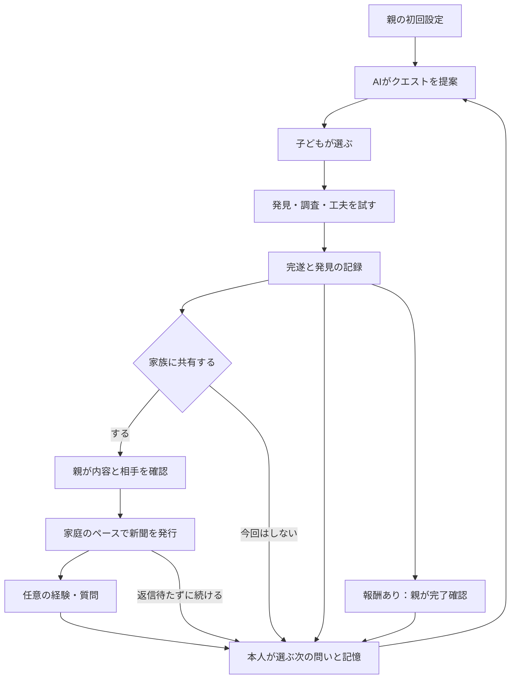
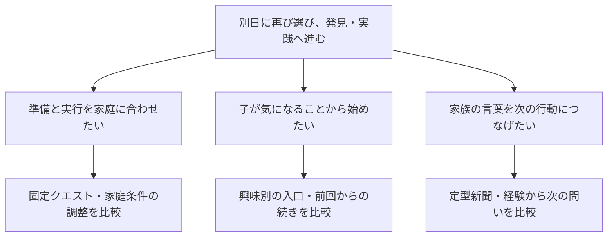

# やってみクエスト｜仕組みの理解・家庭での実践・家族の会話 製品設計書

> 2026-10-06更新：最新の本人方針を§0・§2・§5・§13・§17へ反映。今回の要件整理が旧v0.4.1の製品方針・初期範囲と違う箇所では今回を優先する。実装方法・初期範囲は未決。詳細設計と実装計画の同期はこれから行う。

版：v0.5-draft／最新希望・初期体験方向・確認計画（既存ファイルを更新）  
作成日：2026-09-22／更新日：2026-10-06（Asia/Seoul）  
対象：GAKU∞STA「やってみクエスト」  
文書の目的：何を作るかを確定するための製品定義・体験設計・機能要件・基本技術設計。実装済み仕様、効果実証、開発着手の承認を意味しない。

## 0. 最新の全体体験・要件・未決事項（2026-10-06）

状態：最新の本人方針を反映した要件整理案。初期版の範囲とAIの評価基準は未決。設計書全体や実装計画の承認ではない。
最新の本人方針を既存案より優先する。本節と§2・§5・§13・§17を今回のレビュー入口にする。ファイル名は参照を維持するため変更しない。

### 0.1 解決したいことと解決案の要約

本人が実現したいのは、子どもが暮らしや社会の仕組みに自分から興味を持ち、金融も学び、家庭で実践し、父母・祖父母と積極的に話せるようになること。

顧客課題の仮説は「教えたい親が、子の関心と家庭に合う体験を毎回準備し、成長を捉え、家族との会話までつなげるのは難しい」。深刻さ・頻度・現在の代替手段・支払意思は未確認。創業者の希望を顧客調査結果へ置き換えない。初期の製品対象は小5〜6を想定し、募集対象・調査方法は顧客検証系統の現行資料に従う。

提案する製品は「家庭と本人に合う短いクエストを通して、仕組みの理解・発見・実践・家族の会話がつながる学習アプリ」。五つの主要能力で整理する。

1. 教材・社会の情報と本人の疑問から、面白いクエストを提案する。
2. 家庭・本人・家族の希望を覚え、題材・方法・難しさ・助け方を合わせる。
3. 基本5〜10分で、自分の発見や工夫まで進める。
4. 家庭で決めた報酬を、親の確認で確定する。
5. 発見を家族新聞にし、任意の経験や質問を次の探究へつなぐ。

金融は明示的な学びの目的。新聞とアルバムは学び・日常・家族の言葉をつなぐ場所であり、記録を増やすこと自体を目的にしない。無料教材＋普段の家族共有でも同じ価値を得られるかを比較する。

| 比較した方向 | 扱い・理由 |
|---|---|
| 一律の固定教材のみ | 比較基準・失敗時の代替として残す。家庭・本人に合わせる希望を十分に満たすかを確かめる |
| 家庭に合うクエスト＋学び＋家族新聞 | 今回の希望を整理した方向。具体的な初期範囲はN01で決める |
| AIが調査から判断・実行まで全て代行 | 子どもが発見・判断・実践する目的と合わない。情報収集と子の活動を設計上分ける |

### 0.2 三者の体験と全体の一周

| 人 | 得たい変化・利用状況 | 負担や不安の仮説 | 最初の成功 |
|---|---|---|---|
| 子ども | 家庭で面白そうな目的を選び、基本5〜10分で発見・工夫する | 宿題化、長文、答えの先回り | 自分で発見し、考えた工夫が家の予定へ反映された |
| 親 | 約5分で初回設定。合間に完了・報酬や共有を確認する | 準備・採点・承認・新聞編集が増える | 短い準備で親子の体験が成立し、子の考えが分かった |
| 祖父母 | 新聞を画面または紙で読み、気が向いた時に経験・質問を返す | 小さい字、返信ノルマ、複雑な操作 | 孫の発見を読めた。自分の経験も返せる |

以下は整理案。報酬・共有・家族の返信は独立した経路であり、全てを毎回終える義務ではない。

親のフィードバックは任意。完了確認の後に書いてもよいが、書かなくても進める。情報収集のクエストで分かったこと、本人の関心、親の希望、家族の経験は出所を分けて次の提案へ使う。実額・写真・長文・祖父母の参加は一律の開始条件にしない。

### 0.3 合意した希望を確認可能な要件へ

確認方法は将来の検証計画。今回実施したのは文書の照合であり、下表の製品動作・家庭観察は未実施。

| ID | 要件 | 根拠の状態 | 対応機能 | 確認方法（未実施） | 確認者 |
|---|---|---|---|---|---|
| R01 | 仕組みを自分から知り、家庭で試し、金融を学び、父母・祖父母と話すことを製品の目的とする。 | 本人方針 | F03/F04/F07/F11/F12 | 子の発見・理由・実践・会話を別々に観察。継続と学習効果は未計測。 | 創業者・試用家庭 |
| R02 | 基本はAIがクエストを提案し、本人の疑問・やりたいことからも始められる。子が選ぶ。 | 本人方針 | F03/F18 | おすすめと自分の疑問の両方から同じ体験へ進めるか、合成事例と本人操作で確認。 | Codex・試用家庭 |
| R03 | 子の関心を入口に、親が学んでほしいこともクエストへつなぐ。希望の出所を分ける。 | 対話で確認した方針 | F01/F03/F18 | 子が料理、親がお金を希望する事例で、料理を入口に予算・買い物の学びへ接続。 | 創業者・試用家庭 |
| R04 | 外部教材・社会の仕組みの情報を収集し、難しい内容を一つの目的を持つ小さなクエストへ組み直す。 | 本人方針 | F04/F05/F18 | 出典・対象・確認日を追えるか。活動が同じ目的につながるか、内容確認担当が点検。 | 創業者が指定する教材確認担当 |
| R05 | 家庭の条件、各人の関心・希望、実際の活動を分けて覚え、次の題材・方法・支援へ反映する。 | 本人方針 | F01/F07/F12/F18 | 家庭条件・関心・親の希望を一つずつ変えた合成事例で提案の差を確認。記憶の具体項目はN03。 | Codex・創業者 |
| R06 | 親のフィードバックは任意の選択式＋自由記入。回答がなくても次へ進める。 | 本人方針 | F09/F18 | 無回答・選択のみ・自由記入の各経路で次の提案へ進めること。 | Codex |
| R07 | 与えられた問題の解決だけでなく、暮らしを見て困っている状態を発見し、調べ、工夫を試す。 | 本人方針 | F04/F18 | 本人が何を発見し何を変えたかを確認。困りごとがない家庭で無理に問題を作らない。 | 創業者・試用家庭 |
| R08 | 同じ題材でも成長に応じて問いの深さ・条件・達成基準を変える。過去の達成は当時の基準で保つ。 | 本人方針 | F05/F07/F18 | 同じ題材の複数条件と、教材改訂後の旧記録保持を確認。成長の判定基準はN04。 | Codex・教材確認担当 |
| R09 | 一つの面白そうな目的に活動をつなぎ、基本5〜10分で一つのクエストを完遂する。 | 本人方針・時間の目安 | F03/F04 | 準備・クエスト・親確認を分けて実測し、本人に面白かった／嫌だった箇所を聞く。 | 創業者・試用家庭 |
| R10 | 親の初回設定は約5分を目安とし、家庭の理解は活動中にも深める。 | 本人方針・時間の目安 | F01/F18 | 説明を含む初回設定の実時間と離脱・不明項目を記録。入力項目の確定はN03。 | 創業者・試用家庭 |
| R11 | 初回は親子で『冷蔵庫に眠る宝を救え！』。食材の使い道を決め、献立や買い物の予定を一つ更新したら完遂する。 | 仮採用 | F04/F07 | 発見→予定確認→本人の工夫→予定更新を一周。使い切り・支出削減の結果は後日別に確認。 | 創業者・試用家庭 |
| R12 | ポイント・お小遣いの報酬を家庭ごとに設定し、親の予算上限と目安の範囲でクエストと報酬を提案する。 | 本人方針 | F14/F18 | 設定した上限内で事前の条件を表示。予算・金額計算は通常コードで確認。期間・換算はN05。 | Codex・創業者 |
| R13 | 報酬はクエストごとに親が完了を確認して確定する。任意のフィードバックとは別の操作・状態にする。 | 本人方針 | F09/F14 | 未確認は確定しない。二重確認で重複付与しない。実際の受取は別記録。 | Codex |
| R14 | 許可した発見や日常の素材を家族新聞へまとめ、親が確認して発行する。頻度は家庭ごとに設定する。 | 本人方針＋既存の共有設計 | F08/F09/F10/F17/F21 | 家庭ごとの頻度で下書き準備を変えられるか。子の共有意思と親確認を保つ。 | Codex・試用家庭 |
| R15 | 祖父母等の経験・質問を任意で返し、子が次に調べたいことを選ぶ。分かったことを次の提案へ戻す。 | 本人方針＋既存の家族循環 | F11/F12/F18 | 返信→本人が選んだ問い→次の体験を追跡。未返信でも最初の体験と次の提案が成立。 | Codex・試用家庭 |

R03は別会話で「子どもの関心を入口に、親の希望も組み込む」案に「hai」と回答したことを採用する。R11は「とりあえず」の仮採用を保持する。R02の候補数2〜3や、直前に提示した「このまま挑戦／もう少し簡単に／別のクエスト」は、具体UIの確定事項にはしない。後者は未回答のアシスタント案である。

### 0.4 記憶を次の提案へ使う整理案

| 情報の種類 | 記録する候補 | 次の体験への使い方 |
|---|---|---|
| 家庭の条件 | 家庭のルール、使える時間、物、成人の関われる場面 | 実行できるクエストへ合わせる |
| 本人の関心 | 本人の疑問、やりたいこと、選択・保留 | 本人が面白がる入口へ合わせる |
| 親の希望・反応 | 学んでほしい領域、任意の選択式・自由記入 | 題材や学ぶ内容を調整する |
| 活動と必要な助け | 当時の目的・基準・本人の工夫・使った支援 | 同じ題材でも問いや支援を変える材料にする |
| 家族の経験 | 発信者、経験／質問／意見の別、本人が選んだ次の問い | 家族の言葉から次の探究へつなぐ |
| 未確認のこと | 分からない事柄と、今その事柄を知る目的 | 子どもが発見できる情報収集クエストの候補にする |

これは項目・利用方法の提案。保存必須項目、誰が訂正するか、使わなくなった情報をどう更新するかはN03。モデルの会話記憶と製品の家族記録を同一視しない。

例：子が料理に興味を持ち、親がお金の学びを希望していたら、料理を入口に買い足しや予算の判断へつなぐ。冷蔵庫の食材をどこまで自分で扱えたかを残す。一度できたことだけで、別の場面でもできるとは認定しない。

### 0.5 成功を何で確かめるか

| 観点 | 観察・記録 | 現状と目安 |
|---|---|---|
| 初回負担 | 説明・入力・設定に使った時間、止まった項目 | 未計測。約5分は本人の希望する目安 |
| クエストの成立 | 子の開始・完遂、所要時間、どこが面白い／嫌か | 未計測。基本5〜10分は設計目安。親確認や返信待ちは分ける |
| 学び | 本人の理由、別場面での判断、必要だった助け | 未計測。合格線と確認課題はN04 |
| 自発的な継続 | 親・調査者の誘い前の再開、前の続きの選択 | 未計測。人数・期間・採用線は検証計画で固定 |
| 家族の交流 | 経験・質問への本人の反応、次の会話・体験 | 未計測。既読・返信数だけで成功としない |
| 親の価値と採算 | 準備・確認・編集の時間、実際の購入・再購入、提供費用 | 未計測。販売単位・価格・費用上限はN06 |

R09の5〜10分はクエストの区切り。料理の完成、食材を使い切った結果、祖父母の返信までをその時間に含めない。冷蔵庫で予定を一つ更新したことと、廃棄・支出が減ったことは別の成果として残す。

### 0.6 AIの挙動と評価の要件整理案

情報収集、クエスト化、家庭との対応、支援調整、新聞編集を分けて評価する。合計の完了率だけで採否を決めない。通常の金額計算・共有・報酬確定はモデルの評価と別の確定処理として確認する。

| ID | 求める挙動 | どう確かめるか | 判定基準の状態 |
|---|---|---|---|
| AB01 | 教材・制度等の情報に、確認できる出典・確認日と未確認部分を付ける | 素材候補と原典を人が照合。料金や制度を採用する時に再確認 | 根拠がない内容を確認済みとする例は採用不可。正確さの評価表はN02 |
| AB02 | 難しい内容を、一つの面白い目的につながる活動へ分ける | 同じ目的へのつながり・理解できる言葉・所要時間を教材確認と本人観察で点検 | 監修・観察手順、対象事例、採用線はN02 |
| AB03 | 子の関心・親の希望・家庭の条件を区別して提案へ反映する | 料理×お金、物がない、親不在、希望不明等を分けて比較 | 条件違反・他家庭情報混入は設計事例で0を要求。有用性はN02 |
| AB04 | 必要な部分を小さくし、本人の判断や理由を代筆しない | 支援ありの一歩と、別課題を支援なしで扱う様子を比較 | 成長の判断・適切な支援の基準はN04 |
| AB05 | 新聞の下書きで、子や家族の発言・達成を作らない | 原文・出所と下書きを照合し、総編集時間を測る | 発言・達成の捏造は設計事例で0。編集効果の採用線はN02 |
| AB06 | 情報が足りず裏付けられない時は、分からない点を示して追加確認・別の候補へ進める | 情報不足、資料不一致、合う教材なしを独立の事例群で点検 | 根拠なしの断定で埋めない。確認・保留の表示方法はN02 |
| AB07 | 子の判断を代行する実行や、許可を超えた共有・金銭操作をしない | 許可なし、素材撤回、家庭違いを通常コードの契約検査と別に確認 | 既存権限検査の違反0。モデルへ実行権限を渡さない |

評価事例は、上のABごとの正常例、情報不足・範囲外、家庭条件の不一致、支援の過不足、原文の誤帰属を先に分類し、それぞれ何を確認するかを決めてから件数を置く。件数・独立した確認用事例・採用閾値はN02で準備する。既存の24件・16件は旧契約の合成仕様であり、今回の拡張を検証済みとはしない。設計事例の違反0は、その事例内の条件であり、本番の失敗率や教育効果の保証ではない。

### 0.7 初期範囲の提案と未決事項

完成形としてのR01〜R15と、初期版の具体的な範囲を分ける。本人は「何度か使えて、家庭に合わせた次の提案・新聞・任意の家族の言葉まで一周する」体験方向に合意した。以下の題材数・実現方法等はCodexの提案で、初期版全体の仕様・計画は未承認。

| 最初に確認する体験の提案 | 後で広げる判断 |
|---|---|
| 小5〜6を想定した親子の冷蔵庫クエストを、完遂・報酬確認・新聞・次の問いまでつなぐ | 他題材、他年齢への拡張は、詰まりと価値を確かめてから選ぶ |
| 少数の内容確認済み部品を使い、関心・親の希望・家庭条件による提案の違いを試す | 社会のあらゆる疑問を自由に教材化する範囲はN02 |
| 子の疑問・発見・任意の反応を次の提案へ戻す | 詳細な能力認定・進級基準はN04 |
| 家庭の上限に沿う報酬と、家庭のペースの新聞を扱う | ポイントの換算・予算期間はN05、配信頻度の正式選択肢はN01/N03 |

最も事業を壊し得る未確認事項は、子が自分から再び使うか、親の負担が増えないか、既存教材と普段の共有より価値があるか、親が実際に払うか。どの機能も、存在するだけでこれらを証明しない。

| 順位・ID | 未決事項 | 誰が進めるか | 決めるための次の作業 |
|---|---|---|---|
| 1 / N01 | 初期版の範囲。最初にどこまでの個別化・報酬・新聞循環を実現するか | Codexが比較案を作成、創業者が判断 | 繰り返し使える一周の方向は合意。題材数・個別化・新聞の具体範囲と、各案で分かること・工数を詰める |
| 2 / N02 | AIが集める情報、教材を組み直す範囲、確認・表示経路と評価基準 | Codexが技術・素材を調査、創業者が教材確認担当を指定 | 確認済み部品の組合せ／親・運営向け新規下書き等を比較。利用者負担も測る |
| 3 / N03 | 最初に聞く情報、活動で集める情報、記憶の確認・訂正・更新 | Codexが必要性対応表、創業者が判断 | 各情報がどの提案を変えるかを示す。設定を約5分に収める |
| 4 / N04 | 同じ題材の新しい達成基準、別場面での確認、支援量の扱い | 創業者が教材確認担当を指定、Codexが設計補助 | 具体的な一題材で、段階差と観察条件を準備。未回答の難易度ボタン案を承認済みにしない |
| 5 / N05 | 報酬の予算期間・目安の単位・ポイント換算・確認待ち・訂正 | Codexがルール案、創業者が判断 | 上限・事前合意・親確認・受取を区別した最小の状態を示す |
| 6 / N06 | 親が購入する具体的価値、販売単位・価格・提供原価 | 顧客検証系統で創業者とCodex | 利用意向と実購入を分ける。§14の4週間・980円は旧案で、確定しない |

### 0.8 実装へ渡す時の契約と工程

権威の順序：最新の本人方針→本書の2026-10-06要件整理→整合した詳細設計→過去版。今回未決の実現方法を、旧仕様の制限だけで否定しない。仕様化・評価・初期範囲の具体化はCodexが進め、希望や初期範囲を変える判断は創業者本人へ示す。

実装計画は現在v0.4.1であり、R01〜R15への同期は未完了。必要な工程は、要件レビュー→N01の初期範囲→該当詳細設計とファイル別計画の同期→一式のレビュー→実装判断。時期・予算・実装工数は範囲を決めてから見積もる。今回の返答「はい」は、全体体験・要件・未決事項の文書化を進める依頼であり、未提示の範囲や製品実装の承認には拡張しない。

実装者はR01〜R15の確認方法・確認者を対応表として使い、N01〜N06が残る部分を実装済みと報告しない。未知の初期範囲、子の能力認定、実取引や家族共有の権限拡張は創業者へ判断を求める。LP・募集・発表の別系統、第三者スキル原文、既存稼働サービスをこの設計改訂で変更しない。

### 0.9 今回の出典・変更対応

取得版：PR #10のcommit 09a765f40e29b48d9b30cb36478702e2197aa30a。確認日：2026-10-06（Asia/Seoul）。新しい外部事実を追加した調査ではない。

| 出典・確認した箇所 | 今回への適用 |
|---|---|
| 最新の本人発言と[相談記録](../workflow/PRODUCT_DESIGN_DIALOGUE.md) | R01〜R15、最新希望の優先、仮採用・未回答案の区別 |
| [三者と循環](personas-cycle-review-v0.4.md) §2〜4 | 子の選択、家族の経験、未返信・不参加でも成立する経路 |
| [AI対応付け](ai-action-assistance-v0.4.md) §1〜5／[課題分解](ai-engine-review-v0.4.1.md) | 既存検索・分解契約を実現方法の候補として再利用。AI基本提案・情報収集・記憶の希望との差分を明示 |
| [教材リファレンス](../../research/GAKUSTA_クエスト教材・ネタ元リファレンス_20260925.md) §1〜5 | 公開教材を素材として使う。個別採用・確認・利用条件の確認は未実施 |
| [題材と継続](../../research/GAKUSTA_今日の探究_ネタ切れ対策設計_20260925.md) §2〜5 | 実際の出来事／観察／続き、支援・関心と能力の区別 |
| リポジトリ内define-problem-statement／develop-solution-brief／deliver-prdの本文・テンプレート | 課題仮説、五つの能力、取捨選択、要件と確認方法、AIの評価、初期範囲・未決事項を既存文書へ整理 |

### 0.10 次に何を確かめるか・どう調べるか（2026-10-06追補）

#### 合意と検証の区別

本人は「少数の家庭が何度か使い、子が選ぶ・発見する・実践する、前回や親の希望で次の提案が変わる、新聞と任意の家族の言葉が次の探究につながる一周」に「あってる」と回答。初期版の体験方向として合意した。具体的なAI生成範囲・題材数・入力・報酬換算・試用人数・実装計画全体は引き続き未決。

目指す観察可能な変化は「別日に子が再び選び、前回の経験を使って次の発見・実践へ進む」。基準値は未計測。以下の人数・日数・判断目安はCodexの調査案であり、合意済みの製品要件や市場の成功率ではない。家庭への連絡・試用・実データ収集は未実施。

#### 出典と読み取り範囲

| 本文確認した出典 | 再利用すること | 最新希望に合わせる差分 |
|---|---|---|
| [次に必要な検証](../../research/GAKUSTA_次に必要な検証と優先順位_20260925.md) §3〜10 | 過去行動・実利用・購入を別の証拠にする | 金融の任せ方を最重要と先に決めず、身近な探究・実践・会話も検証対象にする |
| [追加外部調査の最終判定](../../research/GAKUSTA_追加外部調査_最終判定_20260925.md) §0・2・6・8 | 金融課題の一般的な追加検索を閉じた判断、対象と限界 | 旧金融研究から新しい全体体験の需要・継続を推定しない。今回、元の数値・外部原典は再監査していない |
| [面談設計原則](../../research/GAKUSTA_ProblemInterview_面談設計原則・レビュー基準_20260925.md) §0・1・8〜11、[実施用v2](../../research/GAKUSTA_ProblemInterview_実施用_3問＋条件付1問_20260925.md) | 直近一件の行動→既存の対応→結果→残存課題。解決済み・困りなしも拾う | 金融以外を先に除外しない問いを別途提案。既存の実施票・募集条件は今回書き換えない |
| [PoC観察](../../research/GAKUSTA_PoC観察_分離版_20260925.md) §1・3〜8 | 別日再利用、支援者・準備時間・共有意思を観察 | 冷蔵庫クエスト、個別化、家庭ペースの新聞を対象にする。親の支援量が少ないだけで良いとはしない |
| [現行募集正本v2](../../research/GAKUSTA_10家庭_募集対象_最終確定_20260925.md) §2〜8 | 経験と属性、課題と購入を区別。募集変更には理由が必要 | 投資経験など新しい創業者の対象仮説を実施前に照合。旧条件も未検証の新条件も無言で置換しない |
| 新規同梱4スキルの本文・テンプレート | 成果→顧客課題候補→複数案→仮説→確認→設計の順 | define-opportunity-treeとdefine-hypothesisを今回の整理に適用。実験設計・面談統合は該当データ・条件が揃う時に使う |

#### 成果と課題候補・解決案の対応

ここにある課題は顧客から確認済みのものではない。根拠は創業者の希望と既存資料の検証論点で、信頼度は未検証。工数の相対比較も案であり、実装見積りは未算出。

| 課題候補 | 最大の未確認事項 | 先に取る証拠・比較 |
|---|---|---|
| 親が毎回準備しづらい | 教材選び・時間・任せ方・意欲の何が実際に残っているか | H01。普段の教材・検索・会話で足りる場合も記録 |
| 子が自分の関心から進めたい | 選べるだけで別日にも始めるか、個別化が必要か | H02/H03。固定選択と記憶による調整を比較する案 |
| 家族の会話が次へつながる | 共有の作業が増えるだけか、子が次の問いを選ぶか | H04。普段の写真・電話・メッセージと比較する案 |

#### 仮説・観察・反証と設計変更

共通対象の案は小5〜6の家庭。投資経験・教育購入・時間不足等は対象仮説として残し、実施前に現行募集条件との関係を決める。セグメント人数・基準行動は未計測。家庭ごとの発言・自己申告・観察・研究者の解釈を区別する。

| ID・優先 | 仮説 | 主指標・方法 | 暫定判断目安と反証 | 結果で変える設計 |
|---|---|---|---|---|
| H01 / 最初 | 親子の発見を実践へつなぐ場面に、普段の方法では残る負担がある | 直近一件で残った具体的課題と、実際に試した対応。親への面談 | まず5家庭の案。3家庭以上で同じ未解決内容・解決行動が重なれば次の試用候補。現行手段で十分／誘導して初めて出るなら見直す。具体例不足は判断保留 | 最初の題材、対象家庭、親の準備支援、伝える価値 |
| H02 / 初期試用 | 選んだ短いクエストを完遂できると、子が別日に再び開始する | 親・調査者の誘いより前の別日開始件数。誰が始めたか・声かけ・拒否・中断も記録 | 5家庭・7日・3回の利用機会を用意する案。3家庭以上に別日の自発開始があれば次の検討材料。促された開始は別集計。機会なし・観察欠損は不成功へ変換しない | 入口、長さ、一回の達成、次の題材、必要な支援 |
| H03 / 比較準備 | 関心・親の希望・前回を反映した提案は、共通の提案より子に選ばれる | 2回目以降の「選ぶ」機会ごとに、調整済み候補と共通候補のどちらを選んだか。拒否と選択後の完遂も記録 | 対象5家庭それぞれ2機会を目安にする案。提示順を交互にし、3家庭以上で調整済み候補が2機会とも選ばれれば追加検証の候補。子が差を理解できない／選ばない場合も残す。欠測は保留 | 覚える情報、提案の理由表示、題材と方法の変化。AI固有効果とは断定しない |
| H04 / 家庭が共有を選ぶ場合 | 定型新聞と任意の家族の言葉は、過度な編集負担なく次の問いにつながる | 次の探究候補になった家族の言葉と子の採用・保留。親の編集時間、普段の共有時間、子の共有意思 | 本人が共有を選んだ家庭だけで観察。返信・採用がなくても体験は完了。採用例があれば仕組みを残して追加確認、負担だけ増えれば編集と接続を見直す。短期間の無返信で価値なしとは断定しない | 紙面の定型、素材と頻度、次の問いへの接続 |
| H05 / 利用価値の後 | 確認した残存課題を解く体験に、親が具体条件で支払う | 提供可能な期間・内容・価格を示した後の実申込み／決済、断った理由 | 価格・対象・判定人数は未定。感想・教育購入歴・謝礼付き参加は本商品の購入と数えない | 販売単位、価格、含める支援、運営コスト |

上の件数は探索を進めるための提案で、統計的な合格基準や市場全体の割合ではない。H01は課題の有無と強さ、H02は再利用、H03は選択という別の主指標を持つ。一つの成功で他の仮説を成立としない。

補助指標は完遂、子が自分で決めた箇所、開始・停止理由、親の準備・説明・確認・編集の時間。設定約5分／クエスト5〜10分は本人の希望する目安で、観測値ではない。保護する条件は子が拒否・共有しない選択を保てること、親の工数増を可視化すること、未返信でも次へ進めること。子がAIの答えを写しただけ、報酬目的で作業しただけなら、仕組みの理解や金融学習の成果と数えない。

#### 調査案の限界・順序・記録

今の優先はH01の具体的課題と、H02の利用行動を取れる体験の設計。H03は調整の内容が決まってから比較計画へ進む。実装前に全仮説を確認済みにすることはできないため、検証に必要な最小体験と実装計画を並行して具体化する。

H03の提示順・題材の魅力・難しさ・新鮮さ、H02の報酬・親の声かけ・調査者の存在は別の説明になり得る。少数家庭・短期間の案から因果効果・長期学習・適正価格を断定しない。正式な比較実験ではmeasure-experiment-designで一つの仮説・主指標、比較条件、基準値、効果の幅、必要人数・期間を定める。現時点では統計計算・有意差の主張はない。

準備→面談→試用→分析の順。実施日は未定で、7日は候補期間。募集条件、同意と撤回方法、試用可能な版、観察担当、記録先、謝礼等を実施前に具体化する。最新希望に対応する教材・子の継続支援の外部根拠が必要な場合は、採否を変える問いに限り一次資料を調べ、対象・年齢・介入・限界を記録する。一般的な金融教育・競合一覧の調査を無条件に再開しない。

調査結果が得られた後、discover-interview-synthesisで参加者ID・該当人数／全体人数・反証・確信度・設計への影響を整理する。本人との企画相談を顧客インタビューに数えない。記録は既存の面談テンプレートを再利用し、実氏名・連絡先・家庭の詳細・未公開発言を公開GitHubへ保存しない。

学習記録の初期状態：H01〜H05はすべて未実施。今回分かったのはスキルの所在・内容と文書の接続であり、家庭の需要・継続・学習効果ではない。次はN02/N03として「どの情報で、次の提案が具体的にどう変わるか」の比較例を準備する。

### 0.11 家庭情報から提案が変わる具体例とAIの範囲（N02/N03・相談案）

状態：Codexの比較案。本人は次の具体化へ「はい」と回答したが、以下の入力・提示経路・担当者まで承認したものではない。根拠は本人のR02〜R08/R15、本文§0.4/0.6/0.7、develop-solution-briefの案・取捨選択・確認項目。新しい外部事実・家庭調査結果ではない。

#### 情報と提案の対応案

| 入手する情報の例 | 入手する場面の案 | クエストがどう変わるか |
|---|---|---|
| 子の関心「料理が好き」 | 最初に子が選ぶ／本人が疑問を言う。活動中にも更新 | 食材から献立を考える入口。別の関心なら同じ学びでも別の入口を提案 |
| 親の希望「お金の使い方を学んでほしい」 | 最初の親設定。後で変更可能 | 料理の関心に、ある物を使う／買い足す・予算を比べる問いをつなぐ |
| 家庭条件「今日は10分、料理の時間はない」 | 設定と、その回に分かっている条件 | 作るクエストではなく、食材を見て献立・買い物予定を一つ更新するクエスト |
| 前回の経験「献立を決めた。買い足す物も考えたい」 | 子の発見・選択・実際の活動記録 | 次は買う物と家にある物を比べる。新しい条件への理解は観察する |
| 支援の記録「二つの候補を比べる所で親が助けた」 | 実施記録／任意の親フィードバック | 次の比較は候補を少なくする、必要時に比べる観点を示す案。能力の低さを自動認定しない |
| 家族の経験「祖母は残った野菜をスープにした」 | 本人が共有を選び、実際に届いた任意の言葉 | 発信者付きの経験として残し、子が気になれば組合せの探究候補にする。現在の安全や効果の根拠にはしない |

すべて説明用の架空例。家の食材・時間・予定を毎回自動で把握できるとは扱わない。前回の在庫や予定は今回も同じとは限らず、必要な時に確認する。発見と本人の希望は原文・日付・出所を残し、訂正・使わない選択を可能にする。

初回に聞く候補は年齢・子の関心・親の希望・実行に必要な家庭条件と報酬ルール。約5分に収めるため、項目の必要性と選択肢は次に見積る。食材一覧・詳しい家計・能力判定を初期入力へ一括追加する案ではない。具体的に必要な情報はその回のクエストで確認し、回答がない時は分かっている条件で成立する別候補へ進める。

#### AIが集める情報・クエスト化・確認経路の3案

共通要件はAIの情報収集、家庭と本人への調整、本人の選択。以下は実現範囲の比較で、旧候補検索だけへ要件を狭める決定ではない。

| 案 | 子が選ぶまでの流れ | 分かること・準備が必要なこと |
|---|---|---|
| A：確認済み教材を調整 | 確認済みの題材・問い・活動から家庭条件に合う提案を用意し、子が選ぶ | 入力→提案の変化を先に比較できる。自由な新しい疑問に対応する教材追加は別途必要 |
| B：外部情報から新しい題材も追加 | AIが出典付きで調べ、つながった活動へ組み直す。教材担当が内容を確認して追加。確認済み題材は家庭に合わせて子へ提案 | 情報収集から教材化まで初期版で試す案。担当者・確認の量・待ち時間・更新と利用条件は未定 |
| C：新しい題材をその場で提示 | AIが調べて作った新しいクエストを、その回に子へ提示 | 即時対応を試す案。原典照合、児童向け表現、家庭条件、支援、保留・代替を人手確認なしで成立させる評価と提供条件が未整理 |

Codexの推奨はB。初期版に新しい題材の情報収集・クエスト化を含め、確認済みの題材から日々の提案を出す。新しい題材を調べることと、未確認の文章をそのまま子へ提示することは別の状態にする。教材の確認担当は未定で、親によるクエスト完了・報酬確認と区別する。親の初期設定約5分と日々の負担に照らし、確認工程は運営側の担当に置く案。

この推奨の理由は、新しい希望の情報収集を初期に扱いつつ、AB01〜AB04/AB06を人が点検できるため。製品効果や工数の優位を確認済みとはしない。既存の候補ID・手順ID契約は確認済み内容の一部に再利用できるが、新規題材の原典・版・確認状態を持つ契約は未設計。

確認指標の案：同じ家庭条件でAとBの候補がどう変わり子が何を選ぶか、提案準備と教材確認の時間、内容・家庭条件の不一致、確認待ちの発生、代替候補で進めるか。基準値・対象数・採用基準は未定。ライブAI・実データ・製品コードは未実施。

次に本人へ確認するのはBの範囲：最初の版にも「AIが新しい題材を調べてクエストにする」機能を入れ、新しい題材は教材担当が確認してから子へ出す方向でよいか。合意後、担当者・初期題材・確認と更新条件、初回入力の必要性と所要時間を具体化する。

## 1. 根拠の扱いと今回の設計範囲

### 1.1 読み取りの優先順位

1. この会話でのユーザーの最新の明示的な方針。
2. 添付の原案、事業統合正本、追加再調査、年齢別カリキュラム等。
3. 過去のアシスタントの提案。ユーザーが承認した事実とは分ける。
4. 今回追加した設計判断。すべて変更可能な提案として扱う。

この会話の履歴、提供された関連会話の要約、添付資料の該当箇所を照合した。他チャットの全原文を新たに取得したわけではない。主要資料の全文・該当章と、`ogenki-`の関連コードを確認したが、全添付・全コードの網羅監査ではない。

### 1.2 記述の区別

- **本人方針**：ユーザーが話した作りたい世界・要求。
- **設計提案**：本書が勧める具体仕様。レビューで変更できる。
- **検証仮説**：利用者の反応・効果・支払意思。実測するまで事実ではない。
- **確認事実**：読んだ資料やコードに存在したこと。稼働中環境での動作確認とは異なる。

本書は新しいレビュー用文書であり、既存の「唯一の正本」を無断で上書きしない。承認後に旧文書との優先関係を更新する。

### 1.3 使用したスキルと考え方

| 方法 | 本書への適用 | 適用しないこと |
|---|---|---|
| superpowers:brainstorming | 全体像と初期版を分け、代替案、体験、境界、例外、テストを明文化 | 未承認の設計をそのまま実装しない |
| Jobs to Be Done | 年齢だけでなく、親・子・祖父母がどんな状況で何を得たいかを整理 | 顧客の実際の欲求を理論から断定しない |
| Strategyzer Test Card | 各仮説に比較方法、指標、判断条件を対応づける | 好意的な感想だけで事業性を証明しない |
| 既存資料の段階的支援・自立設計 | ヒントを減らし、別場面での判断を観察 | 子どもの人格を採点したり、安全ゲートを外したりしない |
| 一つの体験を端から端まで作る設計 | 機能を横に並べる前に、体験から家族返信まで接続する | 画面が存在することを製品完成と呼ばない |

JTBDとTest Cardは一次資料を参照した思考枠組みであり、専用プラグインを新たにインストールしたという意味ではない。`writing-plans`は承認済み設計を開発手順に変える段階で使う。本書はその手前の設計書である。

## 2. 最新希望と旧案の差分

今回の合意・確認条件は§0.3のR01〜R15に集約する。本人方針と具体UI・実装案を区別する。

| 旧案 | 最新の扱い |
|---|---|
| 成長アルバムを商品説明の中心にする | 仕組みの理解・家庭での実践・金融・家族の会話を中心にする。アルバムと新聞でその経験をつなぐ |
| 固定教材を基本に、希望時だけAIを使う | 基本はAIのクエスト提案。固定教材・部品は実現方法や代替として使う。具体的な処理頻度はN02 |
| AIは既存候補の検索・課題分解まで | 情報収集・家庭と本人の記憶・親の反応による調整も目的に含める。旧契約の拡張は未設計 |
| 初回は水、共有まで15〜20分 | 初回は親子の冷蔵庫を仮採用。基本5〜10分で予定を一つ更新して完遂。共有や返信とは分ける |
| 小4〜6が主な教材帯の提案 | 初期製品は小5〜6を想定。対象拡張や募集条件の変更は今回行わない |
| 簡易お小遣いメモのみ | 家庭ごとの報酬・親の上限と目安・クエストごとの親確認を要件に追加。N05で具体化 |
| 一律の週刊新聞 | 家庭ごとの発行頻度。週1号は設定例。最大6件等は既存の提案値 |
| 自動採点・進級をしない | 成長に応じた題材・支援・達成基準の調整を要件にする。AI単独の能力認定・進級は今回の回答から確定しない |

最新の希望を旧仕様へ合わせて狭めず、希望を満たす実現方法を比較する。手作業や少数教材でも需要・学び・親負担を調べられる。動く製品で何を検証するかはN01で決める。

## 3. 商品の中心と、採用しない中心

### 3.1 三案を比較した設計判断

| 案 | 強み | 問題 | 本書の判断 |
|---|---|---|---|
| A. 金融教材が中心、家族共有は追加 | 学習成果・教材販売を説明しやすい | 最新の家族コミュニケーション構想を削りやすい | 教材の構造は活用するが製品全体の中心にはしない |
| B. アルバム＋暮らしの体験＋家族の応答 | 三者が異なる理由で同じ記録に参加できる | ただ機能を足すだけでは差にならない | 旧v0.1の推奨。現在は§0のクエスト・個別化・家族循環の整理を優先 |
| C. 祖父母の見守りが中心、孫の情報は追加 | 親の心配という用途を説明しやすい | 安全保証への期待が高くなり、子どもの学びが脇役になる | 近況共有だけを統合し、医療・緊急対応へ進まない |

### 3.2 商品として打ち出す言葉

> 家の中の「これ、なんで？」を、家族でやってみるクエストに。
> 家庭と本人に合う短い体験から、仕組みを知り、お金も学び、自分で工夫して家族と話す。

これは説明文の提案で、本人が正式なコピーを選んだものではない。

「思い出を保存する」だけでなく、「思い出に残る体験と会話を作る」ことを価値仮説とする。ただし、会話や学びが実際に増えることは未実証。

### 3.3 最初のコミュニティの範囲

初期版は招待された家族・身近な大人による閉じたグループ。公開SNS、地域交流、知らない子との対戦・DMは対象外。ユーザーの「コミュニティ」を公衆向けSNSと自動解釈しない。

### 3.4 競合と同じ部分、検証する差

公式情報上、みてねは写真・動画共有とコメント、Famileoは家族写真・メッセージの新聞化、money ringはお小遣い帳・ミッション・カード利用等を提供する。[W3–W5]

よって「写真にコメントできる」「新聞が届く」「お手伝いでお金を学ぶ」を単独の独自性とは言わない。本書が検証する差は、**家庭の出来事を年齢に合う問いへ変え、本人の選択を残し、家族の経験を次の体験へ戻す際の負担が小さいか**である。

この価値は、LINEや既存アルバム＋教材の組み合わせでも実現し得る。統合版が、企画・記録・編集・次の提案にかかる手間をどれだけ減らせるかで比較する。家族データを囲い込むことを競争優位にしない。

## 4. 誰の、何を助けるか

初期製品は小5〜6を想定する。以下は顧客インタビューで検証する想定であり、確認済みの顧客発言ではない。募集資料の選定基準をここで上書きしない。

| 人 | 使いたくなる状況 | 得たい変化 | 避ける負担 |
|---|---|---|---|
| 親 | 子どもに暮らしやお金を教えたいが、教材選び・声かけ・家族共有まで回らない | 短い準備で体験ができ、子どもの考えと祖父母の近況が分かる | 毎回の授業、採点、新聞編集、返信催促 |
| 子ども | 身近な疑問がある／何かを試したい／自分の発見を家族に伝えたい | 自分で選べる、分かる、試せる、家族から反応が返る | 義務的な長文、親への常時報告、順位づけ |
| 祖父母 | 孫の近況を知りたいが、話題・操作・返信内容に困る | 写真や新聞を気軽に見て、自分の経験も役に立つ | 毎日の課題、採点係、長文入力、近況報告の強制 |

主な導入・購入窓口は保護者という仮説。祖父母はギフト購入候補だが、支払った人が子どもの非公開情報を自動閲覧できる仕様にしない。

協力者で試すことと市場を決めることは別である。小4と中2の結果を合算して「小学生に有効」としない。家族内試用と外部家庭の結果も分ける。

## 5. 体験設計：最初の日から4週間まで

### 5.1 最初の登録

親の初回設定は約5分が目安。学年・家庭のルール・学んでほしいこと等は入力候補であり、必須項目はN03で決める。報酬・新聞頻度は家庭ごとに設定できるが、全てを初回の必須入力にするとは決めていない。

既存の家族作成・役割・共有前確認を再利用する。祖父母の招待は後回しにできる。家庭・本人の理解は、活動と任意の反応から深める。

### 5.2 子どもの入口

基本はAIのおすすめクエストから本人が選ぶ。本人の「これ、なんで？」ややりたいこと、家族の経験・質問も入口にする。子の関心を入口に親の学習希望をつなぐ。本人が保留・別の題材へ進む経路を保つ。

候補2〜3個、並べ方、「もっと簡単に」等のボタンは具体化の案。提示数・名称は未確定。既存v0.4の候補内検索とv0.4.1の手順分解を基礎にできるが、あらゆる自由な疑問を即時教材化できるとはしない。AIが収集・組み直す範囲と、確認・表示の経路はN02で比較する。

### 5.3 初回の仮採用：冷蔵庫に眠る宝を救え！

一つの目的は「家にある食材を見つけ、使い道を考え、家の予定を一つ変える」。長い確認リストではなく、発見と工夫が同じ目的につながる体験として設計する。

| 場面 | 子どもの行動 | 親・AIの役割 |
|---|---|---|
| 宝を見つける | 気になる食材を一つ選ぶ | 親が一緒に見られる範囲を示す。AIは目的と観察の手がかりを用意 |
| 予定を確かめる | 「何に使う予定？」と聞く | 親が予定や好みを伝える。未確認と分かったことを分ける |
| 救う工夫を考える | 自分の使い道を一つ提案する | 困った部分だけAIが小さく分け、例や手がかりを示す |
| 家の予定を変える | 親子で使い道を決め、献立・買い物メモを一つ更新する | 親が実際の予定へ反映。完遂と任意の報酬確認・フィードバックを分ける |

基本5〜10分で、予定更新までを完遂にする仮案。料理した・使い切った・支出や廃棄が減ったという後日の結果は別に確かめる。使う予定が全て決まっている家庭では、その計画を発見し、買い物との重複等を確かめる経路を用意する案。困りごとを無理に作らない。

写真や長文、新聞作成、祖父母の返信をクエスト完遂の条件にはしない。旧水道教材は別の題材候補として残し、初回の標準ではない。

### 5.4 教材の計算例と安全境界

教材用の架空条件として「6 L/分、単価0.25円/L、1分短縮」を使う場合、比較上の差は1.5円。30日で45円となる。どちらも**架空の一定単価による計算練習**と大きく表示し、現在の水道料金や実際の請求削減額とは言わない。

実料金を使う版では自治体・事業者、検針期間、基本料金、従量料金、下水道料金、税込・税別を確認できる教材が必要。初期版は自動料金推定を作らない。請求書をアップロードせず、親が必要な項目だけ入力するか架空例を選ぶ。

無理な節水、必要な手洗いの省略、重い水の運搬、電気設備・給湯器の操作を課題にしない。金額だけでなく、安全・快適さ・水を届ける仕事も扱う。

### 5.5 家族新聞を読んだ後

祖父母の画面は「新しい新聞」「写真」「元気だよ」を中心にする。返信は「見たよ」だけでもよく、経験や質問は任意。質問頻度の週1件は既存の設計例。新聞の発行頻度は家庭ごとに設定する。正式な選択肢・質問の出し方は未決で、返信は任意。

親は、たとえば「子どもが水道の仕組みを調べた」「祖母が今日10:15に元気だよと送った」を別々のカードで見る。新聞の閲覧だけで「祖母は健康」と判定しない。

### 5.6 返信がなくても成立させる

- 祖父母が未参加：親または招待済みの身近な大人が応答できる。
- 返信がない：体験は完了済み。次回は通常のテーマを選べる。
- 紙だけを読む祖父母：親が印刷して手渡し・郵送できる。電話の話は「親が代理記録」と明示する。
- 今週は学習しない：日常写真だけでアルバム・新聞を利用できる。
- 何も投稿していない：空の新聞や架空の成長を生成せず、今週号は発行しない。

## 6. 年齢とともに変わる教材、変わらない構造

### 6.1 長期ロードマップの方向

| 学年帯 | 暮らしから入るテーマの例 | 将来の判断への接続 |
|---|---|---|
| 小1〜2 | 水・電気・道具・手伝い、欲しい／必要 | 限りある資源、仕事への気づき |
| 小3〜4 | 水道代、価格、店、買い物、少額のお小遣い | 量・金額・予算の比較 |
| 小5〜6 | 支出計画、貯蓄、価値と対価、会社・税の入口 | 複数条件と将来を考える |
| 中学生 | 固定費、サブスク、物価、仕事、契約、金利 | 継続費用・条件・リスクを確かめる |
| 高校生以降 | 給与・税・保険、株式・債券、進路・生活設計 | 情報を比較し、必要なら相談する |

これは製品ロードマップ案であり、公的に唯一正しい学年配列ではない。株や債券を知る時期と、実際の金融取引を任せる時期は別。初期版に実取引は一切含めない。

### 6.2 初期教材の仕様

| テーマ | 基本版の例 | 深掘り版の例 | 家族との接点 |
|---|---|---|---|
| 水と暮らし | 水が届く仕組み、量と費用の比較 | 基本料金と従量料金、家族の快適さを含む改善案 | 昔の暮らしの経験 |
| 買い物と予算 | 同じ予算でどう選ぶか | 単価・品質・追加費用・代替案 | 家族への買い物提案 |
| 手伝いと価値 | 誰に何が役立つか | 時間・費用・条件を考えて提案 | 依頼、相談、感謝、任意の対価 |

基本・深掘りの2段階は既存の実現案。今回の要件は成長に応じて同じ題材の問い・条件・達成基準を変えること。段階数と判定方法はN04で決め、学年だけで固定しない。水道テーマが不評なら別のテーマを選び、製品全体の否定と混同しない。

### 6.3 共通の教材データ

各教材は、テーマID、版、対象帯、前提知識、問い、観察方法、比較条件、段階的ヒント、安全注意、共有する発見、任意の家族質問、別場面の確認課題、出典と確認日を持つ。

生成AIがこの項目を無検証で埋めて本番配信しない。旧初期案は3テーマの固定教材。最新の初期範囲はN01、収集・教材化と確認の分担はN02で決める。ヒントは自力→問い直し→視点→選択肢→具体例とし、必要なときにだけ開く。

## 7. 画面設計と情報の見せ方

### 7.1 役割ごとのホーム

| 役割 | 最初に見えるもの | 主な操作 |
|---|---|---|
| 子ども | 今日のおすすめ、家族からのたね、最近の自分のカード | やってみる／気づきを残す／家族を見る |
| 親 | 子どもの発見、共有確認待ち、祖父母の最新の自己申告 | 一言返す／共有確認／家族設定 |
| 祖父母 | 新着の新聞と写真、大きな元気ボタン | 読む／見たよ／経験を返す |

祖父母へ教材の管理画面や採点画面を見せない。子どもの画面に家計の生データや祖父母の監視ダッシュボードを置かない。

### 7.2 初期版の画面一覧

| ID | 画面 | 必須内容 | 空・失敗時 |
|---|---|---|---|
| S01 | 登録・家族設定 | 呼び名、子どもプロフィール、同意、家族招待 | 招待せず開始可能 |
| S02 | 役割別ホーム | 上記の三者別表示 | 自分の操作から始められる説明 |
| S03 | 体験を選ぶ | 3テーマ、基本／深掘り、所要時間、安全注意 | 今日はやらない |
| S04 | 体験を進める | 予想、確認、選択、結果、任意ヒント | 中断・保存・再開 |
| S05 | 気づき・日常投稿 | 写真または一言、共有候補 | 写真なしでも保存 |
| S06 | 体験カード・返信 | 本人の言葉、公開範囲、返信、次のたね | 未共有・返信なしを正常状態で表示 |
| S07 | アルバム・新聞 | 時系列カード、週刊新聞のプレビュー | 素材なしなら発行なし |
| S08 | 家族の近況 | 元気ボタン、本人発信時刻、受取相手 | 未送信／情報なし／通信失敗を区別 |
| S09 | お小遣いメモ | 入った・使った・残った、目標1件 | 現金残高は記録上の推定と表示 |
| S10 | 設定・データ管理 | 招待失効、共有先、通知、書き出し、削除 | 重要操作は再確認 |
| O01 | 検証運営 | 同意済み家庭の教材割当・指標・作業時間 | 内容閲覧は別権限と監査記録 |

これらは画面型であり、役割ごとに同じ画面を三重に作らない。長文説明より、一つずつ進める短い問いを優先する。祖父母画面は大きな文字とボタンを使い、色だけで状態を伝えない。

### 7.3 記録カードと新聞

日常カードは「写真または一言＋投稿者＋日付」でよい。学習欄を強制しない。

体験カードは、テーマ、本人の予想、確かめたこと、選んだこと、結果・次の疑問を持つ。ただし全欄の長文入力は不要で、未回答をAIで補完しない。写真・金額・失敗談は共有を選べる。

新聞は週1号を初期案とし、共有承認済みのカードから最大6件を選ぶ。表紙、今週の出来事、子どもの発見、家族の言葉、任意の質問で構成する。毎回すべての枠を埋めない。

週末に下書きを作り、親へアプリ内で知らせる。自動配信せず、内容と宛先を確認して発行する。ブラウザー閲覧と印刷用レイアウトを初期版に含め、自動郵送は含めない。

## 8. MVPの機能要件と優先順位

### 8.1 開発の二つの完成地点

- **D0：架空データで一周できるデモ**。初回は冷蔵庫を仮採用し、三者の画面をつなぐ。家族の実データを入れず、シミュレーション表示を付ける。これを実証済み製品と呼ばない。
- **M1：実家庭で使える4週間版**。認証・家族分離・共有同意・保存・返信・近況・計測まで含める。教材数とAIの組込み範囲はN01で更新する。旧案の3教材を、最新希望への合意済み範囲とはしない。

デモ完成と実家庭版の安全性確認を分ける。D0のために作った認証なしの役割切替をM1へ持ち込まない。

### 8.2 M1に含めるもの

| 要件ID | 必須機能 | 完了条件 |
|---|---|---|
| FR01 | 家族と役割・招待 | 認証済みの利用者だけが、許可された家族へ入れる |
| FR02 | 日常写真・一言 | 学習なしで記録・共有できる |
| FR03 | 3教材の体験 | 子どもが選択・中断・拒否・再開できる |
| FR04 | 気づき・家族のたね | 子・親・祖父母からの問いを出所付きで保存できる |
| FR05 | 学習カードと共有確認 | 原文を保持し、本人と親が共有内容・宛先を確認できる |
| FR06 | アルバム・家庭ごとの新聞 | 許可済み素材のみで下書き・発行・取り下げができる |
| FR07 | 反応・経験・質問 | 返信を次の体験候補へ明示的につなげられる |
| FR08 | ogenki型近況共有 | 本人の送信だけを時刻付きで表示し、失敗を成功と見せない |
| FR09 | お小遣いメモ | 入出金と目標を記録。送金・資金預かりはしない |
| FR10 | 同意・権限・削除 | 他家庭からのアクセス拒否、招待失効、共有撤回が機能する |
| FR11 | 計測と運営記録 | 体験・共有・返信・次の行動・手作業時間を識別して記録できる |

### 8.3 後回しにするもの

全年齢の年間教材、動画編集、常時音声録音、専用AIキャラクター、無制限のAI相談、完全自動の採点・進級、銀行連携、送金・カード発行、複雑なポイント経済（家庭内報酬はR12〜R13で扱う）、金融商品の紹介報酬、公開SNS、GPS・歩数・センサー監視、無反応からの自動緊急通報、自動印刷郵送、広告配信、多言語の自動翻訳。

音声入力は端末の標準入力で代替する初期案とし、録音データの保存・文字起こし機能は追加設計にする。録音が祖父母の参加に不可欠と観察された場合は優先度を見直す。

### 8.4 家庭の報酬とお小遣いの要件

今回追加：親が上限・報酬の目安を設定し、アプリが範囲内でクエストと報酬を提案する。クエストごとに親が完了を確認して報酬を確定する。任意の選択式＋自由記入フィードバックは、報酬確認とは別。予算期間・換算・確認待ち・訂正はN05で具体化する。

以下の約束と受取の分離、家庭内の受渡し、履歴を再利用する。

「入った」「使った」の額と短いメモ、日付、目標一件を記録する。金額は整数の円とし、通貨変換はしない。実際の受渡しは家庭内。報酬の約束と、実際に受け取った記録を分ける。

手伝いで対価がある場合は、作業前に内容・完了条件・金額を合意する。通常の家事をすべて有料化しない。金額を稼いだ順のランキングは設けない。金額変更は履歴付きで、受取済み記録の訂正は元記録を参照する調整行として残す。

## 9. 状態遷移と例外設計

### 9.1 体験の状態

候補 → 本人が選択 → 実施中 → 振り返り済み。候補・実施中からは保留／辞退にも進める。保留は再開できる。体験の完了と家族への共有は別の状態にする。

家族からの提案であることは実行義務を意味しない。危険・外出・費用を伴う提案は親の安全確認が必要。M1では未確認の自由提案は「保存されたたね」であり、すぐ実施可能な教材として配信しない。

### 9.2 共有の状態

下書き → 子どもが共有範囲を選択 → 親が共有内容を確認 → 指定した相手へ公開 → 必要時に撤回。

この二段階確認は子どもの体験・言葉・写真を共有するときの規則。成人が自分自身の日常を投稿する場合は本人が宛先を選んで公開できる。成人の投稿でも子どもの写真や体験を含む場合は、子ども本人と管理する親の確認経路へ戻す。成人本人の発言を新聞に再掲載する場合も、元の許可先を拡張しない。

本人が非共有を選んだ素材は親が共有へ強制変更しない。M1の子どもの記録は本人と管理する保護者が見られることを最初に説明し、「本人しか見られない秘密の日記」とは表現しない。

内容・写真・宛先が変わったら承認を取り直す。子どもは祖父母に見せる内容を選べるが、親の管理権限そのものを操作できない。新しい家族を追加しても過去の全記録を自動公開しない。

### 9.3 新聞と撤回

発行時に本文と宛先の版を確定し、後から返信が付いても過去号へ無承認で追加しない。元カードの共有が撤回されたら、そのカードを含むデジタル新聞を閲覧停止し、該当内容を除く再発行を案内する。

印刷・画面保存されたコピーは取り消せないことを共有前に説明する。取り下げ後も外部コピーまで消せたと表示しない。

### 9.4 失敗時の振る舞い

| 事象 | 必須動作 |
|---|---|
| 保存・送信失敗 | 「未送信／再試行」を表示。成功の演出を出さない |
| 二重タップ・再送 | 同一操作IDで重複登録しない |
| 写真アップロード失敗 | 本文を消さず、写真なし保存を選べる |
| 新聞生成失敗 | 元カードを残し、下書きから再試行可能 |
| 祖父母が返信しない | 完了済み体験を戻さない。催促や失敗評価を自動発生させない |
| 招待が期限切れ | アクセスを拒否し、親に再招待を頼む案内 |
| 親が同時に編集 | 版の不一致を返し、黙って上書きしない |
| AIが利用不能 | 固定教材・テンプレートで主要体験が動く |
| 近況が古い | 「最後に本人が送った日時」と表示。異常・健康と推測しない |

## 10. 家族の権限・プライバシー・安全

### 10.1 権限表

| 対象 | 子ども | 管理する親 | 祖父母・招待家族 | 運営 |
|---|---|---|---|---|
| 子どもの未共有の体験 | 本人のみ | 管理対象児のみ | 不可 | 内容閲覧の個別許可時のみ |
| 共有カード・新聞 | 本人または宛先として | 管理対象・投稿管理範囲 | 宛先に含まれるもののみ | 個別許可時のみ |
| お小遣い詳細 | 本人 | 管理対象児のみ | 初期版は不可 | 原則不可 |
| 祖父母の近況 | 本人が宛先にした場合のみ | 宛先に含まれる場合のみ | 自分自身と許可された範囲 | 原則不可 |
| 他の家族グループの内容 | 不可 | 不可 | 不可 | 通常権限では不可 |
| 招待・管理権限の変更 | 不可 | 家族管理者のみ | 不可 | 家族になり代わって変更しない |

家族の管理者であることと、成人全員の個人情報を読めることは別。近況の受取人は祖父母本人が指定し、親にも当然に全情報を見せない。

### 10.2 アカウントと端末

大人は本人認証済みアカウントを使う。子どもは親が作るプロフィールを、親の端末または承認済み端末で使う。子どもモードから親モードへの切替には親の再認証が必要。単なる画面のタブ切替で権限を変更しない。

祖父母の初回設定は親が手伝えるが、その後の本人操作と代理入力を区別する。招待は期限・利用回数を持つトークンで管理し、家族ID自体を招待秘密として使わない。失効・試行回数制限を設ける。

### 10.3 保存・共有の原則

- 家族・研究参加・運営による内容閲覧・AI処理・公開発表への利用の同意を混ぜない。
- 写真の位置情報メタデータを除去し、住所、学校、名札、請求書の写り込みを共有前に確認する。
- 写真は非公開保管。URLを知っているだけで恒久閲覧できる構造にしない。
- 生の請求書、金融口座、医療情報、常時位置情報は収集しない。
- 検証データでは本文・写真を必要以上に収集せず、家庭IDは仮名化する。
- 外部家庭を入れる前に、利用・同意・削除方針の適合性を確認する。本書だけで法令適合済みとはしない。

### 10.4 保持期間の初期案

製品のアルバムは利用中保存し、本人・保護者が書き出し・削除を依頼できる。近況履歴は直近30日を初期案とする。検証用イベントは検証終了後90日で識別子との対応を削除し、同意範囲の集計だけ残す。

削除時は直ちにアクセスを止め、本文・画像等を30日以内、バックアップを最長90日で消去することを設計目標とする。実際の保存サービスがこの条件を満たせるか、実装計画で確認してから利用者に約束する。バックアップから復旧した場合も削除指定を再適用する。

### 10.5 近況共有の境界

M1は「本人が元気だよと送った」ことを届ける機能であり、医療見守り、在宅確認、緊急通報を保証しない。未操作を危険と自動判定しない。親が近況未更新に気づいた場合は、自分で電話等の連絡を取る。

子どもへ「おばあちゃんが返事をしないから確認して」と責任を負わせない。新聞を見ることと元気ボタンを押すことも別操作にする。

## 11. 基本技術設計

### 11.1 推奨構成と再利用方針

M1はスマホ対応Webフロント＋共通API＋関係データベース＋非公開画像ストレージの単一サービス構成を推奨する。初期からマイクロサービスへ分けない。

既存コードに合わせる候補は、React/TypeScript系の画面とFastAPI系のAPI。既存Expo画面をWebへ再利用できるかは、実装計画時に小さく互換性確認する。ライブラリの採用版、ホスティング、認証サービス、費用はまだ確定しない。本書では新規契約・公開環境を作成していない。

| 構成要素 | 責務 | 依存の境界 |
|---|---|---|
| 家族・認証 | 本人、役割、親子関係、招待、許可範囲 | 全APIの入口で検証 |
| 教材・体験 | 固定教材、実施状態、ヒント、本人の判断 | アルバム発行を直接行わない |
| 記録・共有 | 日常カード、体験カード、共有承認 | 閲覧相手を明示的に制御 |
| 新聞 | 許可済みカードの編集・発行 | 生の非共有データを取得しない |
| 応答・たね | 家族返信と次の体験候補の接続 | 強制的な課題作成をしない |
| 近況 | 本人発信の日時と宛先 | 学習評価から分離 |
| お小遣い | 手入力の入出金と目標 | 実際の金融取引を行わない |
| 計測 | 同意されたイベントと運営工数 | 本文・写真を分析ログへ複製しない |

### 11.2 主要データモデル

| エンティティ | 主な項目 | 必須の関係・制約 |
|---|---|---|
| Family | id, name, timezone | 家族IDは推測困難な内部ID |
| Identity / Membership | identity_id, family_id, role, status | 大人の本人と家族内役割を分離。同一家族内で役割を許可 |
| ChildProfile / GuardianLink | child_id, family_id, grade_band, guardian_id | どの親がどの子を管理するか明示 |
| Invitation | family_id, role, token_hash, expires_at, used_at | 招待文字列そのものを保存しない。失効可 |
| Template | id, version, topic, band, steps, hints, safety, sources | 公開済み版を体験が参照 |
| Seed | id, family_id, author_id, child_id, origin, text, source_reply_id, state | 問いの出所、任意性を維持 |
| Experience | id, family_id, child_id, template_version, source_seed_id, state | 選択・辞退・完了を区別 |
| Observation | experience_id, step, response, support_used, actor, version | 本人回答と代理入力・ヒントを分離 |
| Card | id, family_id, author, child_id?, kind, experience_id?, text, version | 日常／体験カードを区別 |
| Media | id, family_id, owner_id, card_id, storage_key, status | 未共有原本を無権限で配信しない |
| Share / Approval | card_id, content_version, recipient_ids, child_choice, guardian_approval, state | 内容版・宛先の組に対する承認 |
| Reply | id, family_id, share_id, author_id, kind, text, proxy_actor_id? | 宛先として読める共有にだけ返信可能 |
| Newspaper / Entry | issue_id, family_id, period, edition, recipients, card_version_ids, state | 各素材の許可範囲との共通部分だけへ配信 |
| WellbeingCheckin | id, family_id, sender_id, recipient_ids, received_at | 他人が本人名義で押せない。代理は別表示 |
| AllowanceEntry / Goal | child_id, amount_yen, kind, occurred_at, related_experience_id?, correction_of? | 家計ではなく本人のお小遣い。重複と訂正を管理 |
| ReadReceipt | item_id, membership_id, read_at | 既読は受取人ごと。誰か一人が読んでも他人を既読にしない |
| Consent / Audit / Event | subject, scope, actor, timestamp, object_id | 同意・重要変更・計測を区別 |

家族に属する行にはfamily_idを持たせ、関連先が同一家族であることも検証する。ID単体で親子関係や閲覧権限を推測しない。写真の一時URL発行や検索・一覧・書き出しにも同じ権限を適用する。

初期UIは子ども1人の設定から始め、兄弟追加を可能にする。祖父母が複数家庭に参加する場合は明示的に家族を切り替え、家族をまたぐ自動転送・横断フィードを作らない。

### 11.3 API契約の要点

以下は命名・契約の設計案であり、既存実装の説明ではない。

| 操作例 | 入出力の要点 | 認可・整合性 |
|---|---|---|
| POST /families | 家族名、本人から作成 | 認証された成人のみ |
| POST /families/{id}/invitations | 役割、期限 → 招待トークン | 管理者のみ。上限・失効あり |
| POST /invitations/accept | トークン → Membership | 期限・用途・本人認証を検証 |
| GET /families/{id}/home | 自分が閲覧可能な要約 | 家族所属だけで非共有内容を返さない |
| POST /children/{id}/experiences | 教材版、任意のseed_id | 本人または保護者。開始主体を記録 |
| PATCH /experiences/{id} | 状態、回答、expected_version | 許可された状態遷移・版を検証 |
| POST /cards | 日常または体験カード | 初期状態は下書き |
| POST /cards/{id}/publish | 内容版、宛先、承認 | 子どもの共有選択・親確認・相手の所属を検証 |
| POST /shares/{id}/replies | 種別、本文、操作ID | 閲覧可能な本人のみ。親の代理は明示 |
| POST /replies/{id}/seeds | 次に試す内容 | 子どもが選ぶたねとして作成。自動実施しない |
| POST /newspapers/draft, /{id}/publish | 期間・素材 → 下書き／発行 | 全素材の宛先条件を再検証 |
| POST /checkins | 宛先、操作ID | senderは認証主体から決める |
| POST /allowance/entries | 入出金、日付、任意の体験ID | 本人・管理する親のみ |

未認証は401、権限不一致は情報を漏らさない404等の統一応答、版の競合は409、入力不正は422、頻度超過は429を設計例とする。書き込みには重複防止キーを用い、保存成功後にのみ受信済み応答を返す。日時はUTC保存・家族のタイムゾーン表示。

### 11.4 通知と運用

M1はアプリ内のお知らせを必須とする。親が招待リンク・新着の案内を既存の連絡手段で送れるが、URLだけで写真本文が見える公開共有リンクにはしない。自動メール・プッシュ配信は追加設計とし、M1の継続利用を手動連絡が支えた場合は運営工数と介入として記録する。

初期の新聞生成は定型レイアウトを使い、素材の重複・権限エラーを検出する。運営の編集作業が必要な場合は、同意された素材だけを扱い、編集者・時間・修正回数を記録する。

## 12. ogenkiの機能採用設計：参考にするものと再設計するもの

### 12.1 今回確認した範囲

リポジトリ：[saienjoy0/ogenki-](https://github.com/saienjoy0/ogenki-)  
参照コミット：`a263b2851447e33bf757b90e749d3222f33f6544`  
確認：ツリー、主なAPI、モデル、main.py、BigButtonScreenの該当箇所、フロントの依存定義。稼働環境のテストや攻撃的検証は行っていない。

### 12.2 統合判定

| 現行で確認した要素・課題 | 新製品での扱い |
|---|---|
| 大きな元気ボタンと送信時の演出 | 操作思想を引き継ぐ。親の画面へ本人の送信時刻を表示 |
| 写真・履歴・招待の画面群 | UI・導線を再利用候補にする。画面があるだけで新要件を満たすとはしない |
| Userのroleがelderly/family中心 | 家族内の親・子・祖父母、親子管理関係、複数家族所属を表現し直す |
| Messageにfamily/group識別子がなく、GET /messagesが全体一覧 | 家族分離と宛先認可が必須。M1前の修正条件 |
| POST /messageが認証不要、sender_idを入力で受ける | 認証主体から送信者を決める。クライアント指定だけを信頼しない |
| GET /users、更新APIに認証依存がない | 全員一覧・任意ユーザー更新を引き継がない |
| /statusとmain.pyの無反応判定が全体の最新記録を参照 | 家族・本人単位へ分離。M1では健康・危険の自動判定を廃止 |
| unreadの取得が共有readをまとめて更新 | 閲覧者ごとの既読記録に変更。GETで他人の既読を消費しない |
| BigButtonScreenのcatch内でも成功演出を呼ぶ | 通信失敗は未送信表示。受信確認後のみ「送りました」 |
| Base64写真等をText列で保持するモデル | 新規画像は非公開ファイル保管＋参照IDに分離 |
| 位置情報・センサー等の依存 | 初期版では使用しない。インストール済み依存と必要機能を同一視しない |

### 12.3 既存データを守る

最初は新しい検証環境と新しい家族グループで動かす。旧データをユーザー名や投稿順だけで家族に割り当てない。帰属が確認できない旧記録は移行対象にしない。

既存DBの置換・削除・利用者への通知・リポジトリ更新は本書の作成に含めない。実装時にバックアップ、対応表、少数データの移行検査、切戻し手順を別途承認する。

## 13. AIと人の役割

最新の製品要件は§0のR02〜R08・R15とAB01〜AB07。旧v0.4/v0.4.1のAPI契約は、使える実現方法として再利用する。基本提案・情報収集・家庭記憶による調整を旧「任意AI」だけへ狭めない。

### 13.1 AIが担う希望と通常コード・本人の分担

| 仕事 | AIへ期待すること | 本人・人・通常コードの役割 |
|---|---|---|
| クエストの提案 | 教材、本人の関心、家庭の条件、親の希望をつなぐ | 本人が選ぶ。実行できる条件は通常コードでも確認 |
| 情報収集と教材化 | 社会の仕組みを調べ、理解・調査・実践できる活動へ分ける | 出典・内容・利用条件を確認。家庭での発見をAIの調査で全て代行しない |
| 家庭への適合 | 人・家庭・活動の記憶を必要な範囲で使い、次の候補を変える | 記憶の出所・確認・訂正を製品側で扱う。詳細はN03 |
| 学びの調整 | 難しい部分を小さくし、同じ題材の問いや助け方を変える | 本人の判断を残す。基準はN04。自動能力認定の可否を今回確定しない |
| 新聞の下書き | 家庭の素材から見出し・短文化・紙面案を作る | 子の共有意思と親の発行確認。家族の原文を保持 |
| 金額・権限・報酬確定 | ルール内の候補の準備を助ける | 金額計算・上限・親確認・受取記録・共有権限は通常コード |

### 13.2 実現方法と評価でまだ決めること

監修部品の組合せ、親・運営向け新規下書き、外部情報の収集・確認を、N02で比較する。自由生成文章をいつ誰が確認してどこへ表示するかは具体化前。現在の「確認済み文章の候補検索」「新規文章は親の下書き」という境界は、初期実現案の比較基準とする。

外部AIの接続・提供元の児童データ条件・運用予算は実接続前に確認する。今回の要件整理では実データを処理しない。未接続でも、合成事例・確認済み素材・人が作る提案で体験と適合を比較できる。固定の代替を、AI停止・情報不足・通信失敗の時に使えるようにする。

### 13.3 再利用する記録・共有の契約

生成案と本人・家族の原文を分け、出所と版を保持する。家族の経験は現在の制度・料金の確認事実へ変換しない。公開・宛先・報酬の最終決定をモデルへ渡さない。

AIの採用は、提案が家庭と本人に合うか、本人の発見・判断を残すか、親や運営の手間が減るかで評価する。旧候補検索の合成評価だけで、今回の情報収集・記憶・学習調整まで実現したとは言わない。

## 14. 何にお金を払うのか

### 14.1 有料商品の第一仮説

**家族向け4週間体験パック**：年齢に合うテーマ、短い手順とヒント、家族への共有カード・新聞、振り返りと次の体験候補をまとめて提供する。

親が教材を探し、体験を考え、記録を整理し、祖父母へ共有する作業を毎回しなくてよくなることに対価を求める。写真保管だけ、知識クイズだけ、元気ボタンだけの価値は分けて検証する。

初期の購入単位は1家族・4週間、検証中の対象児は1人という案。教材の安全性・使いやすさを確認した後、継続4週間を980円で提案する価格実験案を置く。これは相場・最適価格・正式料金ではない。料金徴収前に提供範囲、支払方法、解約・返金条件を別途確定し、今回は徴収しない。

祖父母からの教育ギフトは別の購入仮説。親の利用同意や子どもの共有意思を飛ばせない。課金システムはM1必須にせず、実際の購入検証は適切な外部決済等を使う別手順とする。

### 14.2 継続の理由

新しい年齢・生活イベントに合う体験が届き、過去の成長とつながり、家族の言葉が残ること。毎日開かせること、同じヒントに依存させること、解約時に思い出を失わせることではない。

試用終了・解約後は新しい教材配信を止めても、案内した期間内のデータ書き出し・削除を提供する。正式サービスの長期閲覧・保管条件は、原価を確認してから決める。

### 14.3 原価と続ける判断

1家族あたり収支＝売上−決済費−保存・配信費−教材制作費の配賦−編集・サポート工数×時間単価−印刷等の実費。

手作業を「将来AIでゼロになる」と仮定して採算をよく見せない。教材原稿、家庭別調整、問い合わせ、新聞編集を分けて計測する。少人数で好評でも、継続購入と提供コストが両立しなければ商品設計を変える。

## 15. 証明する仮説と測り方

### 15.1 実装する計測

同意範囲で、family_created、experience_selected、experience_completed、hint_opened、card_published、newspaper_opened、reply_created、seed_accepted、next_experience_started、checkin_sentを記録する。意味的な命名例であり、既存イベントではない。

S・Q等は検証者用の仮説的な観察尺度とし、子どもの画面に能力順位として表示しない。M1で自動の進級判定は行わず、「理由を説明できた」「別の場面で同じ比較軸を使った」など、根拠のある記録を保護者に示す。標準化された能力診断とは表現しない。

家庭ID、教材版、年齢帯、操作主体、時刻、起点IDを持たせる。本文・写真・お小遣い額をイベントログへ送らない。親の手助け・運営からの連絡・編集作業は、本人の自発的行動と別項目にする。

「返信を読む→次を始める」があっても、返信が原因とは断定しない。本人の「どの言葉がきっかけになったか」という短い確認を併記する。

### 15.2 検証段階

| 段階 | 相手・方法 | 分かること | 分からないこと |
|---|---|---|---|
| D0操作確認 | 架空データで三者の導線を一周 | 画面と説明がつながるか | 家庭で継続するか |
| 身近な試用 | 中2の弟、小4の協力候補と保護者。祖父母は任意 | 難易度、詰まり、共有への抵抗、親負担 | 市場規模・年齢の最適性 |
| 外部4週間 | 同意した8〜12家庭の探索試験 | 利用、家族往復、負担、学びの兆候 | 長期効果や因果の確証 |
| 有料継続 | 条件を明示した次のパックの購入・再購入 | 実際の支払行動と継続 | 大規模獲得時の採算 |

### 15.3 比較する相手は「いつものやり方」

A条件：同じ教材と共有用の案内を渡し、普段のLINEや写真共有で家族に伝える。B条件：アプリで体験カード・新聞・返信・次のたねを使う。

家庭をA→BとB→Aに分け、2週間ずつ使う探索案。教材難度・支援・通知頻度をできるだけ合わせる。学習や家族の話題は次期間へ残るため、持越し効果を除去できない。第1期間の比較、順序別の結果、家庭ごとの変化を併記し、統計的な効果証明として発表しない。

親族が参加しない家庭と三世代参加家庭、年齢帯、身内と外部家庭を区別する。祖父母の有無で子どもの評価を上下させない。

### 15.4 Test Cardの形で記録する

| 仮説 | 観察・比較 | 主な指標 | 判断の仕方 |
|---|---|---|---|
| 準備・共有の手間が減る | A/B各期間の親の実作業を記録 | 週あたり分数、催促回数、やめた理由 | 学び・交流が同等以上で手間が減るか |
| 家族との意味のある往復が生まれる | カードと返信、電話等の自己報告 | 経験・質問への本人の反応、次の会話 | スタンプ数だけを成功としない |
| 次の体験を本人が選ぶ | 次のたねからの開始を追跡 | 自発／親の声かけ／運営介入を分けた再参加 | 催促必須なら継続仮説を修正 |
| 暮らしの理解が別場面へ移る | 未実施の別問題を使う | 理由・比較軸・必要な支援 | 同じ答えの暗記と区別 |
| 継続にお金を払う | 次の提供内容と価格を提示 | 提示数、購入数、返金、再購入 | 利用意向と購入を別々に報告 |

10家庭を試す場合の暫定的な前進条件は、6家庭以上で2回目の本人選択による体験、5家庭以上で内容のある家族往復、3家庭以上で次の有料パック購入が見られることとする案。親負担は「補助・記録・共有の合計が週15分以内」を暫定目標とし、一緒に楽しんだ時間は別記する。

これらの人数・時間は業界標準でも成功確率の推定でもない。実験開始前に予算と継続判断の目的に合わせて承認・固定する。分母は登録した全家庭を基本にし、中断者を隠さない。三世代特有の指標は祖父母が参加した家庭数を併記する。

一家庭でも重大な情報漏えい・無許可共有が起きた場合は実証を停止して原因を確認する。反応が良くても安全問題を平均値で相殺しない。

### 15.5 結果による方向転換

- 写真・新聞は使うが体験は使わない：コミュニケーション商品として価値を再検討する。金融教育の効果を主張しない。
- 体験は使うが祖父母との往復がない：質問頻度・届け方を見直す。三世代統合の価値は未確認とする。
- 学び・会話は起こるが親が疲れる：自動化以前に入力・確認・課題の頻度を減らす。
- 無料では使うが購入しない：購入者・価格・提供単位を再検討する。
- 運営が毎回催促した場合しか動かない：自走するアプリとは言わず、人的な体験サービスの原価を評価する。

## 16. 実家庭版の受入条件

以下は実装時に実行するテストであり、今回は未実施。

| ID | テスト | 合格条件 |
|---|---|---|
| AC01 | 登録→体験→共有→返信→次のたね | 三者のアカウントで記録が正しくつながり、再読み込み後も保存される |
| AC02 | 祖父母なし・返信なし | 子どもが体験を完了し、次を選べる |
| AC03 | 日常写真のみ | 学習欄を埋めずに共有・新聞掲載できる |
| AC04 | 辞退・中断 | 罰・減点・執拗な通知なく保留・再開できる |
| AC05 | 他家庭・他児のIDに差し替え | 一覧、詳細、更新、写真、書き出し、近況の全てで拒否 |
| AC06 | 子どもが親の操作を要求 | サーバー側でも拒否。UIだけの制限にしない |
| AC07 | 共有内容または宛先を変更 | 古い承認で公開できず、再確認が必要 |
| AC08 | カードの共有撤回 | 関連するデジタル新聞・画像経由のアクセスも止まる |
| AC09 | 元気ボタンの通信失敗・再送 | 未送信表示。再送しても二重記録せず、本人の受信時刻を表示 |
| AC10 | 二人の祖父母・複数家庭 | 近況・既読が混ざらず、本人ごとに表示 |
| AC11 | AI停止・新聞生成失敗 | 体験データを失わず、固定手順と再試行で継続可能 |
| AC12 | 金額例・教材の違い | 架空と実額を区別し、教材版・単位・計算が追跡可能 |
| AC13 | 写真不許可・スマホ非所有 | 一言入力と親の端末で主要体験を完了可能 |
| AC14 | 書き出し・削除・復旧 | 対象データだけを出力し、削除指定が復旧で消えない |
| AC15 | 参加者計測 | 身内／外部、年齢、介入、欠測、中断を分離して集計可能 |

性能・操作性の初期目標：主要な文字画面は通常回線で3秒以内に操作可能、文字拡大で主要操作が欠けない、写真のアップロード中に状態が分かること。通信条件・端末を明記して検証し、目標未達を隠さない。

要件とテストの対応：FR01→AC05・06・10、FR02→AC03・13、FR03→AC01・02・04・12、FR04→AC01・04、FR05→AC06・07・08、FR06→AC01・03・07・08・11、FR07→AC01・02・10、FR08→AC09・10、FR09→AC05・12、FR10→AC05・06・07・08・14、FR11→AC15。招待期限・失効・再利用、金額訂正・報酬と実受取の分離についても、FR01・FR09の個別テストを実装計画で追加する。

## 17. レビューで決めることと次の工程

今回のレビュー入口は§0。R01〜R15は本人の希望を要件へ整理したもの、R11は仮採用、具体UI・初期版の範囲・AIの実現方法は別の提案として示す。

1. 全体の体験と要件に、希望の抜け・誤読がないか確認する。
2. N01の初期範囲について、比較案と各案で確かめられることを示す。
3. N02〜N05を、その範囲で必要な部分から具体化する。
4. 機能・画面・API・データ・実装計画の差分を同期し、レビュー対象hashを更新する。
5. 整合した一式への実装判断を得て、対象版と実行方式を記録する。

既存v0.4.1のファイル別計画には今回の差分が未反映。計画作成済みという理由で初期範囲を確定しない。今は文書の整理・設計の段階であり、製品実装・実家庭公開・ライブAIを開始していない。

N06の購入理由・価格・採算は顧客検証と並行して進める。旧4週間・980円や旧試用人数は、最新の販売・検証条件が決まるまで過去の案として読む。

## 18. 参照資料と確認の限界

### 18.1 ユーザー提供資料

- [L1] 原案「今のところの案.txt」（添付コピー02）：三世代の双方向クエスト、新聞、お小遣い、AIの補助役。
- [L2] 「今の進捗(1)(1).txt」（06）の写真・家族・成長記録・親の役割の章：本人の選択と家族の言葉。
- [L3] 「GAKUSTA_やってみクエスト_事業統合正本_20260821 (1).md」（14）：全文を参照。金融中心の旧構成、教材、α版の記載、未検証事項。
- [L4] 「GAKUSTA_追加再調査_失われたディテールと未設計層_20260821(1).md」（15）：全文を参照。問いの入口、支援と安全の分離、家族返信、PoC。
- [L5] 「金融教育カリキュラム設計調査_年齢・領域・進級条件_20260821(1).md」（13）：年齢別範囲・進級・支援・教材運用の関連章。
- [L6] 旧進捗・ピッチ関連資料（05・07・09・10・12等）：見出しと関連記述を照合。古い方針を最新の合意と混同しないために使用。

α版の家族5人試用等はL3に記載された既存実績として扱い、今回新たに検証した成果とはしない。L3〜L5に引用された研究・統計を本書作成時に全件再検証したわけではないため、新たな効果保証や市場規模の推計には使っていない。

### 18.2 今回参照した一次情報

- [W1] [Christensen Institute — Jobs to Be Done](https://www.christenseninstitute.org/theory/jobs-to-be-done/)：状況の中で求める進歩から顧客価値を捉える枠組み。
- [W2] [Strategyzer — Test Card](https://www.strategyzer.com/library/validate-your-ideas-with-the-test-card)：仮説・テスト・指標・成功条件を明示する方法。
- [W3] [みてね公式](https://mitene.us/)：家族写真・動画共有、整理、コメント等。
- [W4] [Famileo公式](https://www.famileo.com/famileo/en-EU/)：家族写真・メッセージを祖父母向け新聞へまとめるサービス。
- [W5] [セブン銀行 money ring公式](https://www.sevenbank.co.jp/personal/other-services/moneyring/)：お小遣い帳、ミッション、プリペイドカード等。

競合比較は公表機能の確認であり、内部実装・非公開機能の不存在を証明しない。上記が市場の全競合ではない。

### 18.3 確認したコードのリンク

- [参照コミット](https://github.com/saienjoy0/ogenki-/commit/a263b2851447e33bf757b90e749d3222f33f6544)
- [messages.py](https://github.com/saienjoy0/ogenki-/blob/a263b2851447e33bf757b90e749d3222f33f6544/backend/app/api/endpoints/messages.py)
- [users.py](https://github.com/saienjoy0/ogenki-/blob/a263b2851447e33bf757b90e749d3222f33f6544/backend/app/api/endpoints/users.py)
- [groups.py](https://github.com/saienjoy0/ogenki-/blob/a263b2851447e33bf757b90e749d3222f33f6544/backend/app/api/endpoints/groups.py)
- [models.py](https://github.com/saienjoy0/ogenki-/blob/a263b2851447e33bf757b90e749d3222f33f6544/backend/app/models.py)
- [main.py](https://github.com/saienjoy0/ogenki-/blob/a263b2851447e33bf757b90e749d3222f33f6544/backend/app/main.py)
- [BigButtonScreen.tsx](https://github.com/saienjoy0/ogenki-/blob/a263b2851447e33bf757b90e749d3222f33f6544/frontend/src/screens/BigButtonScreen.tsx)

## 19. 設計レビュー記録

- 最新のユーザー方針を旧金融単独の正本より優先した。
- アシスタントの「小4・水道に固定」を本人の承認と扱わず、教材例と対象仮説に戻した。
- 祖父母機能が存在することと、祖父母の毎回参加が必須であることを分けた。
- 写真だけでも使える経路、返信が来ない経路、紙だけの経路を設けた。
- 新聞・写真・近況・お小遣いの閲覧範囲を分離し、共有承認の版と撤回条件を定義した。
- 既存の家族分離不足、なりすまし可能な入力、送信失敗の成功表示を実家庭公開前の修正条件とした。
- 成果・教育効果・支払意思は仮説のままとし、完成画面や家族内試用で証明済みとしない。
- 実装受入テストを定義したが、実行済みとは記載していない。
- 本書はレビュー待ち。仕様承認後に実装計画へ進む。
