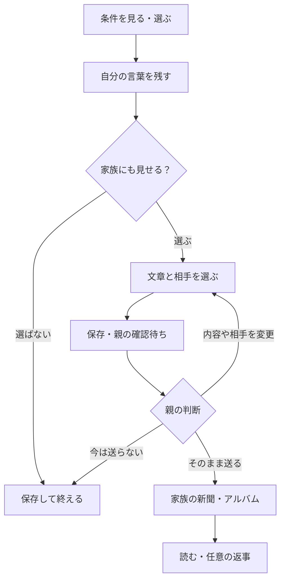

# UIを見直した結果と画面設計図 v2

2026-10-07／DESIGN・D90。今回の依頼「UIがほんとうにそれでいいの、図の作成をどうやってやるかもっと吟味してください、それで作成して」に対する設計成果物。実際の家族ではなく架空の内容を使う。製品実装・利用者観察は未実施。

## 結論

前の三者の生成画像を、そのまま実装の基準にはできない。温かい紙色と緑、三者の目的を分ける方針は継承する。**一つの出来事カードを中心に、子の選択と記録、親の確認、家族の閲覧をつなぐ構成**を採用する。保存して終える道を基本にし、家族への共有は同じカードから任意で選ぶ。祖父母は新聞を直接読み、自分の今日を本人の操作で送れる。

[共有の画面図](../review/ui-20261007/sharing.svg)／[お金と特典の画面図](../review/ui-20261007/money.svg)／[祖父母とアルバムの画面図](../review/ui-20261007/grandparent.svg)。
[状態と操作を確かめる見本](../review/ui-20261007/index.html)は単体でブラウザーに開ける。役割・画面・失敗・文字サイズを変える外側の操作は設計レビュー専用で、製品の役割切替や権限ではない。全ての保存・送信・ポイント操作は画面内だけの模擬。実装へコピーしない。

## 前の案で足りなかったこと

| 問題 | 今回の変更 | 確かめる場所 |
|---|---|---|
| 大きな装飾からは子が何を選べるか分からない | 目的・人数・予算と、買う／待つ／別の商品や店を先に示す。写真は素材がある時に使う | UI01・UI02 |
| 一枚の正常画面では、保存と共有の違いが分からない | 記録と共有を別の表示にし、共有しなくても保存で終われる | UI03 |
| 親の一押しの対象と、変更後の扱いが曖昧 | 実際の本文と相手を同じカードに示す。変更したら子の選び直しへ戻す | UI06 |
| 新聞で本人が言っていない文章が追加されていた | 本人が選んだ原文の範囲を同じ内容で表示する。新しい文章の下書きは別の設計・確認対象 | UI03→UI06→UI08 |
| 祖父母の「読む」と「自分から送る」が混ざっていた | 新聞／今日を送る／これまでの位置を固定。成人本人の送信は親の確認待ちにしない | UI08〜UI12 |
| お金・ポイント・練習のお金・約束の金額の関係が見えない | 円／P／練習円を明示。残高と未受取の約束を分け、交換は申請から受取まで分ける | UI04・UI05・UI07 |

画像のタブ名を短縮して最新の導線資料と違わせない。本文は子・親16px以上、祖父母20px以上。意味のある素材がない時に写真の空欄を大きく置かない。

## 役割ごとの用事から決める

以下は設計仮説。年齢だけで端末への慣れを決めない。

| 役割・場面 | 来た用事 | 懸念 | 最初に成功すること |
|---|---|---|---|
| 子・買い物前後の家や店 | 条件を見て自分で選び、残したいことを一言残す | 入力のために現実の用事を止める／親の望む答えを求められる | 一つ選ぶ、または中断する。記録は自分の言葉で残す |
| 親・家事の合間 | 必要な内容だけ判断し、家族の出来事を知る | 確認が積み上がる／何を誰に送るか分からない | 本文と相手を見て一押し。今は送らない・後でを選べる |
| 祖父母・読みたい時や散歩の後 | 家族の出来事を読み、自分の今日も残す | どこを押すと送られるか不明／毎日求められる | 記事を直接読む。内容と相手を見て「元気だよ」を送れる |

初回の家族作成・招待・閲覧範囲はS01計画に分ける。通常利用は同じ役割へ戻し、未完了の用事があれば続きから開く。今回の夕飯の条件は代表場面であり、毎回ここから開始を強制する設計ではない。祖父母不参加でも子と親の記録は成立する。

## 三つの構成を比較した

| 構成 | よい点 | 負担・限界 | 判断 |
|---|---|---|---|
| 全機能を並べたホーム | 全機能が目に入る | 最初の用事を選びにくい。役割の違いが薄くなる | 設定・一覧の探索に限定 |
| 役割別の入口＋一つの出来事カード | 同じ入力を引き継ぎ、普段の用事を短くできる | 必要な時に詳細を開く設計が必要 | 採用 |
| 会話を中心にする | 自由な相談ができる | 保存・公開の対象が曖昧になる。使い方の説明が増える | 困った時の任意の支援 |

子「今回のやってみ／これまで／お金とごほうび」、親「確認／家族の記録／設定」、祖父母「家族の新聞／今日を送る／これまで」。28機能を28個のタブにしない。読む画面には、無理に主ボタンを追加しない。判断や確定の場面には目立つ主ボタンを最大一つ置き、後で・断る道を残す。

## 図をどう作るか

| 方法 | 適すること | 今回の扱い |
|---|---|---|
| 生成画像 | 雰囲気・素材・テーマを比べる | 文言や状態が変わり得るため補助資料 |
| 編集できるFigma画面 | 共同で配置を直す、部品と変数を共有する | 将来の見た目の詳細化で選べる。今回は新しい外部の正本を増やさない |
| 正確な画面データ＋SVG＋操作できる合成見本 | 文言、状態、引継ぎ、拡大時の配置を確認する | 今回採用。正確な情報から図を作り、ブラウザーで確かめる |

順序は、用事と内容を決める→導線の分岐を描く→実際の文章と数字を入れた画面図→通常・空・失敗・保留→利用者が意味を理解できるかを確認→見た目の細部、で進める。画面データは[ui-screens-20261007.json](ui-screens-20261007.json)、共通の意味・文字・色は[ui-system.json](ui-system.json)。固定の静止図は各役割の情報配置、合成見本は入力と状態の引継ぎを確認する。静止図の固定幅は、実際の製品の固定高や固定幅を要求しない。

## 導線と分岐

Eは別画面への入力し直しではなく、Bの同じカードを広げる場面。親の確認待ちは相手への公開ではない。親の通常の確定では確認ダイアログを重ねない。成人本人の近況は「内容＋相手を見る→本人が送る」で成立し、上の子の親確認を通らない。

## 画面と機能の対応

UI番号は今回のレビュー箇所。C/P/G・WF・S番号を置き換えない。S23〜S27等を図の参照に含めても、製品やその細部が完成した意味にはしない。

| UI | 表示する場面 | 既存画面／導線 | 開発単位 | 今回見られること |
|---|---|---|---|---|
| UI01 | 条件 | C01／WF01 | S01・S02 | 人数・予算・変更・断る道 |
| UI02 | 選択と任意の助け | C02／WF02・03 | S03・S23 | 買う・待つ・別案。固定文案の助け |
| UI03 | 記録と任意の共有 | C03・C04／WF04〜06 | S04・S05・S07・S24 | 原文、範囲、宛先、保存失敗。写真・音声・AI生成は詳細未実装 |
| UI04 | 財布・別の残高 | C05 | S13〜15・S19〜22 | 円・P・練習円、未受取。金融練習は入口と情報の枠 |
| UI05 | 特典と申請 | C05の追加用途 | S16・S17 | 家庭の特典・予約・申請中。承認と受取の詳細は次の設計 |
| UI06 | 親の確認 | P01・P02／WF07 | S08 | 本文と相手、一押し、変更・断る・保留 |
| UI07 | 次に任せる条件 | P01の追加カード | S14・S18 | 期間、根拠、未確認点、受取予定 |
| UI08 | 新聞と任意の返事 | G01〜03／WF08・10 | S09・S11・S12 | 選ばれた原文を読む。次のたねは追加する場所のみ |
| UI09 | 本人の一言送信 | G04／WF11・12 | S10 | 「元気だよ」・相手・自分に残す |
| UI10 | 歩数と一言 | G04／WF11・12 | S10・S25 | 手入力の出所・失敗で入力を維持 |
| UI11 | 過去の出来事 | C04・P03・G02／WF13 | S06・S26・S27 | 同じ記録を日付で読む。日記・印刷は枠の対応 |
| UI12 | 新着なし | G01・G02／WF10 | S01・S09・S28 | 過去を読める・今日を送る位置を保つ |

S01の初回設定、S12の次のたね、S14の詳細設定、S20〜22の練習、S23〜24のAI、S26日記、S27印刷、S28運営は、既存の個別計画・仕様に接続する。全機能を今回の一枚に詰め込まない。各S機能の実装時に、その機能の入力・結果・空・失敗まで具体化して完成させる。

## 状態の確認

| 場面 | 表示・動き | 保つもの |
|---|---|---|
| 保存失敗 | 未保存／もう一度保存する | 本人の入力と選んだ範囲 |
| 共有を希望 | 保存済み＋親の確認待ち | 相手にはまだ出さない |
| 内容・相手を変更 | 子どもに選び直してもらう | 古い意思や承認を使わない |
| 送信失敗 | 未送信／再試行 | 原文と宛先。送信成功にしない |
| 親が断る・保留する | 保存は成立したまま | 子の記録を消さない |
| 祖父母の新着・返信なし | これまでを読める | 健康・安全・学習を推定しない |
| お金・特典の約束 | 未受取／申請中／受取待ちを区別 | 受取前に円残高へ足さない |
| 文字拡大・動き抑制 | 一方向に読める。状態は文字でも伝える | 操作の意味と要求数 |

動きはM01選択、M02移動、M03保存、M05新聞、M06送信、M07助けに対応。合成見本は選択の100msのみ。OSまたは本人設定の動き抑制で0ms。実装での保存・共有成功は永続化の応答後に表示する。この見本の120msの待ち時間は模擬であり、サーバー応答の実装ではない。

## 数字・原文の出所

夕飯3人分・予算1,000円、本人の発言と860円、祖父母の5,200歩は導線v2の架空例。500円×一か月5%＝25円、対象元本上限1,000円・支払上限50円・親負担・11月1〜30日は家庭のお金設計v1の例。実市場の推奨金利ではない。財布1,000円受取−500円支出、120 Pと映画100 P、家族の名前は、この状態を見せるための追加の架空データ。買い物の家族予算と本人のお小遣いを混同しない。

「4週間で予算を超えた記録なし／比較3回／目標達成／月払いを希望」はUI07の合成例。未記録の日を成功と扱う判定を実装した意味ではない。本人の希望確認と記録の出所が揃ったケースとして描き、全領域の能力認定にしない。不足時は保留する。提案方式は、S18の透明なルールと根拠から設計・検証する。

## 出典と変更の対応（作成前に確認）

| 出典 | 確認箇所 | 適用・限界 | 変更先 |
|---|---|---|---|
| 機能全体v5・FEATURE_DELIVERY | 28開発単位、依存と受入条件 | 画面数と開発単位を混同しない | UI01〜12の対応 |
| 主要導線v2 | §1・2・3・4 | 一つのカード、原文、任意共有、一押し、本人発信 | UI01〜03・06・08〜12 |
| アルバムと家庭のお金v1 | §2・5・6・7 | 記録の出所、期間と率、約束と受取 | UI04・05・07 |
| role-experience v0.3・役割別UIスキルと参照 | 役割、文字、サイズ、M01〜07、失敗 | 役割の目的を分け、共通の意味を使う。利用者実証ではない | 全画面 |
| GOV.UK Making prototypes（2026-10-07確認） | 種類・目的・試作と製品の違い | 段階に合う図から試作へ進める根拠 | 図の作り方と合成見本 |
| W3C Reflow（同日確認） | 320 CSS px、情報と機能を失わず読む | 狭い幅と文字拡大の検査。合格を画像だけで言わない | UI・検査 |
| Google PAIR Feedback & Controls（同日確認） | 制御・フィードバック | 任意の助け、本人が選べる道。AIは今回使用しない | UI02 |
| Playwright公式 Locators／Assertions／Screenshots（同日確認） | role/label照合、状態の確認、描画出力 | 見本の操作・表示とPNG作成。実家庭の理解ではない | check-ui-review.mjs |

一次資料： https://www.gov.uk/service-manual/design/making-prototypes ／ https://www.w3.org/WAI/WCAG22/Understanding/reflow.html ／ https://pair.withgoogle.com/chapter/feedback-controls/ ／ https://playwright.dev/docs/locators ／ https://playwright.dev/docs/test-assertions ／ https://playwright.dev/docs/screenshots

## 検証と次の判断

検査コード：[check-ui-review.mjs](../../tools/development/check-ui-review.mjs)。原文の範囲を親・新聞へ引き継ぐ、私的な保存が新聞に出ない、失敗で入力が残る、変更後の古い承認を使わない、成人発信、ポイントの予約と円の区別を合成見本で確認する。12画面のラベル・文字とボタン・主操作数・キーボード・axe、4幅×2文字サイズ×12画面＝96配置、動き抑制を確認する。SVGをブラウザーで描画しPNGにする。実行結果はVERIFICATION.mdを参照。

利用者には、説明せずに「何を誰に送るか」「保存だけならどうするか」「来週にするにはどうするか」「新着がなければどうするか」を試してもらう予定。次の操作を5秒程度で説明できるか、確認待ちを送信済みと誤認しないか、拡大文字で意味を追えるかを観察し、結果に応じて入口と文言を修正する。今回この観察は実施していない。図が完成したことを、UIが最適・学習が改善した証拠にしない。
