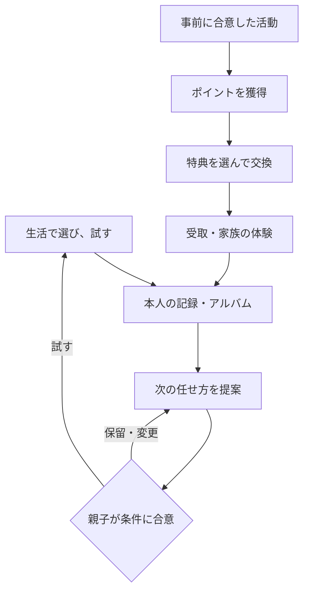

# やってみクエスト｜アルバムと家庭のお金・報酬の設計案 v1

作成日：2026年10月6日  
状態：DESIGN／D90に追加する検討案。最新のユーザー案を具体化したもの。デモ・製品実装・実家庭での判定・送金・証券売買は未実施。既存の承認状態は変更していない。

## 1. 今回決める全体像

**本人の選択がアルバムに残る。その記録から、サービスが次に任せる範囲と渡し方を提案する。家庭が合意した条件で試し、お金の配分と結果を本人が確かめる。**

これに、任意のポイントと特典交換を加える。アルバム・お小遣い・ポイント・家庭内金利・金融の練習は同じ体験を参照するが、残高や許可はそれぞれ区別する。

今回のユーザー方針：
- デモ作成は後にし、アルバムとポイント・報酬の機能を先に考える。
- サービス側が「今どこまで任せられるか」を判定し、次の金額・渡し方を提案する。
- 親は提案を見て、簡単に承認・変更・保留できる。
- 親が負担する家庭内金利で、使う・貯める・増やす割合を本人が考える。
- 銀行・借金・銘柄と利回りまで、学びを広げたい。
- 交換できる特典には追加のお小遣い・プレゼント・家族のお出かけ等を含めたい。

採用する設計上の前提：
- 初期対象は小5〜6。金融の実体験と、家族の日常・思い出を両方残せる。
- サービスの判定は、対象領域と確認できた記録に基づく暫定的な「任せ方の提案」。適正金額を保証する能力診断ではない。
- 基本のお小遣い、活動の追加報酬、ポイントによる特典、貯蓄ボーナスを別の家庭ルールとして扱う。
- 今回は家庭内での受渡しを記録する設計。銀行や証券口座への接続は別の将来設計。
- 数値・会話・価格・ポイントの例は全て架空。推奨相場や検証済み基準ではない。

全ての体験がポイント獲得を伴うわけではない。特典を使わず貯める、ポイント機能を使わない、祖父母が参加しない家庭でも成立する。

## 2. 使う人の用事と入口

| 役割 | 用事と利用場面の想定 | 懸念の仮説 | 最初の成功 |
|---|---|---|---|
| 子ども | 家や買い物前後に、記録を残す・お金を分ける・欲しい特典を選ぶ | 宿題になる、理由を採点される、約束した特典が届かない | 自分の言葉が残り、使えるお金と交換条件が分かる |
| 親 | 家事等の合間に、任せ方・家庭の支払・交換依頼を判断する | 提案が過大、毎回採点が必要、追加費用が見えない | 根拠と負担が揃った一件の提案を判断できる |
| 祖父母 | 好きな時に新聞・思い出を読み、自分の近況を残す | 家計・能力評価に関わる義務を感じる | 許可された記録を読み、自分の一言を届けられる |

端末やデジタル習熟度、上記の感情は未観察。年齢だけで操作能力を決めない。

子の入口は「今回のやってみ」。記録の再閲覧は「これまで」、金額と特典は「お金とごほうび」へまとめる。後者の中で円とポイントを別の欄にし、機能ごとの入口をホームに大量に並べない。親は既存の「確認」と「家族の記録」を使う。祖父母は既存の「家族の新聞」と「これまで」を使い、子の財布や判定画面を標準で表示しない。

## 3. アルバム：写真に、当時の考えと家族の言葉が残る

### 3.1 一件の出来事を残す

| 最初に見える情報 | 必要なら開く情報 |
|---|---|
| 日付、誰の出来事か、写真または一言、本人が選んだこと | その時の目的・予算、比べたこと、本人の理由、結果、助けの出所 |
| 家族の言葉がある場合は、誰の言葉か | 元の返信、次に試したこととのつながり |
| 保存・共有の状態 | 修正履歴、共有する相手、取り下げ |

写真だけ、近況だけ、買わなかった・待つことにした記録も残せる。日常の写真に金融の質問を強制しない。入力は前の導線案どおり「話す→同じカードで確かめて残す」を使う。

架空例：
> 10月6日　夕飯の買い物  
> 「大きい肉の方が量あたりは安かったけど、今日使う分だけにした」  
> 祖母の言葉：「私は残りを冷凍していたよ」  
> 後日、本人が選んだ続き：「冷凍できるなら比べる条件が変わるかな？」

当時の発言と、後日追記した結果を分ける。子が話していない理由をAIで埋めない。祖母の経験を現在の事実や正解に変換しない。

### 3.2 見返し方は三つ

1. 日付で見る：最近・今月・過去。日付を移動しても読み位置を保つ。
2. 用事で見る：買い物、貯金の目標、家族のお出かけ等。分類は訂正できる。
3. 前と今回を見る：関連する二件を並べる。「以前は何を考え、今回は何を変えたか」を本人の言葉で読める。

お気に入りは本人が選ぶ。回数や金額で記録の価値・子の能力を順位付けしない。家族新聞は同じ許可済み素材の読み方の一つとし、新聞用・アルバム用に二度入力しない。

### 3.3 思い出と、提案の根拠

同じ出来事を任せ方の根拠として参照できるが、日常写真や祖父母の元気ボタンは金融能力の判定材料にしない。表示例は「量と使う日を比べた記録が二件ある」。総合能力点や「完全に自立した」といった認定は出さない。

私的な家計・残高・支援履歴は本人と管理する親の範囲。祖父母へは子が選び親が確認した素材だけを見せる。新しい家族の参加によって過去の全記録を自動公開しない。返信の撤回があれば、その言葉を根拠にした新しい候補は再確認する。

長期の思い出を残したいという価値は維持するが、「10年間必ず保存する」という運用保証はまだ決めない。保存・書き出し・削除・共有撤回を次の製品仕様で合わせる。

## 4. お金・ポイント・練習用のお金

| 種類 | 表示するもの | 増える時 | 使う時 |
|---|---|---|---|
| 実際のお金：円 | 受取済み／使った／手元・親が保管する分。記録上の残高と確認日 | 家庭で実際に受け取ったことを記録 | 現実で払った額を記録 |
| 家族ポイント：P | 保有／交換依頼で予約中／使えるポイント | 事前に決めた活動の対価として確定 | 家庭が提示した特典へ交換 |
| 練習用のお金：練習円 | 銀行・借入・投資の練習用残高、負債、評価損益 | 練習内のルール | 練習内の取引だけ |

「来月2,000円を渡す予定」「利息25円を払う約束」「ごほうびで300円を追加する承認」は、受取済みの円残高に入れない。ポイントと円に共通の価値換算を強制しない。実際のお金を練習の投資に移したと見せない。

同じ活動に円とポイントを両方払う場合は、その二つを実行前に合意する。片方をもう一方へ換算しただけなら二重に獲得計上しない。訂正は元の受取・支払に対応する履歴を残す。

## 5. サービスが「次に任せる範囲」を提案する

### 5.1 金額、期間、判断範囲を分ける

| 軸 | 変更例 | 何を確かめるか |
|---|---|---|
| 一度に扱う金額 | 買い物一回300円から500円へ | その用途の必要額、残金、相談の条件 |
| 管理する期間・渡し方 | 都度→週ごと→2週間ごと→月ごと | 次の受取日までの使い道と残す分を見通せるか |
| 自分で決める範囲 | お菓子だけ→文具も含める | 用途や条件が変わっても比較・相談できるか |

一軸を変えたことを、全領域へ適用しない。買い物を任せられることは、課金・契約・借入・投資を許可することにはならない。必要な時に相談することも、任せ方の根拠になる。

初回に親が、任せたい用途、家庭が負担できる上限、親に相談する条件を選ぶ。サービスはその範囲内で額・周期・試す期間を提案する。金額が多い家庭ほど子が上位になる設計にしない。

### 5.2 四週間の記録をどう読むか

| ユーザー案の材料 | サービスで確かめること | 材料が足りない場合 |
|---|---|---|
| 予算オーバーなし | 合意した予算と変更履歴、記録されている支出、残金の確認範囲 | 「記録された3件では超過なし」と範囲を示す。全支出が超過なしとは言わない |
| 3回価格比較できた | 比べた内容、目的に合う理由、場面の違い、本人・親・アプリの支援の出所 | 比較ボタンを押しただけでは比較できたと判定しない |
| 貯金目標を達成 | 先に決めた目標、期限、実際の残高、家族からの追加額 | 未確認額は見込みとして扱う |
| 衝動買い後の後悔が減少 | 本人の振り返りと比較できる以前の記録 | 未記録を後悔なしにしない。後悔の有無を毎回聞く必要もない |
| 月払いへの準備 | 次の受取日までの予定、本人の配分案、変更時の相談方法 | 月払いへの直接変更は保留し、今の周期か短い延長を候補にする |

四週間・二場面等は検討する観察期間や試行条件であり、金額・周期の変更が安全だと実証された基準ではない。任せ方に必要な記録が集まらなくても、アルバムや学びの利用は続けられる。判定のために全購入の長文記録を義務にしない。

親の手間を増やしすぎないため、通常の短い記録を再利用する。追加で必要な金額の照合等は任せ方を見直す時にだけ短く確かめる。日常の記録が少ない家庭への適合性は、検証が必要。

### 5.3 提案の三つの出し方

| 方式 | 利点 | 限界 | 判断 |
|---|---|---|---|
| 親が全ての記録を読み、額と周期を決める | 家庭事情を反映しやすい | 親の比較・準備が重い | 必ず残す代替 |
| 確認できた記録＋家庭の上限＋説明できるルールで候補を出す | 理由と未確認点が見え、親が直せる | ルールの妥当性は未検証 | 最初の提案方式 |
| AIが総合能力を採点して額と周期を決める | 自由な記述を広く読める可能性 | 記録の偏り・推測・尺度の未検証。理由文の品質と判定の正しさは別 | 自動昇格・支払に採用しない |

サービス側の判定状態は「次の範囲を試す候補」「今の範囲を続ける候補」「材料が足りず提案保留」「条件を見直す候補」。子全体の合格・不合格や減点にしない。

AIを使うなら、出所が確かめられた材料を親向けに説明する下書きの候補とする。現在のAI jobは、お小遣いの額・周期・能力判定を扱う契約ではない。家計や金融履歴を既存のAI入力へ無断で追加しない。まず固定のルールと文章で比較する。

### 5.4 親が一押しで判断できるカード

以下は、必要な記録と本人の希望が揃っている架空例。

> **次の1か月、月初に2,000円を渡して試してみませんか**  
> **現在：毎週500円　提案：月初2,000円**  
> 対象：本人の文具とお菓子。通学・必需品等の費用は含めない。  
> 根拠：記録された買い物で予算と残金を確認／目的の違う場面で比較した／本人が来月の配分を考えた。  
> 本人の案：今使う1,000円、目標に貯める500円、家庭内金利を試す500円。  
> 未確認：1か月を実際に管理できるか。  
> 変更する日と、見直す日：家庭が確認した具体的な日付。  
> この期間の予定額：2,000円。追加の貯蓄ボーナスや特典の費用は別の欄。  
> 主なボタン：**この条件で1か月試す**  
> その他：条件を変える／今のまま／後で

子が変更を望んでいない、配分案がない、使う予定が不明な場合は、上の根拠を自動で作らない。今の週払いを続けるか、例えば「4週間だけ、週500円×4回→2週間ごと1,000円×2回」を候補にする。これは合計2,000円で周期だけを変える架空の試行案。

**毎週500円と毎月2,000円は年間では同額ではない。**52回と12回なら26,000円と24,000円になる。親へ実際の支払日・回数・対象費用・期間合計を示し、単に「同じ金額を月払いへ」と説明しない。周期変更とお小遣い増額も別の変更として見せる。

親が承認した条件と子が希望した内容が揃って、試行予定になる。親が額・用途等を変えたら、子に新しい条件を確かめる。実際の受渡しは家庭内で行い、受取記録がついた後に円残高へ反映する。

### 5.5 試した後

期間の終わりに、残った額だけでなく、目的の物を用意できたか、途中で計画を変えたか、本人が困った時に相談できたかを短く見る。「続ける／周期を短くする／用途を変える」を提案する。失敗を理由に既に約束した基本のお小遣いや獲得済みポイントを一方的に没収しない。

親の承認回数や提案採用率は、使いやすさの情報に留める。判断力の改善・提案の正しさの証拠にしない。成長の確認には、後の別の実生活場面で本人が何をしたかを見る。

## 6. 家庭内金利：親が払う貯蓄ボーナスを選ぶ

### 6.1 最初のルール案

ユーザーの「残した500円に5%」を、**一か月の貯蓄ボーナス5%**という家族ルールとして具体化する。固定の実市場金利や標準の推奨値ではない。初期はOFFで、家庭が使いたい時に親子で期間・対象額・上限を決める。

架空例：
- 開始時の対象額：500円。対象元本は上限1,000円。
- 期間：一か月の開始日と終了日を指定する。例は11月1日〜11月30日。月途中に始める時は、最初の対象期間を親子で明示する。
- 満額の条件：対象の元本を、その期間残す。
- ボーナス：5%。一期間の支払上限50円。親が負担する。
- 500円を残した場合：500円×5%＝25円。受け取れば合計525円。
- 残した額が多い、率が高い、という理由で能力を上位にしない。

### 6.2 途中で使う時と、次の期間

本人は途中で取り出せる。最初の案では、**開始時の対象元本のうち、その期間ずっと残した額**に一度だけ率をかける。途中で取り出して戻した分、期間途中の追加分は次の期間から対象にする。日割りの利息に見せない。

計算の対象額は、開始時の対象元本と、その期間の当該枠の最低残高の小さい方。ボーナスは対象額×率を円単位で切り捨て、支払上限を適用する。例：開始500円、途中で200円を取り出した場合、今回の対象は300円で15円。最初の元本500円の全額を失ったり、罰を課したりしない。

利息を受け取った後、次の期間にも貯めるか、使う分に移すかは本人が選ぶ。利息も含め525円を次の対象とし同じ5%なら、上限に達していない例で次回のボーナスは26円。複利がどう起きるかを示せるが、親の負担上限は維持する。

単純な期間ルールを選んだ設計案で、銀行の一般的な計算方法そのものではない。日割り・平均残高・年率換算等を学ぶ時は別のルールとして比較する。過去に合意した期間の率を、後から下げない。

### 6.3 率の表示と、お金の出所

| 表示 | 500円の例 |
|---|---|
| 月5% | 一か月で25円。家庭独自の貯蓄ボーナス |
| 年5% | 一年で25円の単利の例。一か月を単純に12分の1で近似すれば約2.08円 |

月5%を毎月複利で続ければ、上限・引出し・端数処理がない場合の一年の増加率は約79.6%。年5%と混同させない。今回の案は上限と円単位の端数処理があるため、実際の家庭内の一年の増加と、この理論値は一致しない。

「お金を持っているだけで誰も払わずに増える」と説明しない。画面には「今回は親が払う25円」と示し、銀行が払う利息や株の値動きとの違いにつなげる。Greenlightの親負担金利は年率を設定し月次で計算する。FamZooには期間設定と支払上限がある。実装方式をそのまま移すのではなく、家庭のルールの明示に参考にする。

計算したボーナスはまず「親が払う予定」。実際の受取が確認されるまで「使えるお金」にしない。自動計算と実送金を混同しない。払えない場合も未受取の約束を消さず、親が変更・延期について相談する。

### 6.4 配分する経験

最初は「今使う／目標のために貯める」を選べ、家庭内金利をONにした時だけ「金利を試す」が増える。三つの枠の合計は、実際に受け取った金額と一致する。

例：2,000円から1,000円・500円・500円を本人が分ける。これを最適な配分として初期値や正解に固定しない。近い予定で使う額、目標、期間を本人が見て配分を変えられる。何も買わない・全部貯めることだけを高評価にしない。

## 7. ポイントと特典交換

### 7.1 ポイントは任せ方の判定から独立させる

家庭が合意した追加の活動や企画の対価にポイントを使える。最初の例は「家族と合意した活動を終えたら10P」。具体的な活動・完了条件・対価を始める前に決める。子から内容や対価の提案もできる。

初期案の付与者は親。完了を確かめる方法も事前に決め、活動の申告はまず「確認待ち」とする。親が週末等にまとめて確認できる。確定した一件に対して一度だけ付与する。AIの能力評価、単なる自己申告、写真の公開を自動付与の根拠にしない。

学習の正解、長い理由文、安い物を選んだこと、毎日ログイン、家族への写真公開、祖父母の返信にはポイントを連動させない。買わない・待つ・相談する選択も、家庭が合意した活動なら同じ条件で扱う。普段の家事を全て有料にすることを初期値にしない。

アルバムへの投稿・家族への共有は、対価を受け取るための必須条件にしない。断る・失敗を話すことを減点にしない。ポイントを使わず直接の円の対価を選ぶ家庭も使える。

### 7.2 特典は家庭が約束できるものを並べる

以下の必要ポイントや金額は仮の例。サービスが現金やチケットを提供する約束ではない。

| 種類 | カードの例 | 条件を具体化すること |
|---|---|---|
| お金 | 翌月だけお小遣い＋300円 | 追加額、渡す日、一回か継続か、親の予算 |
| 物 | 自分で選ぶ本一冊 | 商品の範囲、上限、注文する人、受取時期 |
| 小さな体験 | 家族と行きたいカフェ | 対象の人、予算、候補日 |
| 大きな体験 | 家族でディズニーへ行く約束 | 実現できる時期、誰の費用をどこまで含むか、移動費等、変更時の扱い |
| 家族独自 | 子が提案する体験・プレゼント | 親が内容と条件を確認してから交換対象にする |

サービスは特典の型と条件の記入を助ける。必要ポイントは家庭が具体的な約束と合わせて決める。全国共通で「1P＝1円」と固定しない。円に交換する特典がある場合は、その特典の換算条件を明記する。

特典の選択・達成は、任せられる範囲を自動で増やさない。「翌月だけ＋300円」は追加報酬。「月払いに変更する」「使う対象を増やす」は任せ方のルール変更。恒久的なお小遣い増額を特典にする場合も、開始時期・期間・家庭の負担を別途確認する。

### 7.3 交換画面

> **使えるポイント：80P　予約中：20P**  
> **家族とカフェ：60P**  
> 内容：家族で一回。条件：週末の候補日から相談。約束する人：親。  
> 交換後の使えるポイント：20P。  
> 主なボタン：**この特典をお願いする**  
> その他：まだ貯める／別の特典／条件を見る

最初に「今お願いできる」「もっと貯めて選ぶ」を見せる。選択肢が少なくても、家族が実現できるものを用意する。単に賞品の画像だけを並べず、期間・費用範囲・約束する人を見せる。

子の導線：選ぶ→交換後の残高と条件を見る→依頼。  
親の導線：内容・必要ポイント・追加費用・時期を見る→「この条件で交換する」。  
その後：円なら実際の受取、物・体験なら提供・実施の記録。思い出として残すのは本人の希望時。

### 7.4 ポイントと受取の状態

依頼時に必要ポイントを予約し、使える残高から外す。親の承認で一度だけ消費を確定し、特典は「受取待ち」になる。承認自体を物・体験の受取済みにしない。

| 状態 | ポイント | 表示 |
|---|---|---|
| 候補・閲覧 | 変化なし | 内容と条件 |
| 依頼済み | 予約中 | 親の確認待ち |
| 親が承認 | 消費を確定 | 受取待ち・実施予定 |
| 親が拒否／依頼を取消 | 予約を解除 | 理由や条件を見直せる |
| 承認後に提供できず取消 | 消費分を返す | 未提供・相談する |
| 受取・実施済み | 二度減らさない | 受取済み／体験済み |

同じボタンの再押下や通信の再試行で、二度獲得・消費・受取計上しない。値段や特典内容が変わったら古い依頼を勝手に新条件で確定しない。子が新条件を選ぶ。特典が急に取り下げられる時は、既に承認した約束を履歴に残し、代替か返却を相談する。

家族ポイントの利息と、円の家庭内金利を同時に初期導入しない。円の時間価値を体験する今回の金利は円に適用し、ポイントの複雑な金融経済は増やさない。

## 8. 銀行・借金・銘柄・利回りへの広げ方

金融の練習は、目標と条件を見て本人が決める体験として置く。実際のお小遣いの残高とは別に「練習用」と表示する。ポイントで購入・獲得する参加権を必須にしない。

| 題材 | 選ぶ経験 | 表示すべきこと |
|---|---|---|
| 銀行と預金 | お金を置く場所・期間・使う日を比べる | 誰が利息を払うか、引き出せる時期、条件 |
| 借金 | 待って買うか、先に借りて後で返すか | 元本、利率と期間、利息、総返済額、将来使える額 |
| 株・ファンド等 | 自分が知る会社、複数の会社等から選ぶ／投資しない | 期間、価格の上下、配当・費用、確定していない損益 |
| 配分 | 今使う・貯める・投資に回す割合を変える | 合計、近い目標に必要な額、減る場合の結果 |

### 8.1 借金の最初の例

練習円で「今1,000円を借り、一か月後に一回だけ5%を追加して返す」なら、返す額は1,050円。次の期間に入る練習円が2,000円なら、返済後に使えるのは950円。待つ・別の物にする・今回は買わないも選べる。追加借入や自動延滞罰を最初の学習ループに入れない。

これは仮の一期間の単利ルール。実際の借入商品、年率、手数料、返済方式等は別の条件として学ぶ。実際の子の借金や、親からの利息付き貸付を自動で作る設計にはしない。

### 8.2 銘柄を選ぶ時

最初は架空の会社・市場の条件で、同じ期間に上がる場合と下がる場合を確かめる。将来、実在銘柄を教材にする場合は、過去の同じ期間のデータ・出所・価格調整・配当・費用の扱いを表示して練習に使う。実在の銘柄を選べることと、売買・お金の預かり機能は別の設計。

「この銘柄なら年5%」のように将来利回りを固定表示しない。配当利回り、値上がりを含む期間損益、将来の予測は分ける。比較は同じ開始・終了条件で行う。利益が出たことだけで判断が上手くなったと評価しない。

架空例：練習投資500円が450円なら損益−50円、期間騰落率−10%。実際の円やポイントから50を引かない。実際に受け取った配当や費用を含む総収益の例へ拡張する時は、その条件も表示する。

Investor.govは、株価は上がるだけでなく下がり、損失があり得ると説明している。FamZooには投資の値動きを家庭内の記録で模倣する例がある。今回の初期案は、家族の実資金と損失を連動させず練習内で扱う。

## 9. 先に具体化する順番

これは設計上の優先順位。実装計画や実装開始の承認ではない。

1. アルバムの一件：本人の言葉・写真・家族の言葉・追記。既存の一回の記録を使う。
2. 円のお小遣いと家庭ルール：基本額、周期、用途、約束と受取を分ける。
3. 家族の特典：ポイントを使う家庭は、少数の実現可能な特典と交換・受取状態を決める。
4. 任せ方の提案：記録の範囲、根拠、未確認点、次の額・周期・試す期間を親へ示す。
5. 家庭内金利：ONの家庭だけに、期間・率・対象額・上限・受取を見せる。
6. 練習の銀行・借金・銘柄：円残高から独立し、増える場合・減る場合・待つ選択を扱う。

PMのOSTで置く中心の成果は「本人が、家庭と合意した範囲の次の生活場面で、条件を見て配分・選択・相談・修正をできること」。親の準備時間と子の記録負担も合わせて見る。利用頻度、ポイント残高、親の承認率だけを成果にしない。

| 機会・困り所の仮説 | 比較する選択肢 | 優先する案 |
|---|---|---|
| 親がいつどこまで任せるか分からない | 手動の振り返り／根拠付きルール提案／AIによる総合採点 | 根拠付きルール提案＋手動の代替 |
| 子が考えたことを後で思い出せない | 写真中心／出来事と本人の言葉／詳細な必須日記 | 出来事と本人の言葉 |
| 特典を貯める・交換する選択をしたい | 直接円の対価／全てポイント／円＋任意の家族ポイント | 円を分かる形で残し、家族ポイントは任意 |

重要度・満足度の実測値はないため、仮の数値スコアで順位付けしない。

## 10. 自己点検と、後で確かめること

### 10.1 設計文書の整合性

| ローカル確認ID | 関連する既存機能・画面 | 文面で確認する条件 |
|---|---|---|
| AR01 | F06・F07・F10／C03・C04・P03・G02 | 一件の記録を許可範囲で再利用し、日常にも使える |
| AR02 | F14／C05・P03 | 円・ポイント・練習円と、約束・受取を混同しない |
| AR03 | F03〜05・F14／親への提案画面は追加案 | 金額・期間・用途を別に見て、記録不足では判定保留になる |
| AR04 | F14への追加案／家庭内金利画面は追加案 | 月／年・対象額・上限・支払者・未受取が分かる |
| AR05 | F14とは別の新規報酬機能案／交換画面は追加案 | 予約・消費・受取・取消の状態が整合する |
| AR06 | 将来の金融教材案／銀行・借入・投資の練習画面 | 金融練習の損益が実際の残高を動かさない |
| AR07 | F08・F09・F15・F20／各役割の画面 | 原文・対象版・相手・権限、取消、大きな文字、入力の代替を保つ |

新しいF番号や既存の承認IDを勝手に発行したものではない。ARは本書だけの確認ID。今回は動きを追加せず静的な状態と文言を定める。今後の動きも、保存・送信の成功確認後にだけ使い、動きを減らして同じ情報が読めるようにする。

### 10.2 未確認・失敗時

- 記録不足：提案保留。現在の合意した範囲で利用を続ける。
- 親が提案を拒否：条件を見直すか保留。子を不合格にしない。
- 子が周期変更を望まない：今の方式を維持する選択を残す。
- ポイント付与・交換・保存に失敗：成功扱いにせず、再試行でも重複しない。
- 特典を提供できない：受取済みにしない。延期・代替・ポイント返却を相談する。
- 金利ルールや残高が変更された：対象期間と版を再確認し、計算の見込みを直す。
- 家族の返信・祖父母の参加なし：本人の記録、財布、任せ方の試行を続けられる。
- 音声・AIを使えない：文字・固定の説明・手動の振り返りから続ける。
- 金融履歴を祖父母へ見せない：学習・家族の近況利用を止めない。

### 10.3 次に検証する仮説

現時点では文面の自己点検と算術確認のみ。利用者の操作・学び・支払需要は未確認。

| 仮説 | 後で行う確認 | 判定を見直す材料 |
|---|---|---|
| アルバムの本人の言葉に価値がある | 許可された見本で、写真だけの記録と比べて何を読み取るか確認 | 長文負担の割に思い出や判断の文脈が伝わらない |
| 提案が親の判断負担を減らす | 架空の十分な記録・不足した記録を使い、提案の理由と未確認点を説明できるか見る | 親が重要な条件を見落とす・全面的に自動判定へ任せる |
| 周期を延ばして本人の計画経験が増える | 合意・運用条件を整えた将来の試行で、次の別場面の配分・相談を見る | 不足・親の補填や管理負担が増え、本人の経験が増えない |
| 金利で時間と配分を考えられる | 一か月と一年、支払者、途中の引出しの例を本人が説明できるか見る | 率の単位や出所を誤解する、貯めることだけが目的になる |
| 多様な特典に意味がある | 家庭が実現可能な候補を作り、子が選ぶ条件・交換後の約束を確認 | ポイントのためだけに入力・公開する、特典が提供されない |

これらは今後の確認方法。実家庭の試行や参加者への連絡を、この文書作成で実施したことにはしない。

## 11. 参照したものと変更の対応

改訂・作成前に確認した資料：
- 最新の会話：サービスによる任せ方の判定・提案、親の承認、家庭内金利、配分、銘柄、特典交換。
- 現在の「主要導線と表示情報 v2」：一つの出来事カード、任意の共有、親の一押し、同じ記録の再利用。
- 添付「今の進捗(2)(1).txt」D-1〜2：事前の対価合意、基本のお小遣いを罰で削らない、金銭以外の返礼。
- 添付「事業統合正本」E-2〜4・D領域：支援量と判断品質を区別し、異なる場面を見る。ただし当時のS/Qと進級閾値は設計仮説。
- 添付「金融教育カリキュラム設計調査」11〜15：何を知るかと何ができるか、単一レベルにしない考え方。
- 添付「pasted.txt」：写真に当時の考えと家族体験を重ねるアルバムの構想。会話上の構想で、利用者の需要を実証したものではない。
- [機能レビュー票](https://github.com/saienjoy0/saitama-/blob/main/docs/design/FEATURE_REVIEW.md) F06〜10・F14〜15：アルバム、共有、約束と受取、送金なし。
- [製品設計](https://github.com/saienjoy0/saitama-/blob/main/docs/design/product-design-v0.1.md) 7.3・8.4・9.2：記録の任意項目、事前合意、版と共有範囲。
- [三者体験 v0.4](https://github.com/saienjoy0/saitama-/blob/main/docs/design/personas-cycle-review-v0.4.md)：子の主導権、任意の返信、M1で能力自動採点を戻さない理由。
- [AI設計 v0.4.1](https://github.com/saienjoy0/saitama-/blob/main/docs/design/ai-engine-review-v0.4.1.md)：現在の出力契約と、自己申告完了を理解や自立へ変換しない境界。
- yattemi-codex-workflow、yattemi-role-based-ui-designと二つの参照：役割の用事、情報の出所、固定の代替、静的な状態の意味。
- [PM opportunity-solution-tree（確認した版）](https://github.com/phuryn/pm-skills/blob/8607e3b077817f89bf4a9b623246219734ac3be0/pm-product-discovery/skills/opportunity-solution-tree/SKILL.md)：望む成果、機会、複数の解決法、後の検証をつなげる。

外部の一次資料（2026年10月6日に確認）：
- [CFPB Assess the Building Blocks](https://www.consumerfinance.gov/consumer-tools/educator-tools/youth-financial-education/assess/)：金融能力を知識だけでなく習慣や判断等も含めて見るための参考。このサービスの「月2,000円を任せてよい」という基準ではない。
- [Greenlight Parent-Paid Interestの公式説明](https://help.greenlight.com/hc/en-us/articles/360020603133-What-is-Parent-Paid-Interest-How-do-I-set-it-up)：親が年率を設定し、親の資金から月次で支払う仕組み。年率と月次支払を区別する参考。
- [FamZoo公式FAQ](https://blog.famzoo.com/p/famzoo-faqs.html)：親負担金利、期間と上限、金銭以外の報酬、投資の値動きを模倣する例。既存機能の存在はこのサービスの教育効果の証拠ではない。
- [Investor.gov Stocks](https://www.investor.gov/introduction-investing/investing-basics/investment-products/stocks)：株の所有・配当・値動き、損失の可能性を扱う根拠。

作成前の対応付け：上記のアルバム構想とF07→出来事＋本人の言葉、対価ルールとF14→約束／受取・交換状態、カリキュラムとCFPB→範囲を限定した提案、Greenlight/FamZoo→金利の出所・期間・上限と特典、Investor.gov→増減を含む金融練習。この対応を会話で示した後、本書へ具体化した。

最新ユーザー案は、従来後回しだったポイント・金利・任せ方の提案を検討する方針変更として扱った。既存のM1仕様へ実装済みの要件として書き戻したものではない。統合する際はFEATURE・DECISIONS・AI契約・既存レビュー一式と実装計画の対象を改訂して確認する。本書を作ったことだけで製品BUILD・実家庭公開・ライブAIを開始しない。