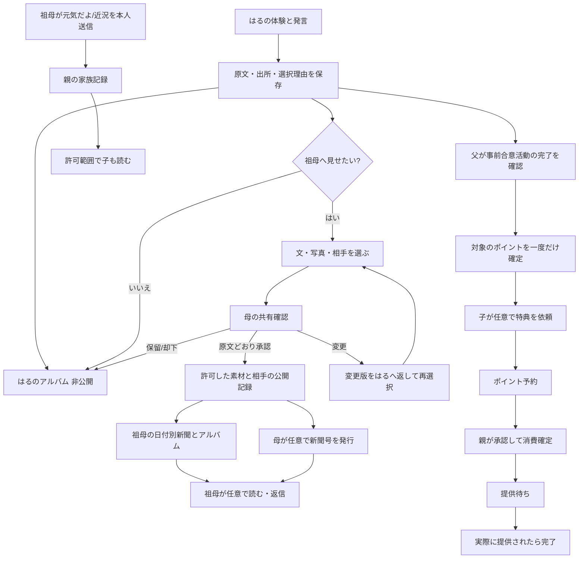

# やってみクエスト｜3体験×4人×新聞／アルバム×報酬　全周回の批判的レビューと修正正本
更新：2026-10-08／対象：GAKU∞STA発表用の合成ユーザーストーリー。**本体製品は DESIGN／D90、実装未許可。**

## 0. 結論：直近デモは「子だけの会話デモ」で、家庭体験として未完結だった

これまでの画面は、子が声で条件を報告して新聞下書きを得るところまでは見せられた。しかし親子の権限、誰が何の完了を確認するか、親の発行操作、祖母の受取と本人発信、報酬の確定と交換、次回への再利用までを同じ出来事として貫通できていなかった。

**修正の判断**：
1. 3クエストは「初回の約束 → 家の仕事を調べる → 夕飯を引き受ける」の同じ家庭の連続場面。ただし後ろ2つは前の全部を解かなくても単独開始可能とする。
2. AIの提案は「短い理由＋必要時に根拠表示＋未確認項目＋本人が選ぶ」。人の好み・経験・値段・現在在庫を作らない。
3. 一件の出来事から **子の非公開アルバム／親の家庭記録／許可済み素材の祖母向け日付別新聞／任意に発行する号** を派生させる。二度入力させない。
4. **報酬確認／共有確認／閲覧・返信／次の任せ方提案** は異なる独立状態。親の確認と祖母の返信と子の達成を紐づけて強制しない。
5. 日付別に許可済み素材を読むことと「新聞号を発行すること」は別。日々の編集を親に要求しない。

## 1. 監査対象と引用元

| 確認したGitHub資料 | 採用した既存要件 | 注意した齟齬 |
|---|---|---|
| PR #12 `docs/design/representative-household-scenarios-20261007.md` HSC-01〜03 | はるが自分で選び、家族へ聞き、条件で案を変え、試す。初回0P／調査20P／実践40Pは合成例 | この数値は家庭の事前合意に限る。実行した事実と本人の言葉を分ける |
| PR #11 `docs/design/やってみクエスト_機能全体と導線の設計順_20261006.md` S01〜S28 | 体験→記録→アルバム→親の確認→祖母の新聞・近況→報酬／次の任せ方 | 旧F/C/P/G画面IDと新Sバックログを同一IDとして混同しない |
| PR #11 `docs/design/やってみクエスト_主要導線と表示情報_20261006.md` WF01〜13 | 子の共有は宛先・素材を選んだ上で親確認。祖母本人の元気投稿は本人送信。日付閲覧と新聞の発行は別 | 親の新聞編集を毎日必須にしない。成人近況を子の共有審査に回さない |
| PR #11 `docs/design/やってみクエスト_アルバムと家庭のお金・報酬設計_20261006.md` | 円・P・練習円を分離、付与は事前合意／親確認、交換は予約→承認消費→提供を区別 | 報酬と共有を結び付けない。自動で「能力合格」も出さない |
| main `docs/design/role-experience-v0.3.md` C01〜05/P01〜05/G01〜04 と M01〜07 | 親の内容＋宛先確認、祖母の大きな文字、公開成功前に成功演出しない | 旧版は親の「号としての新聞編集」まで定義。新版の日付閲覧は追補案。両方を混ぜない |
| PR #13 `理由のある提案_説明根拠と本人の意思決定_20261008.md` | 過去記録／子の申告／家族の話／推測／未確認を区別 | AIが内部思考や子の動機を後付け創作する仕様にはしない |
| main `current/PROJECT_STATE.json` | DESIGN／D90、実装未承認、合成レビューのみ可能 | これらの書面とデモは本番公開・実家庭への送信を許可しない |

合成家庭：はる（小5）、母、父、別居の祖母。母を**発表上の共有確認を行う管理親**、父を**活動完了・ごほうびの確認を担当する権限のある親**とする。これは発表用の明示した役割設定。実家庭では親権限を事前に設定し、子の画面から親権限へボタンだけで移動させない。

## 2. 問題一覧（致命度順）

| 重要度 | 以前の不自然さ・危険 | なぜ問題か | 修正すること | 反証・受入観察 |
|---|---|---|---|---|
| P0 | 材料名も買い足す物も未定のうちに「A店980円／B店920円」へ飛ぶ | 同じ買う物・量でないと比較にならない | 現在在庫→4人分の必要量→買い物リスト→2店の価格→比較の順 | はるが「材料を見た」だけなら材料名を聞き、店へ飛ばない |
| P0 | 本人の報告から即「祖母へ新聞配信済み」になる | 保存・共有意思・親の宛先／素材承認が違う | 非公開保存→本人が共有希望→親が該当版・宛先確認→許可分だけ掲載 | 子の未承認の数字や家計が祖母に見えない |
| P0 | 「できた」と言えば40P確定／祖母が読むと報酬 | 現実の達成を本人だけで認定できない。共有強制に陥る | 事前の家庭合意＋本人の完了申告→親の確認待ち→親確認後一度だけ40P | 共有拒否や祖母未読でも、事前合意なら親確認から付与 |
| P0 | 人数・帰宅約束・送迎同意・祖母の好み・家庭科経験がAIの都合で事実になる | 安全性と信頼、AIの根拠提示を損なう | 出所・時点・本人報告を明示。不明は保留。家族本人の合意確認まで「予定」 | 音声「おばあちゃんは好き」の無報告では好みを言わない |
| P1 | 3つのシナリオが独立の見せ場で、次の理由がない | 前の学びを次の判断に使う循環が見えない | 初回の「まず調べる」→重複買いの情報伝達を試す→在庫記録を次の夕飯に再利用。ただし再確認 | 前回記録を「今日もある」と断定しない |
| P1 | 親は一度に記事・報酬・家庭ルールを全部承認させられる | 親の過負荷・支払ミス・同意の混同 | 母の共有確認／父の活動確認／特典の承認を別カードに。本文・写真・宛先・費用は明示 | 「記事だけ後で」「報酬だけ今」でも成立 |
| P1 | 祖母は孫の新聞の受け手だけで、自分の役割がない | 3世代循環で祖母の利用理由が弱い | 読む／任意の一言／独立して「元気だよ」「歩数」「写真」を送る／日付アルバムを読み返す | 新着・返信がなくても本人投稿は成立 |
| P1 | 投稿＝新聞号発行。新聞が出るまで読めない | 読みたい時に読めず、親が毎日編集する負担 | 共有許可済みの記事は日付別タイムラインで閲覧。号は任意編集／印刷 | 号を発行しなくても祖母が読める |
| P1 | ポイント獲得→自動で「カフェに行った」 | 交換予約と親の承認、実際の提供が違う | 20P＋40P＝60P（双方親確認済の場合のみ）。50P依頼→予約→親承認で消費→提供待ち→体験後に実施済 | 未提供時は未実施、取消なら一回だけ返還 |
| P2 | AIの理由を毎回長く表示する | 子が次の現実行動を見失う | 短い理由常時＋根拠は開閉。家族に聞く・調べる・別案を同列に | 画面1件につき主操作1つ、詳しい解説は任意 |
| P2 | 同じ情報を記事・新聞・親・祖母に繰り返し入力させる | 継続の負担が高い | 出来事IDと出所を一度保存し、表示と共有範囲を変えて再利用 | 親の修正後、本人の共有意思を取り直す |
| P2 | 祖母の歩数を安全確認として扱う／未送信を異常とする | 本人意思と健康推測の混同 | 元気ボタンは本人からの近況発信のみ。未入力は「お知らせなし」 | 近況なしの日から健康状態・危険を推定しない |

## 3. 3体験の自然な本筋（順番固定は説明用のみ）

### HSC-01 初回の約束：「何を自分でやってみたい？」
- **入口**：はる「いつも頼まれた物だけ買う。今度は献立や買う物を考えたい」。
- **AIの理由付き支援**：作りたい気持ちと実行の許可は別。今回どこまで任せてもらえるか親へ聞くことを勧める（本人の経験は本人の発言と表示）。
- **現実の相談**：母「一食なら任せたい。人数・予算はその日、調理は一緒に」。父「店と道・荷物は相談」。はるは「予算を超えたら料理を変えていい？」と聞き、本人も条件を確かめる。
- **記録／閉じ方**：役割範囲を管理親が確定。初回の約束が本人・親のアルバムに残る。**合成例0P**。祖母への共有は**任意**、家計の条件・権限情報は自動掲載しない。
- **次の自然な動機**：はる「いきなり全部は難しい。家のご飯がどう決まるかを知りたい」。→ HSC-02を本人が選ぶ。次を選ばなくても「約束した範囲」が分かれば一回の体験として閉じる。

### HSC-02 家の仕事とお金：「料理前の仕事は誰がしている？」
- **入口**：HSC-01の「家のご飯がどう決まるか知りたい」から始まる。前回をしていない子には、まず一つの疑問から開始。
- **AIの支援**：「家事の見えない準備を調べると、買い物の決め方が分かるかも」。誰に何を聞くかの例を出し、家庭の回答を代行しない。
- **現実の行動**：母から「料理前の在庫確認」、父から「仕事帰りの買い物」を聞く。玉ねぎの重複購入があった理由は、悪者探しでなく買い物前に在庫が共有されないこと。
- **本人の提案と修正**：はる「買い物前に私が家の材料を伝える」。父「店に入ったあとでは遅い」。はる「寄る日を先に教えてね。出かける前に伝える」。→ 実際に一度確認して伝える。
- **家計の学びは任意**：収入40万円・確認済み支出19万円等は合成例であり、21万円を自由なお金と認定しない。親が話せない家計額を要求せず、祖母の新聞へ自動掲載しない。
- **記録／閉じ方**：「料理の前にも仕事があった」「買い物前に在庫を伝える案を試した」等、本人が報告した範囲で記録。**事前合意した調査なら20Pは親確認待ち**。私的アルバムは保存できるが、共有は別。
- **次の自然な動機**：前回在庫を確かめた→次の夕飯の手がかりになる。**今日の在庫と量は改めて確かめる**。必ずしも本日にそのまま在庫があるわけではない。

### HSC-03 祖母の夕飯：「一食の段取りを引き受ける」
1. **入口と家庭の条件**：祖母が来る。はるは献立を考えたい。家庭が4人・17:30食事・16:45帰宅・予算1,000円・親と調理・合意活動40Pを提示した **合成例**。この確認前にAIが制約を作らない。
2. **献立候補の理由**：以前、米・玉ねぎ・にんじん・ルーを確認した記録はある（過去）。家庭科でカレーを作った経験や「祖母がはるのカレー好き」は、**今回本人が話した場合に限り**理由に加える。「まだ材料があれば買い足しが少なそう」と**条件付きで**カレーを候補に出す。**決めるのははる**。
3. **現物確認と買い物リスト**：家の材料を再確認し、家庭の4人分のレシピやルー表示を参照。米・玉ねぎ・にんじん・ルーがまだ使えると判明した合成場面で、肉400g・じゃがいも1袋・祖母の好きなトマト2個（好きという根拠は本人の発言がある場合だけ）を買うと**はるが決める**。
4. **初めて価格比較**：同じリスト・量でA店（520+260+200=980円）とB店（480+240+200=920円）のチラシを本人が調べる。AIは出所・日付・税込等の比較条件を確かめ、60円差を計算。B店は候補であり購入済ではない。
5. **移動・家族への相談**：はる「荷物を持つのが大変かも。お父さんに迎えを頼みたい」。AIは理由と頼み方の例を出すだけ。はるが父へ聞き、父から「A店なら16:30、B店なら17:00」を聞く。
6. **選び直し**：B店は60円安いが、16:45帰宅という今回の**事前合意**に間に合う送迎ではない。はるが「A店にする」と理由を話し、父にA店16:30迎えを改めて頼み、父が合意する。AIは決定と合意を代行しない。
7. **店頭の選択**：A店で肉400g520円／600g600円を本人が見つける。AIは100g単価130円／100円、600g案なら肉以外の460円と合わせ1,060円になることを説明。必要量・余り・予算から400gを本人が選ぶ（別案は親へ予算相談）。
8. **実行**：予定と実際を区別。合成場面ではA店で980円支払、16:30父と合流し16:40帰宅、親と調理、17:30祖母と食べる。写真だけ／レシートだけで全部実施としない。
9. **一言の記録**：はる「B店は安かったけれど時間でA店にした」「肉は大きい方が単価は安いが今日は400gにした」等**本人が話した理由**を残す。AIが未発言の気持ちを作文しない。ここで**本人のクエストは終了**し得る。
10. **家庭循環は別の状態で続く**：親が事前合意活動を確認すると40Pが一度だけ確定。はるが内容を祖母へ見せたい場合、本人が素材／相手を選ぶ。母が該当版を確認して共有。祖母はいつでも読む・任意に返信。新聞号の発行は必要な時のみ。
11. **続きと報酬**：調査20Pと夕飯40Pの**両方が親確認済みなら60P**。家庭で登録された「カフェ50P」がある場合、はるは依頼→50P予約→権限のある親が条件を承認→消費確定（残り10P）→実際にカフェに行ったら「提供済」。**承認時点では未実施**。特典を使わなくても終了。
12. **次の学びは選択制**：はるが「2日分なら大きい肉を使う？」等と言ったら次のクエストのヒント候補とする。祖母の助言や過去アルバムは出所を表示し、はるが採用しなくてもよい。

## 4. 完了の定義：3種類の「終わり」を区別

| 層 | ここで終わる条件 | 他の人の操作は必要か |
|---|---|---|
| **本人の行動** | はるの現実行動・結果報告・必要なら振り返り。中止も事実として終われる | 元々家庭で合意した実行条件は守るが、新聞や祖母の返事は不要 |
| **家庭内の手続** | 親が必要な約束・報酬・共有を個別に確認。保留は保留のまま表示 | 報酬確定・子の対外共有には担当する親の判断 |
| **家族交流・次の循環** | 許可された出来事を親／祖母が読む。任意返信／祖母からの近況。次をはるが選ぶ | 読み・返信・特典交換はどれも必須ではない |

「祖母に新聞が届いた」「ポイントが確定した」「実際にカフェに行った」を**ひとつの完了フラグにまとめない**。

## 5. 母・父・祖母と子の具体的な操作契約

### はるの画面：今日のやってみ／これまで／お金とごほうび
- いつ：家族に聞いた後や外から戻った時。**入力ドックはカードを覆わない**。発言は本人の言葉として保存、修正可能。
- 実行後：今回の記録カードに「本人が選んだ案」「理由（本人の言葉）」「行った／途中／やめた」「写真任意」を表示。
- 操作：①**自分のアルバムに保存** ②必要なら**祖母にも見せたい**→見せる文・写真・相手を選択 ③今回は見せない。
- 保存できた後も、祖母にはまだ表示されない。共有希望は「母の確認待ち」。
- 親が本文を大きく変えたら子に差分を返して再同意。保存済み私的記録は消えない。

### 母：共有確認と家族の記録（発表での役割設定）
- 入口「確認」に対象のカードを直接表示。原文とAI案の差、写真と相手「祖母」が見える。
- ひと押しで「この文章と写真を祖母に見せる」。本文を変更する・写真を除外する・宛先を変える場合は**はるに変更後の内容を見せ直す**。拒否・保留も可能。
- 承認した**内容バージョンと宛先**の範囲で、日付別の新聞・アルバムへ掲載。最初の承認だけで全過去記録を公開しない。
- 号を編集したい日は許可済み記事を最大6件選んで新聞号にする（既存P04・旧案の上限）。**日付別の普段の閲覧では発行操作不要**。
- 子が新聞公開を拒否しても、親は自分の権限で子の私的な確認記録を見られるが、祖母に自動公開しない。

### 父：現実の相談／活動完了とごほうびの確認（発表での役割設定）
- 子は現実に父へ時刻や荷物について相談。デモは**父本人の返答**と**子が父から聞いたと申告した言葉**を区別する。
- 事前合意して実行した活動だけを「確認する」。調査20P、夕飯40Pはそれぞれ**未確認→確認待ち→一回だけ確定**。本人が実行していない／条件が変わったら変更を相談。
- カフェ50Pなど**家族が登録済みの特典**への依頼を、条件・費用・時期を見て承認・保留・却下。承認＝カフェ提供ではない。
- 片方の親しか操作できない家庭も成立。役割の違いは**画面の演出**であり、一般家庭での父母の固定分担ではない。

### 祖母：新着の新聞／日付別アルバム／本人の「元気だよ」
- 入口は「家族の新聞」。**許可済み**の子の写真と一言・日付を大きな字で読む。家計全体・子のポイント・親の判断材料は標準非表示。
- 読んだ後「読んだよ」「私ならこうしていたよ」「質問する」「今は返さない」は全て任意。返信は本人の文章として区別し、はるの判断の上書きや採点にしない。
- 新着がなくても過去の許可済みの記事を見返せる。記事がない日を「異常」としない。
- 「今日を送る」から祖母本人が**『元気だよ』だけ／一言／写真／手入力の歩数**を相手に送れる。子の写真を添える場合は子と管理親の確認へ戻す。送信ACK後だけ送信済み表示、未送信から安全・健康状態を推定しない。
- **祖母の近況は家族アルバムの独立した出来事**として親に届き、許可範囲で子が見られる。家族の誰かが読み返すことに価値があり、返信を強制しない。

## 6. 家族新聞 ≠ アルバム ≠ 親の確認（ひとつの記録を多用途に）

**公開状態**：`local_draft` → `saved_private` → `share_requested` → `parent_review` → `published_to_recipient_vN` ／ `rejected` ／ `revoked`。文／写真／宛先を変えたら承認版が変わる。デモはサーバー通信がないため公開を**模擬**するだけ。新聞に編集したことだけで新規公開権限を増やさない。

**報酬状態**：`activity_offered` → `activity_agreed` → `child_claimed_done` → `parent_review` → `earned_once`。さらに交換は `available` → `reserved` → `redeemed_approved` → `awaiting_delivery` → `delivered`。却下／取消／未提供の返還・再試行も別処理。

**新聞状態**：許可済みの日時・内容を日付順に読む「日付別フィード」と、編集・対象・配信日時が固定される「新聞号」は別データ。祖母は同じ内容を二重に受け取ったと誤認しない表示を使う。

## 7. 発表で見せる一周（子→母→祖母→祖母から親→父→子）

**短縮実演に使うのはHSC-03**。その前にHSC-01の家族合意／HSC-02の在庫・20Pを「過去の合成履歴」として明示。**誰も入力していない新しい事実を過去実績として装わない**。

| 順 | 操作者 | 画面上に見えること | 主操作 | 動作の結果と次の人 |
|---:|---|---|---|---|
| 1 | はる | 今回の夕飯クエスト。過去の在庫は「前回の情報」 | 今回も使えるか見てくる | 現物確認後に今回の情報を残す |
| 2 | はる | 買う物と4人分。祖母にトマトを出す理由は本人が話す | リストを決める | ここで初めて値段調査へ |
| 3 | はる | A/B同じ量のチラシ、父の時間、肉の総額 | 本人の理由を話してA店へ変更 | 買い物と家族の合意へ |
| 4 | はる | 購入・調理の結果を短く話す→写真任意→アルバムに保存 | 「この内容で残す」 | 非公開アルバム保存。体験は完了 |
| 5 | はる | 「おばあちゃんにはこの文章と写真を見せたい」 | 「母に確認をお願い」 | 祖母にはまだ見えない |
| 6 | 母 | 本人原文と記事案・写真・宛先「祖母」 | 「この内容を見せる」 | 祖母の**日付別新聞**で許可済み記事を表示 |
| 7 | 祖母 | 新着カードと過去の日付／記事詳細 | 読む、任意で「読んだよ」 | はるには受信した言葉として届く。返事なしでも完了 |
| 8 | 祖母 | 今日を送る・歩数手入力の出所 | 「元気だよを送る」 | 親側の家族の記録へ届く。必要なら子へ閲覧 |
| 9 | 父 | 活動終了の本人報告と事前の約束40P、家族の確認 | 「実行を確認」 | 40P一度だけ確定。新聞と無関係 |
| 10 | はる | 調査20P＋夕飯40P＝60P。家庭で登録済のカフェ50P | 「カフェをお願い」 | 50P予約、利用可能10P。カフェ未実施 |
| 11 | 父 | カフェ50P、日程・予算・家庭が提供する人 | 「この条件で交換」 | 50P消費確定。カフェ提供待ち |
| 12 | はる＋親 | 実際にカフェへ行った日に提供結果を記録 | 「体験した」 | 提供済み。任意の思い出カードが残る |
| 13 | はる | 前回の肉の選び方、祖母から聞いた料理の工夫（受信時のみ） | 「次は2日分を考える」または「今日は終える」 | 新しい出来事へ。何もしない選択でも体験終了 |

**時間の順は強制しない**。父の40P確認は母の共有承認より先でも後でもよい。祖母の近況投稿は新聞の有無とは独立。試作品では操作確認のため順番を固定した案内ボタンを置いてよいが、本番製品に固定進級ロジックを持ち込まない。

## 8. 画面と動作の受入試験（代表テスト）

| ID | 操作と前提 | 正しく見える状態・次の操作 |
|---|---|---|
| FL-01 | 初回の希望だけ記録 | 親の合意は未完。祖母は何も見えない。ポイント0 |
| FL-02 | 家族の約束後、調査クエストを選ぶ | 前の希望を参照。新たな家計の全額入力は不要 |
| FL-03 | 「材料見てきた」だけ報告 | 名前を聞き返す。買い物リストや価格の捏造なし |
| FL-04 | 前回にんじんがあった | 今回は未確認。使えるか確認の導線 |
| FL-05 | 本人の好み未報告 | AIは「祖母がはるのカレー好き」「家庭科経験あり」と断定しない |
| FL-06 | 同量の買い物リスト確定前に店の値段を要求 | 比較条件が揃わないと説明して先に必要量を確かめる |
| FL-07 | B店の方が安い＋父が17:00 | 帰宅の事前合意と条件の食い違いを表示。本人が再決定 |
| FL-08 | 600g肉の総額比較 | 肉600円＋他の品460円＝1,060円。予算1,000円なら超過60円 |
| FL-09 | 予定だけで購入・調理未報告 | 新聞は「実行した」と書かない |
| FL-10 | 子が私的アルバム保存 | 親の管理範囲で保存、祖母には未公開 |
| FL-11 | 見せたい宛先「祖母」、共有依頼 | 母確認待ち。共有済みではない |
| FL-12 | 母が本文を変更 | 子へ差分を戻す。旧同意で勝手に送らない |
| FL-13 | 母が元の版・祖母宛を承認 | 祖母だけ日付別新聞に表示。別宛へは再確認 |
| FL-14 | 祖母が返信しない | クエスト・報酬・次の活動は止まらない |
| FL-15 | 祖母「元気だよ」だけ送信 | 親側の家族記録に反映。子の写真共有承認は不要 |
| FL-16 | 祖母の歩数は手入力 | 「手入力」と明記。安全確認や健康推論をしない |
| FL-17 | 家庭で40P事前合意なし | 申告だけでポイント付与しない。親確認も自動計算もしない |
| FL-18 | 40P合意済、父が確認→連打 | 確定は一度、40Pだけ。新聞共有なしでも成立 |
| FL-19 | 20P＋40P確定＝60P、カフェ50Pを依頼 | 利用可能10P、予約50P、提供待ちでない |
| FL-20 | 父が交換承認 | 利用可能10P、予約0P、消費50P、**カフェ未提供** |
| FL-21 | カフェが実施されない | 提供済みにならない。取消なら50P一度だけ返還 |
| FL-22 | 祖母に新着記事なし | 前の記事・本人の近況送信が使える |
| FL-23 | 子が共有を取り下げる | 以後の閲覧は停止。印刷された紙まで消えたと表示しない |
| FL-24 | スマホ390／320px、文字拡大200%、キーボード表示 | 下部入力がカードを覆わない。祖母の本文20px以上、操作56px以上。実端末で確認必要 |
| FL-25 | 音声認識・AI・通信に失敗 | 文字で続ける、入力内容保持。保存／送信成功の演出をしない |
| FL-26 | 子が記事作成や共有を拒否 | 活動と親による実行確認は進められる |
| FL-27 | 別の子がB店を選ぶ／父が迎え不可 | AIはA店唯一正解にせず、家族と別案／中止を選べる |
| FL-28 | 親権限のないユーザーが承認画面へ | 変更不可能。発表用役割スイッチは実権限ではない |
| FL-29 | 承認済み記事を同じ祖母の別の号へ載せる | 再承認不要、ただし宛先・本文・写真を変える時は再確認 |
| FL-30 | 祖母から届いた料理のコツをAIが次へ使う | 出所「祖母からの話」を表示。本人の意見や事実にすり替えない |

## 9. 動作・表示の基準（旧M01〜M07の契約を継承）

- タップの選択：100ms程度、色・枠で示す。画面遷移M02は180ms・移動8px以内。動きを減らすなら即切替。
- **保存の成功表示は保存完了を確認してから**。合成デモは画面内シミュレーションであり、サーバーへの保存ではないと常時明示。
- 新聞表示は静的カードを基本、祖母の切替は120ms以下フェード、勝手なページ送りや揺れ演出なし。
- 返事や近況送信は1回だけ操作受付、失敗なら未送信。二重タップで送信・ポイント処理が重複しない。
- 子・親の本文16px以上、祖母の本文20px以上、主なタッチ48px以上／祖母56px以上。長い根拠は「なぜ？」で任意展開。
- 下部入力ドックはコンテンツを**覆わない**。画面上部に戻らず続ける。文字を大きくしてもカード最下部と戻る・中断が読める。
- 自動能力認定、返信をしない祖母への催促、豪華特典による強制継続は採用しない。

## 10. 実装境界・未確定事項

本書は旧設計を無断で製品仕様へ統合する**実装承認ではない**。正式実装には①親・子・祖母の実権限と同意モデル、②保存と公開のモデル、③記事生成の検査仕様、④ポイント台帳／二重実行防止、⑤既存AI契約との整合、⑥端末別の音声・歩数入力、⑦削除・印刷・取り下げ仕様のレビューが必要。

**検証されていない仮説**：祖母が長く読みたいか、返信が次回の行動に影響するか、親の確認負担を削減できるか、特典が子の継続要因になるか。外部調査の一般傾向を本家庭の実測結果とは扱わない。家庭試験では「親が1件承認するのに何秒かかるか」「祖母が一人で新聞を読めるか」「子が翌週、AIなしに以前の比較方法を使うか」を確認する。

この設計案の一周が実演で成立しても、学習効果・販売需要や本番安全性が確認されたことにはならない。
